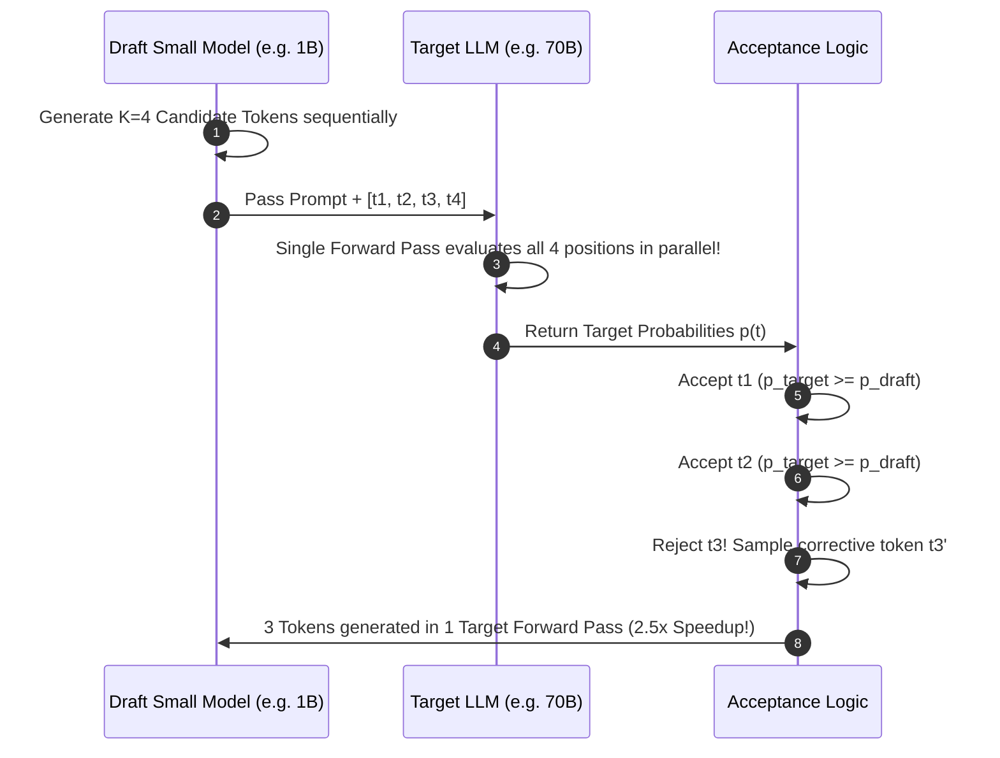

# Module 05: Continuous & Dynamic Iteration-Level Batching

## Speculative Decoding Verification Pipeline

---

## 🗺️ Recommended Step-by-Step Learning Path

Follow this exact sequence to achieve complete mastery of this module:

| Step | File to Open | What You Will Do |
| :---: | :--- | :--- |
| **1** | **[01_README.md](01_README.md)** | Read conceptual overview, architectural foundations, and mental models. |
| **2** | **[00_FOUNDATIONS_PLAYGROUND.md](00_FOUNDATIONS_PLAYGROUND.md)** | Practice beginner spoonfed micro-drills and line-by-line syntax breakdowns. |
| **3** | **[00_try_it_yourself.py](00_try_it_yourself.py)** | Run in terminal (`python 00_try_it_yourself.py`) for an interactive zero-dependency sandbox. |
| **4** | **[04_TROUBLESHOOTING_AND_EDGE_CASES.md](04_TROUBLESHOOTING_AND_EDGE_CASES.md)** | Study forensic runbooks, edge cases, and real-world failure post-mortems. |
| **5** | **[03_SELF_ASSESSMENT_AND_CHALLENGES.md](03_SELF_ASSESSMENT_AND_CHALLENGES.md)** | Test your knowledge with self-assessment quizzes, challenges, and diagnostic scenarios. |
| **6** | **[02_PROJECT_GUIDE.md](02_PROJECT_GUIDE.md)** | Follow guided project implementation for `starter/` and `project_solution/`. |
| **7** | **[problems/](problems/)** | Solve hands-on problem bank challenges and verify with `pytest problems/tests`. |
| **8** | **[debug_lab/](debug_lab/)** | Diagnose and fix silent production bugs in the Bug Hunter Drill. |

---

## 1. Algorithmic Principles of Iteration-Level Scheduling

Classical static batching operates at request granularity: a batch of $B$ requests enters execution concurrently and holds GPU resources until the longest request in the batch completes generation.

### 1.1 The Inefficiency of Static Batching
Let sequence length of request $i \in \{1, \dots, B\}$ be $S_i$.
$$\text{Total Wasted Execution Slots} = \sum_{i=1}^B (\max_j S_j - S_i)$$
Because generation length in production exhibits high variance (e.g. short greetings vs full code solutions), static batching achieves $< 40\%$ compute utilization.

### 1.2 Iteration-Level Scheduling (Orca / vLLM)
Iteration-level scheduling executes at step granularity:
1. At step $t$, the execution engine runs one decode forward pass for the active batch $\mathcal{B}_t$.
2. For every sequence $i \in \mathcal{B}_t$:
   - If token $y_{i,t} == \langle\text{eos}\rangle$ or reached $\text{max\_tokens}$, retire sequence $i$ and deallocate physical blocks.
3. The scheduler checks the waiting queue $\mathcal{Q}$:
   - If available KV cache capacity $\ge S_{\text{prompt}}$ for candidate $k \in \mathcal{Q}$, admit candidate $k$ into $\mathcal{B}_{t+1}$.
4. Advance to step $t+1$.