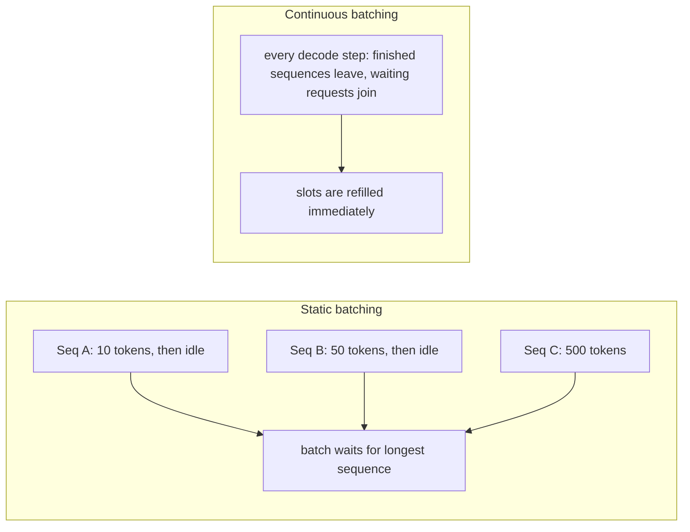

# Module 05: Continuous & Dynamic Iteration-Level Batching

> **Architectural Scope**: Static vs continuous (in-flight) batching, iteration-level scheduling (Orca), the scheduler's queues and budgets, interaction with prefill, and scheduling policies.

---

## Why this module matters

Batching is how GPUs get efficient (Module 01): one read of the weights serves many tokens. But LLM requests are wildly unequal: one asks for 10 output tokens, another for 1,000, and nobody knows in advance. A batching strategy designed for equal-length work (the classic deep-learning approach) leaves the GPU mostly idle on this traffic. **Continuous batching**, also called *in-flight* or *iteration-level* batching, re-forms the batch **every decode step**, and it is the single biggest scheduling idea in modern serving: reports from Anyscale and others show several-fold (up to an order of magnitude) throughput gains over naive static batching on realistic workloads.

## Mental model: a bus that lets people on and off at every stop

**Static batching** is a tour bus that waits for a full group, drives the whole route, and nobody leaves or boards until the last passenger's stop. The seats of people who got off early stay empty for the rest of the trip. **Continuous batching** is a city bus: at every stop passengers get off and new ones board, so seats are almost always full.

```mermaid
flowchart LR
    subgraph Static["Static batching"]
        S1["Seq A: 10 tokens, then idle"] --> SW["batch waits for longest sequence"]
        S2["Seq B: 50 tokens, then idle"] --> SW
        S3["Seq C: 500 tokens"] --> SW
    end
    subgraph Cont["Continuous batching"]
        C1["every decode step: finished sequences leave, waiting requests join"] --> C2["slots are refilled immediately"]
    end
```

## 1. Why static batching fails for LLMs

In a static batch of `B` requests, every request runs until the **longest** one finishes (finished sequences are padded or masked), and new requests wait for the whole batch to complete.

**Worked example.** Four requests with output lengths 10, 50, 100 and 500 tokens, batched together. The batch runs 500 decode steps. Useful token-steps are `10 + 50 + 100 + 500 = 660` out of `4 x 500 = 2,000` slots: **33% utilisation**. A request arriving just after the batch started waits up to 500 steps before it can even start (huge TTFT). With a heavy-tailed length distribution (a few very long outputs), utilisation collapses further.

## 2. Iteration-level scheduling (Orca)

The key idea from **Orca** (Yu et al., OSDI 2022): make the scheduling unit one **iteration** (a single forward step that produces one token for every running sequence), not a whole request. After every iteration the scheduler:

1. **Removes** sequences that emitted an end-of-sequence token or hit their length limit (their KV blocks are freed, Module 03).
2. **Adds** waiting requests into the freed capacity, running their **prefill** and then including them in subsequent decode steps.
3. Runs the next iteration with the new set.

Because the batch is rebuilt every step, there is no padding waste to the longest request, new requests start within one iteration, and short requests return immediately instead of waiting for stragglers. Orca also introduced **selective batching**: operations that treat tokens independently (the projections and MLPs) batch *across* requests of different lengths by concatenating tokens, while attention (which depends on each request's own KV cache) is computed per request. Modern engines (vLLM, TGI, TensorRT-LLM "in-flight batching", SGLang) all work this way.

The same workload with continuous batching keeps all 4 slots busy as short requests finish and new ones take their place: utilisation approaches 100% subject to demand and memory.

## 3. The scheduler

A typical engine (for example vLLM) keeps three collections and consults them every iteration:

- **Waiting queue:** admitted requests not yet started.
- **Running set:** sequences in the current batch.
- **Swapped/preempted set:** sequences evicted under memory pressure (Module 03).

Admission is bounded by **budgets**:

| Budget | Meaning |
|---|---|
| `max_num_seqs` | maximum concurrent sequences in the batch |
| `max_num_batched_tokens` | maximum tokens processed per iteration (prefill tokens + one decode token per running sequence) |
| free KV blocks | a request is admitted only if its prompt (plus headroom) fits in the cache |

Each iteration, the scheduler first tries to keep all running sequences going (allocating a new KV block when one fills; **preempting** if none are free), then admits waiting requests while budgets allow.

## 4. The prefill problem

Prefill for a long prompt is a big compute-bound chunk of work. If a 16,000-token prompt is admitted into an iteration alongside 100 decode sequences, that iteration takes hundreds of milliseconds, and **every running user sees a stall** in their token stream (a TPOT spike). Conversely, delaying prefill hurts the new user's TTFT. This tension is why engines add **chunked prefill** (split long prompts across iterations and mix them with decode, Module 06) and, at scale, **prefill/decode disaggregation**.

## 5. Scheduling policies

- **FCFS** (first come, first served): simple and fair; long requests at the head can still delay others (head-of-line blocking in the waiting queue).
- **Priority classes:** interactive requests ahead of batch jobs; preempt batch work when interactive traffic arrives.
- **Shortest-job-first / length-predicted scheduling** can reduce average latency but needs output-length prediction and risks starving long requests.
- **Fair scheduling** across tenants (for example virtual token counters) prevents one heavy user from monopolising capacity.
- **Cache-aware ordering** (Module 04): prefer requests sharing cached prefixes.
- **Admission control and load shedding** when the queue grows beyond what SLOs allow, rather than letting all requests time out.

## 6. Engineering details

- **CUDA graphs:** decode steps have fixed shapes for a given batch size, so engines capture a CUDA graph per batch-size bucket to cut kernel-launch overhead (a visible win at small per-step times of a few milliseconds); the batch is padded up to the nearest captured size.
- **Streaming:** tokens are returned as produced (SSE/gRPC streaming); the engine loop and the API layer are decoupled so slow clients do not block the scheduler.
- **Sampling and stop conditions** are per-sequence even though the forward pass is batched.
- **Overhead matters:** with step times of 5 to 20 ms, Python scheduling overhead must be tiny (multi-step scheduling, asynchronous output processing).

## Worked example: effect on latency

At 20 requests/s with an average of 300 output tokens and a decode step of 25 ms, a static batch of 32 must collect 32 requests (up to 1.6 s of waiting for the first) and then run to the longest output (say 1,000 steps = 25 s). Continuous batching starts each request at the next 25 ms iteration and finishes it in about `300 x 25 ms = 7.5 s`. TTFT falls from seconds to tens of milliseconds plus queueing, and E2E latency for the typical request is cut by about 3x, while GPU utilisation rises.

## Common pitfalls

1. **Setting `max_num_batched_tokens` too high**: long prefills stall decode (TPOT spikes); too low: wasted prefill efficiency and higher TTFT.
2. **Setting `max_num_seqs` beyond what KV memory supports**, causing preemption thrash.
3. **Comparing against a weak baseline**: the gain is huge versus naive static batching but smaller versus tuned dynamic batching.
4. **Ignoring tail latency of long requests** under SJF-style policies (starvation).
5. **Python scheduler overhead** dominating at high request rates.
6. **Not separating latency classes**, so a batch job's long prompts harm chat users.

## How this connects

- **Module 01** supplies the metrics; **Module 02/03** make continuous admission possible by managing KV memory.
- **Module 06** fixes the prefill/decode interference described here.
- **Module 09** benchmarks the scheduler's behaviour under load and autoscales on its queue metrics.
- **Course 04** (system design): this is a specialised *queueing and scheduling* system.

## Go further

- roadmap.sh: *Inference Engineering* nodes **continuous batching**, **request queueing**, **latency vs throughput**, **inference engines**.
- Yu et al., *Orca: A Distributed Serving System for Transformer-Based Generative Models* (OSDI 2022); Anyscale blog "How continuous batching enables 23x throughput in LLM inference"; Hugging Face TGI documentation on continuous batching.
- vLLM scheduler documentation.

---

## Module Study Progression
1. **Beginner Playground**: Read [00_FOUNDATIONS_PLAYGROUND.md](00_FOUNDATIONS_PLAYGROUND.md).
2. **Architecture Theory**: Study this [01_README.md](01_README.md).
3. **Hands-on Project**: Follow [02_PROJECT_GUIDE.md](02_PROJECT_GUIDE.md).
4. **Staff Interview Challenges**: Check [03_SELF_ASSESSMENT_AND_CHALLENGES.md](03_SELF_ASSESSMENT_AND_CHALLENGES.md).
5. **Production Debugging**: Review [04_TROUBLESHOOTING_AND_EDGE_CASES.md](04_TROUBLESHOOTING_AND_EDGE_CASES.md).
