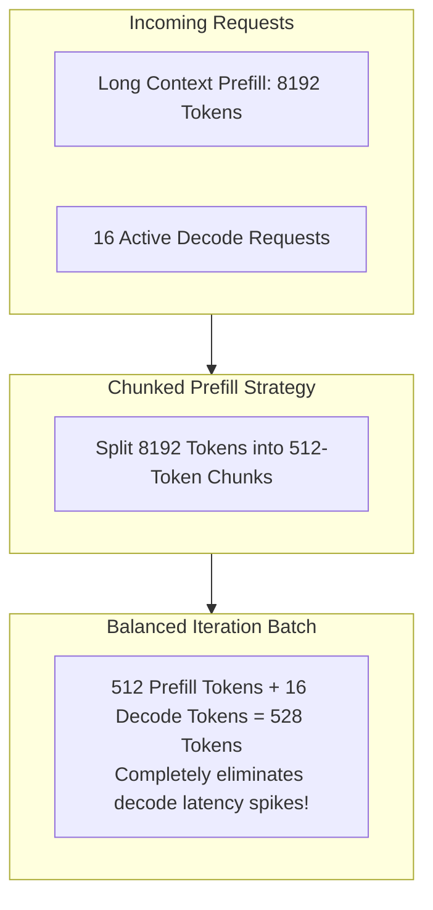

# Module 06: Chunked Prefill & Disaggregated Prefill-Decode (PD) Architecture


## Chunked Prefill & Decode Co-Scheduling



---

## 🗺️ Recommended Step-by-Step Learning Path

Follow this exact sequence to achieve complete mastery of this module:

| Step | File to Open | What You Will Do |
| :---: | :--- | :--- |
| **1** | **[01_README.md](01_README.md)** | Read conceptual overview, architectural foundations, and mental models. |
| **2** | **[00_FOUNDATIONS_PLAYGROUND.md](00_FOUNDATIONS_PLAYGROUND.md)** | Practice beginner spoonfed micro-drills and line-by-line syntax breakdowns. |
| **3** | **[00_try_it_yourself.py](00_try_it_yourself.py)** | Run in terminal (`python 00_try_it_yourself.py`) for an interactive zero-dependency sandbox. |
| **4** | **[04_TROUBLESHOOTING_AND_EDGE_CASES.md](04_TROUBLESHOOTING_AND_EDGE_CASES.md)** | Study forensic runbooks, edge cases, and real-world failure post-mortems. |
| **5** | **[03_SELF_ASSESSMENT_AND_CHALLENGES.md](03_SELF_ASSESSMENT_AND_CHALLENGES.md)** | Test your knowledge with self-assessment quizzes, challenges, and diagnostic scenarios. |
| **6** | **[02_PROJECT_GUIDE.md](02_PROJECT_GUIDE.md)** | Follow guided project implementation for `starter/` and `project_solution/`. |
| **7** | **[problems/](problems/)** | Solve hands-on problem bank challenges and verify with `pytest problems/tests`. |
| **8** | **[debug_lab/](debug_lab/)** | Diagnose and fix silent production bugs in the Bug Hunter Drill. |

---

## 1. The Problem: Inter-Token Latency (ITL) Degeneracy

Autoregressive decode tokens must be served with low, predictable Inter-Token Latency (ITL $\le 25\text{ ms}$).
However, prompt prefill is computationally intensive ($O(S^2)$ attention and large GEMMs). Co-locating prefill and decode without bounds causes severe ITL degradation:

```
Without Chunked Prefill (Latency Jitter Spike):
Decode:  [20ms] [20ms] [20ms] [--- 450ms Prefill Freeze! ---] [20ms] [20ms]
                                      ^
                           Catastrophic User Jitter!

With Chunked Prefill (Bounded Execution Time):
Iter:    [Decode + Chunk 1 (30ms)] [Decode + Chunk 2 (30ms)] [Decode (20ms)]
```

---

## 2. Sarathi-Serve Chunked Prefill Mechanics

Chunked prefill (Agrawal et al., OSDI 2024) decomposes prompt sequence $S$ into chunks of size $C$:
$$K = \left\lceil \frac{S}{C} \right\rceil$$
At each iteration $k \in \{1, \dots, K\}$:
1. Process chunk $k$: compute queries $Q_k$ and attend to all prior cached keys $K_{1\dots k}$.
2. Co-schedule chunk $k$ alongside the active decode token batch.
3. Keep iteration execution time strictly bounded within the SLA budget:
   $$T_{\text{step}} = T_{\text{prefill}}(C) + T_{\text{decode}}(B) \le T_{\text{SLA}}$$

---

## 3. Disaggregated Prefill-Decode (PD) Serving

Modern hyperscale inference separates physical instances into two distinct pools:
- **Prefill Instances ($P$-Workers)**: Sized with high compute-to-bandwidth ratio (e.g. $TP=4$ or $TP=8$) for maximum GEMM throughput.
- **Decode Instances ($D$-Workers)**: Sized with high memory bandwidth and large physical block pools for maximum concurrent batching.
- **RDMA Interconnect**: Generated KV cache blocks are transmitted from $P$-Workers to $D$-Workers over 400 Gbps RoCE/InfiniBand with GPUDirect RDMA.