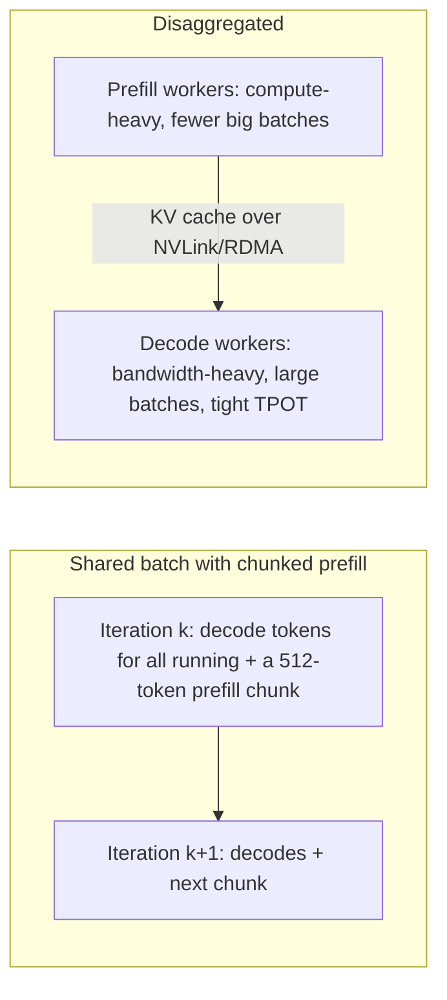

# Module 06: Chunked Prefill & Prefill-Decode (PD) Disaggregation

> **Architectural Scope**: Prefill/decode interference, chunked prefill with a per-iteration token budget (stall-free batching), disaggregated prefill and decode clusters, KV-cache transfer costs, and when each technique pays off.

---

## Why this module matters

Module 01 showed that prefill is **compute-bound** and decode is **memory-bound**, and Module 05 showed that continuous batching mixes them on the same GPU. That mixing causes **interference**: one long prompt can freeze everyone else's token stream for hundreds of milliseconds, while protecting decode latency delays the new user's first token. You cannot optimise TTFT and TPOT independently on a shared batch, and tight SLOs on both are what real products need. Two techniques resolve this tension: **chunked prefill** (smooth the interference) and **PD disaggregation** (remove it by separating the phases onto different GPUs).

## Mental model: one road for trucks and sports cars, or two roads

Prefill requests are heavy trucks (lots of work, run in parallel across many tokens); decode steps are sports cars (tiny work, but latency-critical and numerous). On a shared road a truck blocks the cars. Chunked prefill makes the trucks drive in small pieces so cars slip by between pieces. Disaggregation builds **a separate road for each**, sized and tuned for its traffic.

```mermaid
flowchart LR
    subgraph Shared["Shared batch with chunked prefill"]
        I1["Iteration k: decode tokens for all running + a 512-token prefill chunk"] --> I2["Iteration k+1: decodes + next chunk"]
    end
    subgraph Disagg["Disaggregated"]
        P["Prefill workers: compute-heavy, fewer big batches"] -->|"KV cache over NVLink/RDMA"| D["Decode workers: bandwidth-heavy, large batches, tight TPOT"]
    end
```

## 1. The interference problem in numbers

On an 8B model, a 16,000-token prompt needs about `2 x 8e9 x 16,000 = 2.6e14` FLOPs, around 0.65 s at 400 TFLOP/s. If that prefill runs as one iteration, every one of the 100 running decode sequences waits 0.65 s for its next token (versus a normal 10 to 20 ms): a huge TPOT spike. Meanwhile if the scheduler refuses to admit the prompt until decodes finish, the new user's TTFT balloons.

## 2. Chunked prefill (stall-free batching)

**Idea** (Sarathi, Sarathi-Serve; adopted by vLLM, SGLang, TensorRT-LLM): split a long prompt into **chunks** of at most `C` tokens (for example 512 to 2,048) and spread them across consecutive iterations. Each iteration has a fixed **token budget** (`max_num_batched_tokens`): the scheduler first includes **one decode token for every running sequence**, then fills the remaining budget with the next chunk of a pending prefill.

- **Bounded iteration time:** every iteration costs roughly the same, so no decode stalls longer than one budget-sized step.
- **Better GPU use:** decode steps are memory-bound and leave compute idle; the prefill chunk **fills that idle compute**, so the two phases share the GPU more efficiently (a prefill chunk "rides along" with decode).
- **Costs:** a long prompt takes several iterations, so *its* TTFT rises slightly; chunks after the first must attend to the KV of earlier chunks (re-reading it, though paged/flash kernels handle this efficiently); very small chunks reduce prefill efficiency. Tune the budget: larger favours TTFT and throughput, smaller favours smooth TPOT.

Worked example: budget 2,048 tokens with 100 running decodes: each iteration processes 100 decode tokens plus a 1,948-token chunk, about `2 x 8e9 x 2,048 = 3.3e13` FLOPs, roughly 80 ms. The 16K prompt finishes prefill in about 8 iterations (about 0.7 s total, similar to before), but running users see at most an ~80 ms step instead of a 650 ms freeze.

## 3. Prefill-decode disaggregation

Chunking smooths interference but does not eliminate it: both phases still share one GPU's memory bandwidth, KV space and scheduler. **Disaggregation** (DistServe, Splitwise, Mooncake; supported in vLLM, SGLang and NVIDIA Dynamo, llm-d) runs prefill and decode on **separate GPU pools**:

1. A request goes to a **prefill worker**, which computes the prompt's KV cache and the first token.
2. The KV cache is **transferred** to a **decode worker** (over NVLink within a node, or RDMA/InfiniBand across nodes), usually layer by layer so transfer overlaps with compute.
3. The decode worker streams the remaining tokens.

**Benefits**

- **No interference:** TTFT and TPOT are controlled by different machines.
- **Independent optimisation:** prefill pools can use higher tensor parallelism and smaller batches to minimise TTFT; decode pools use larger batches, more replicas, quantised weights and KV, and can run on bandwidth-rich hardware.
- **Independent scaling:** scale prefill and decode counts to match the workload's prompt/output ratio.
- DistServe reports several times higher **goodput** (requests meeting both SLOs) than colocated serving on its workloads.

**Costs**

- **KV transfer.** Cost is `KV bytes = tokens x bytes per token` (Module 02). A 2,000-token prompt on an 8B model (128 KiB/token) is 250 MiB; at 50 GB/s over a NIC that is about 5 ms. For a 70B model (320 KiB/token), 2,000 tokens = 625 MiB, about 13 ms. Layer-wise streaming hides most of it; very long prompts or slow networks make it significant (RDMA or NVLink is effectively required).
- **Complexity:** two pool types, routing, KV handoff protocol, failure handling, and capacity planning for the **P:D ratio**. A wrong ratio leaves one side idle while the other queues.
- **Memory duplication and fragmentation**: finished prefills occupy decode-side memory; cache-aware routing (Module 04) becomes more complex.
- **Less benefit for short prompts and low load**, where colocated serving is already fine and simpler.

## 4. Choosing between them

| Situation | Recommended approach |
|---|---|
| Moderate load, mixed prompts, one or a few GPUs | **Chunked prefill** (on by default in recent engines); tune the token budget |
| Strict TTFT *and* TPOT SLOs at high load, long prompts (RAG, long context, agents) | **Disaggregation** (often together with chunked prefill on the prefill side) |
| Short prompts, long outputs | colocated is usually enough; decode dominates |
| Very long prompts (100K+) | disaggregate; consider context parallelism for prefill (course 08, Module 07) |
| Small team / few replicas | prefer simplicity; disaggregation's operational cost may not pay off |

Measure **goodput at your SLOs** (Module 09) on your real prompt/output length distribution before committing.

## Common pitfalls

1. **Chunk size too small** (poor prefill efficiency) or **too large** (decode stalls return).
2. **Judging by throughput alone** and missing TPOT spikes; plot per-token latency percentiles.
3. **Disaggregating without RDMA/NVLink**, so KV transfer dominates TTFT.
4. **Wrong P:D ratio**: one pool saturated, the other idle; monitor both queues and rebalance (or autoscale separately).
5. **Ignoring prefix caching interactions**: cached prefixes may live on only some workers.
6. **Assuming it helps every workload**: short-prompt chat gets little benefit.
7. **Not accounting for first-token handling**: the first token is produced by prefill; decode workers take over from the second.

## How this connects

- **Module 01** gives the phase characteristics; **Module 05** introduces the shared-batch scheduler this module repairs.
- **Module 02/03**: KV size and blocks determine transfer volume and format.
- **Course 08, Module 01 and 02**: interconnect bandwidth and collectives bound KV-transfer performance; **Course 04** covers the routing/load-balancing patterns involved.

## Go further

- roadmap.sh: *Inference Engineering* nodes **prefill / decode phases**, **disaggregation**, **independent component scaling**, **multi node inference**, **cache aware routing**.
- Agrawal et al., *Taming Throughput-Latency Tradeoff in LLM Inference with Sarathi-Serve* (OSDI 2024); Zhong et al., *DistServe* (OSDI 2024); Patel et al., *Splitwise* (ISCA 2024); Qin et al., *Mooncake* (2024).
- vLLM docs on chunked prefill and disaggregated prefilling; NVIDIA Dynamo documentation.

---

## Module Study Progression
1. **Beginner Playground**: Read [00_FOUNDATIONS_PLAYGROUND.md](00_FOUNDATIONS_PLAYGROUND.md).
2. **Architecture Theory**: Study this [01_README.md](01_README.md).
3. **Hands-on Project**: Follow [02_PROJECT_GUIDE.md](02_PROJECT_GUIDE.md).
4. **Staff Interview Challenges**: Check [03_SELF_ASSESSMENT_AND_CHALLENGES.md](03_SELF_ASSESSMENT_AND_CHALLENGES.md).
5. **Production Debugging**: Review [04_TROUBLESHOOTING_AND_EDGE_CASES.md](04_TROUBLESHOOTING_AND_EDGE_CASES.md).
