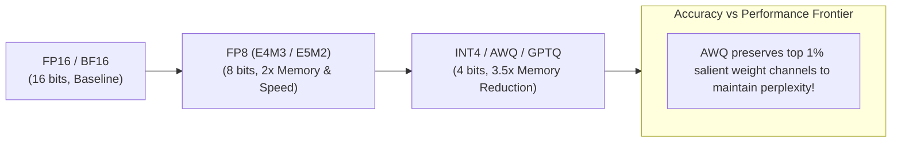

# Module 07: Speculative Decoding & Medusa Architectures

## LLM Weight & Activation Quantization Formats

## 1. Mathematical Formulation of Speculative Decoding

Speculative Decoding (Leviathan et al., ICML 2023; Chen et al., 2023) breaks the sequential autoregressive dependency by decoupling candidate token proposal from candidate token verification.

### 1.1 Rejection Sampling with Exact Distribution Preservation
Let $M_p$ denote the large target model with probability distribution $p(x | x_{<t})$ and $M_q$ denote the small draft model with distribution $q(x | x_{<t})$.
Given $\gamma$ speculative draft tokens $(x_1, x_2, \dots, x_\gamma)$:
1. Concurrently evaluate target model logits $p(x_i | x_{<i})$ for all $i \in \{1, \dots, \gamma+1\}$ in a single forward pass.
2. For each draft token $x_i$, accept $x_i$ with probability:
   $$\alpha_i = \min\left(1, \frac{p(x_i)}{q(x_i)}\right)$$
3. If token $x_k$ is rejected, discard tokens $x_{k+1} \dots x_\gamma$.
4. Sample replacement token $x_k$ from the normalized residual distribution:
   $$p'(x) = \frac{\max(0, p(x) - q(x))}{\sum_y \max(0, p(y) - q(y))}$$

**Theorem**: The sampled token sequence follows distribution $p(x)$ exactly. Speculative decoding guarantees zero degradation in perplexity or task accuracy.

---

## 2. Medusa: Multi-Head Speculation Without Draft Models

Medusa (Cai et al., 2024) eliminates the secondary draft model:
- Multiple lightweight feed-forward heads are attached on top of the target model's final hidden state.
- Head $k$ predicts the token at step $t + k$.
- Candidate sequences are verified using a **Tree Attention** mask in the next forward pass.