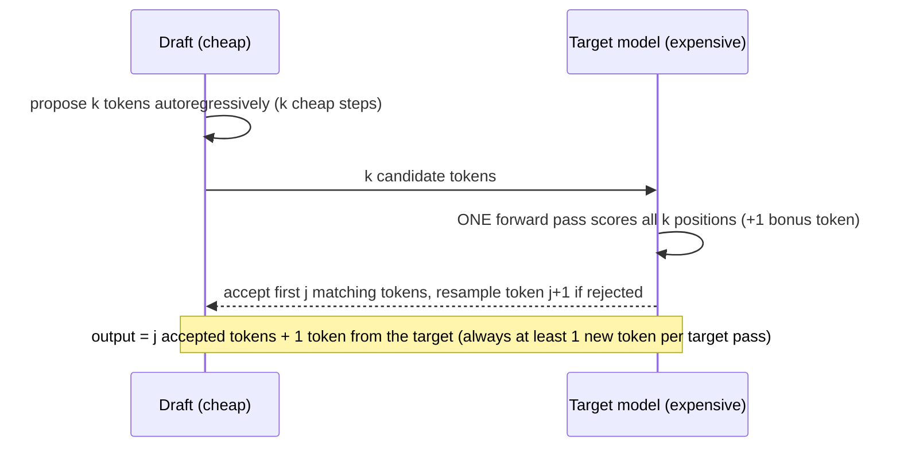

# Module 07: Speculative Decoding & Medusa Multi-Head Verification

> **Architectural Scope**: Draft-and-verify decoding, the rejection-sampling rule that keeps the output distribution exact, expected speedup maths, draft-model alternatives (n-gram, EAGLE, Medusa heads, multi-token prediction), tree verification, and when speculation stops helping.

---

## Why this module matters

Decoding generates one token per forward pass, and each pass has to read every weight from memory (Module 01). The GPU's compute sits mostly idle. **Speculative decoding** exploits that idle compute: cheaply *guess* several future tokens, then have the big model **check all the guesses in a single pass**. When the guesses are right you emit several tokens for the price of one weight read, and because of how verification is done, the output distribution is **mathematically identical** to normal sampling from the big model. It is one of the few optimisations that makes decoding faster without changing what the model says.

## Mental model: a junior drafts, the senior signs off in bulk

A fast junior writer drafts the next five words. The senior editor reads all five at once (reading five words costs barely more than reading one, because the editor's time goes into opening the document) and accepts the longest correct prefix, then writes the next word themselves if they spot an error. If the junior is usually right, the pair finishes much faster than the senior writing alone; if the junior is wrong every time, you only lose a little.

```mermaid
sequenceDiagram
    participant D as Draft (cheap)
    participant T as Target model (expensive)
    D->>D: propose k tokens autoregressively (k cheap steps)
    D->>T: k candidate tokens
    T->>T: ONE forward pass scores all k positions (+1 bonus token)
    T-->>D: accept first j matching tokens, resample token j+1 if rejected
    Note over D,T: output = j accepted tokens + 1 token from the target (always at least 1 new token per target pass)
```

## 1. Why verification is nearly free

A target forward pass over `k + 1` positions in parallel is a small matrix-matrix operation that still has to stream all the weights once: for `k` of a few, its time is about the same as a single-token decode step (course 07, Module 01 roofline). So a round costs roughly *one target step + `k` draft steps*, and yields on average several tokens.

## 2. The accept/reject rule (why it is exact)

Let `q(x)` be the draft's probability for a proposed token and `p(x)` the target's probability at that position (both after the same temperature/top-p adjustments).

- Accept the draft token `x` with probability `min(1, p(x) / q(x))`.
- If rejected, sample a replacement from the **residual distribution** `max(0, p(x) - q(x))` renormalised, and stop the round there.
- If all `k` tokens are accepted, sample one **bonus token** from the target's distribution at the next position.

Leviathan et al. (2023) and Chen et al. (2023) prove this produces samples from exactly `p`. For **greedy** decoding it reduces to: accept while the draft token equals the target's argmax.

## 3. How much faster? The expected-speedup formula

Let `alpha` be the average probability a draft token is accepted (assumed independent), `k` the number of drafted tokens per round, and `c` the cost of one draft step relative to one target step. The expected number of tokens produced per round is

`E[tokens] = (1 - alpha^(k+1)) / (1 - alpha)`

and a round costs about `1 + k c` target-step equivalents, so

`speedup ~ E[tokens] / (1 + k c)`.

**Worked example.** `alpha = 0.8`, `k = 4`, `c = 0.05` (a draft 20x cheaper): `E[tokens] = (1 - 0.8^5) / 0.2 = 3.36`, cost `1 + 4 x 0.05 = 1.2`, speedup `3.36 / 1.2 = 2.8x`. With `alpha = 0.5`: `E[tokens] = (1 - 0.5^5) / 0.5 = 1.94`, speedup `1.94 / 1.2 = 1.6x`. With `alpha = 0.3` the gain is only about 1.2x. Acceptance rate is everything.

Acceptance is higher when the task is **predictable** (code, structured output, summarisation, editing), when the **temperature is low**, and when the draft is well aligned with the target (same family and training data).

## 4. Where do the drafts come from?

| Method | Draft source | Notes |
|---|---|---|
| **Separate small model** | e.g. a 1B draft for a 70B target of the same family | simple; needs the same tokenizer; extra memory and KV cache for the draft |
| **N-gram / prompt lookup** | copy continuations of n-grams that appeared earlier in the prompt/output | no model at all; excellent for summarisation, code edits, RAG answers that quote the context |
| **Medusa** | extra lightweight **decoding heads** on the target's last hidden state, head `i` predicts token `t + i + 1` | no separate model; heads are small MLPs; needs a short fine-tune |
| **EAGLE / EAGLE-2/3** | a tiny autoregressive head over the target's *features* | higher acceptance than Medusa, 3x or more speedups reported |
| **Multi-token prediction (MTP) heads** | heads trained with the model (for example DeepSeek-V3) reused for speculation | built in from pre-training |
| **Self-speculation** (layer skipping, lookahead decoding) | the target itself with shortcuts | no extra weights; smaller gains |

## 5. Medusa and tree verification

**Medusa** (Cai et al., 2024) adds `K` extra heads to the frozen (Medusa-1) or jointly fine-tuned (Medusa-2) target. Each head predicts a token further ahead from the *same* hidden state, so there is **no sequential draft loop**: all `K` predictions come from one pass. Because each head is uncertain, Medusa does not use a single chain; it keeps the **top-`s` candidates from each head** and forms a **tree** of candidate continuations (for example 2 x 3 x 2 = 12 paths). The target scores the whole tree in one pass using a **tree attention mask**, where each candidate token attends only to its own ancestors, and then picks the longest accepted path. Medusa commonly uses a "typical acceptance" rule (accept tokens within a plausibility threshold of the target distribution) instead of exact rejection sampling, which gives higher acceptance at the cost of exactness; use the exact scheme if distribution fidelity matters.

Reported speedups are typically around 2 to 3x on chat workloads at small batch sizes.

## 6. Engineering and limits

- **Batch size.** Speculation turns spare compute into speed, so it helps most at **small to moderate batch sizes** where decode is memory-bound. At large batches the GPU is already compute-bound and the wasted verification of rejected tokens costs real throughput; engines can disable or shrink speculation as load rises.
- **Memory:** a draft model needs weights and its own KV cache; head-based methods need little extra.
- **Tuning `k`:** longer drafts help only if acceptance stays high; many systems adapt `k` per request or per step.
- **Sampling compatibility:** top-p/top-k and structured/constrained decoding must be applied consistently to both distributions or the exactness guarantee breaks.
- **Metrics:** track *acceptance rate*, *mean accepted length*, and end-to-end TPOT, not just tokens per second.
- **Support:** vLLM (`speculative_config` with draft model, n-gram, EAGLE, MTP), SGLang, TensorRT-LLM, TGI.

## Common pitfalls

1. **Using a draft that is poorly aligned or has a different tokenizer**: low acceptance, no speedup.
2. **Enabling speculation at high load** and losing throughput.
3. **Expecting gains on high-temperature creative sampling**, where acceptance falls.
4. **Forgetting the draft's own cost** (`c`): a large draft can erase the benefit.
5. **Breaking exactness** with mismatched sampling parameters between draft and target (or by using typical acceptance without knowing it).
6. **Measuring only on easy prompts** (code, repetition) and generalising.
7. **Ignoring memory** for the draft's KV cache, which reduces the target's batch capacity.

## How this connects

- **Module 01** explains why decode has spare compute; **Module 03/05** supply the KV-block and scheduling machinery that must roll back rejected tokens.
- **Module 08** (quantised weights) and speculation both attack the same bottleneck from different angles and combine.
- **Course 06** (transformers) provides the architecture the heads attach to; **Course 07** kernels support tree attention masks.

## Go further

- roadmap.sh: *Inference Engineering* nodes **speculative decoding**, **draft target decoding**, **eagle**, **n gram**, **inference engines**.
- Leviathan et al., *Fast Inference from Transformers via Speculative Decoding* (ICML 2023); Chen et al., *Accelerating LLM Decoding with Speculative Sampling* (2023); Cai et al., *Medusa* (2024); Li et al., *EAGLE* (2024).
- Hugging Face "Assisted generation" blog post; vLLM speculative decoding documentation.

---

## Module Study Progression
1. **Beginner Playground**: Read [00_FOUNDATIONS_PLAYGROUND.md](00_FOUNDATIONS_PLAYGROUND.md).
2. **Architecture Theory**: Study this [01_README.md](01_README.md).
3. **Hands-on Project**: Follow [02_PROJECT_GUIDE.md](02_PROJECT_GUIDE.md).
4. **Staff Interview Challenges**: Check [03_SELF_ASSESSMENT_AND_CHALLENGES.md](03_SELF_ASSESSMENT_AND_CHALLENGES.md).
5. **Production Debugging**: Review [04_TROUBLESHOOTING_AND_EDGE_CASES.md](04_TROUBLESHOOTING_AND_EDGE_CASES.md).
