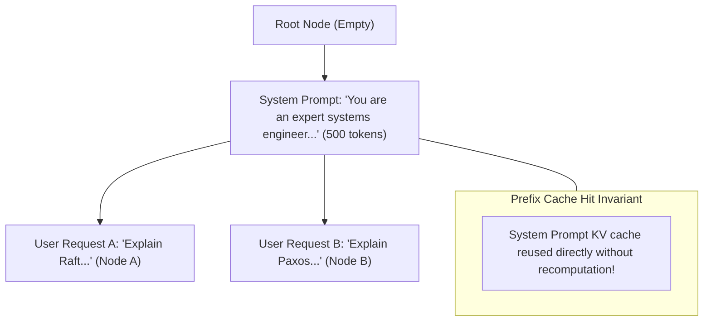

# Module 08: Model Quantization for Serving (FP8, INT4, AWQ & Marlin)

## Radix Tree Prefix Cache Sharing Architecture

---

## 🗺️ Recommended Step-by-Step Learning Path

Follow this exact sequence to achieve complete mastery of this module:

| Step | File to Open | What You Will Do |
| :---: | :--- | :--- |
| **1** | **[01_README.md](01_README.md)** | Read conceptual overview, architectural foundations, and mental models. |
| **2** | **[00_FOUNDATIONS_PLAYGROUND.md](00_FOUNDATIONS_PLAYGROUND.md)** | Practice beginner spoonfed micro-drills and line-by-line syntax breakdowns. |
| **3** | **[00_try_it_yourself.py](00_try_it_yourself.py)** | Run in terminal (`python 00_try_it_yourself.py`) for an interactive zero-dependency sandbox. |
| **4** | **[04_TROUBLESHOOTING_AND_EDGE_CASES.md](04_TROUBLESHOOTING_AND_EDGE_CASES.md)** | Study forensic runbooks, edge cases, and real-world failure post-mortems. |
| **5** | **[03_SELF_ASSESSMENT_AND_CHALLENGES.md](03_SELF_ASSESSMENT_AND_CHALLENGES.md)** | Test your knowledge with self-assessment quizzes, challenges, and diagnostic scenarios. |
| **6** | **[02_PROJECT_GUIDE.md](02_PROJECT_GUIDE.md)** | Follow guided project implementation for `starter/` and `project_solution/`. |
| **7** | **[problems/](problems/)** | Solve hands-on problem bank challenges and verify with `pytest problems/tests`. |
| **8** | **[debug_lab/](debug_lab/)** | Diagnose and fix silent production bugs in the Bug Hunter Drill. |

---

## 1. Mathematical Principles of Uniform Quantization

Uniform quantization maps a continuous real-valued tensor $X \in \mathbb{R}$ to a discrete grid of $b$-bit integers $\mathbb{Z}$:

### 1.1 Symmetric Quantization
$$q = \text{clamp}\left(\left\lfloor \frac{x}{s} \right\rceil, -2^{b-1}, 2^{b-1} - 1\right)$$
$$\hat{x} = q \times s$$
where scale factor $s$ is:
$$s = \frac{\max(|X|)}{2^{b-1} - 1}$$

### 1.2 SmoothQuant Mathematical Invariance
SmoothQuant (Xiao et al., ICML 2023) observes that activation quantization is hard because of persistent activation outliers, whereas weight quantization is easy.
Because linear operations satisfy associativity:
$$Y = X W = (X \cdot \text{diag}(s)^{-1}) \cdot (\text{diag}(s) \cdot W) = \hat{X} \hat{W}$$
By choosing per-channel smoothing scale $s_j$:
$$s_j = \frac{\max(|X_j|)^\alpha}{\max(|W_j|)^{1-\alpha}}, \quad \alpha \in [0.5, 0.85]$$
The dynamic range of activations is smoothed down, enabling seamless 8-bit matrix multiplication without outlier degradation.