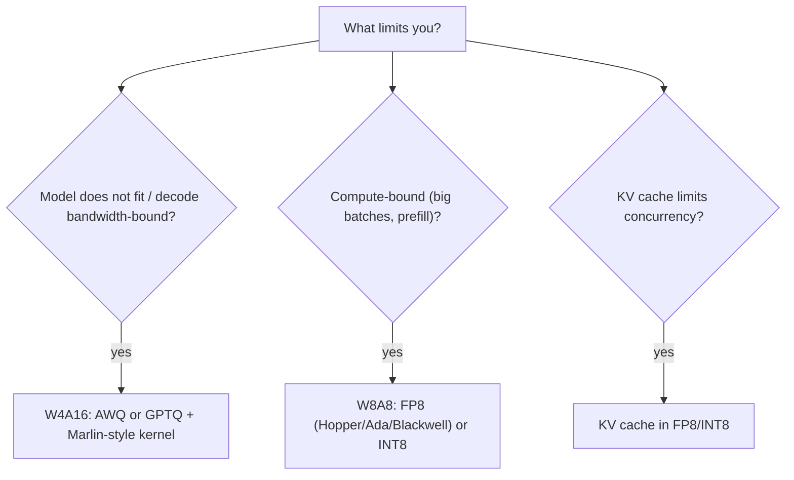

# Module 08: Model Quantization for Serving (FP8, AWQ, Marlin)

> **Architectural Scope**: Choosing a quantisation scheme for serving (W8A8-FP8, W4A16 AWQ/GPTQ, W4A8, FP4, KV-cache quantisation), how kernels like Marlin make 4-bit weights fast, calibration, accuracy validation, and hardware support.

---

## Why this module matters

Quantisation is the cheapest way to make serving **faster and cheaper**: fewer bytes per weight means less memory traffic per decode step (Module 01), more room for KV cache and larger batches (Module 02), and sometimes the ability to fit a model on fewer GPUs at all. Course 07, Module 10 showed how the *kernels* work. This module is about the **engineering decisions**: which format, for which hardware and which workload, how to calibrate it, and how to prove you did not break the model.

## Mental model: which resource are you short of?

Quantisation trades numeric precision for bytes. Different schemes attack different bottlenecks:

- **Weights are too big, or decode is bandwidth-bound** (small batch, interactive): shrink the weights (4-bit weight-only, W4A16).
- **Compute is the limit** (large batch, prefill, throughput serving): use lower-precision *math* (FP8/INT8 on both weights and activations, W8A8) so Tensor Cores run faster.
- **KV cache limits concurrency** (long contexts, many users): quantise the cache (FP8/INT8 KV).

```mermaid
flowchart TD
    Q["What limits you?"] --> M{"Model does not fit / decode bandwidth-bound?"}
    M -->|"yes"| W4["W4A16: AWQ or GPTQ + Marlin-style kernel"]
    Q --> C{"Compute-bound (big batches, prefill)?"}
    C -->|"yes"| W8["W8A8: FP8 (Hopper/Ada/Blackwell) or INT8"]
    Q --> K{"KV cache limits concurrency?"}
    K -->|"yes"| KV["KV cache in FP8/INT8"]
```

## 1. The menu

Notation `WxAy` = weights in x bits, activations in y bits.

| Scheme | Bytes/weight | Speeds up | Hardware | Typical quality impact |
|---|---|---|---|---|
| FP16/BF16 | 2 | baseline | all | none |
| **W8A8 FP8** (E4M3 weights and activations) | 1 | decode (bandwidth) **and** prefill (2x Tensor Core rate) | Hopper, Ada, Blackwell | small; usually near-lossless with good scaling |
| **W8A8 INT8** (SmoothQuant-style) | 1 | decode and prefill | Ampere and newer | small if outliers are handled |
| **W4A16 AWQ / GPTQ** | about 0.5 (+ scales) | decode (bandwidth); prefill gets no compute boost | Ampere and newer | small to moderate, more at 3 bits |
| **W4A8** (e.g. QServe, FP8 activations) | about 0.5 | decode and prefill | recent GPUs | moderate, newer |
| **FP4 / NVFP4 / MXFP4** | 0.5 | everything, with 2x FP8 rate | Blackwell | model- and recipe-dependent |
| **KV cache FP8/INT8** | n/a (cache) | capacity and KV bandwidth | most | small; test long context |

Other formats you will meet: **bitsandbytes NF4** (used for QLoRA fine-tuning; fine for experimentation, slower than dedicated kernels for serving), **GGUF** (llama.cpp CPU/edge formats with many k-quant variants), **compressed-tensors** (the format vLLM uses for many W8A8/W4A16 checkpoints, produced by `llm-compressor`).

## 2. FP8 in detail

FP8 has two variants: **E4M3** (4 exponent, 3 mantissa bits, range about +-448, used for weights and activations) and **E5M2** (wider range, used for gradients). Serving recipes:

- **Weights:** quantised offline, with a scale per tensor or (better) per output channel.
- **Activations:** scales are either **static** (computed from a calibration set; fastest, but sensitive to distribution shift) or **dynamic** (computed per token or per tensor at runtime; a little more overhead, more robust).
- **Accumulation** stays in FP32 inside the Tensor Core; outputs are rescaled and cast back to BF16.
- **KV cache** can use FP8 with per-head or per-tensor scales.

Because FP8 is one byte, it halves weight traffic **and** doubles peak Tensor Core throughput, so it helps both decode and prefill. On Hopper it is the default recommendation for production serving when quality validates.

## 3. AWQ, GPTQ and why a kernel like Marlin matters

**AWQ** (activation-aware weight quantisation) and **GPTQ** (Hessian-based layer-wise rounding) produce **INT4 weight-only** checkpoints (course 07, Module 10). But a 4-bit checkpoint only speeds up inference if the GEMM kernel can read 4-bit weights and dequantise them *without becoming compute- or instruction-bound*. Naive dequantising kernels reach only a fraction of the ideal 4x speedup.

**Marlin** (IST Austria, Frantar et al., 2024) is an FP16xINT4 GEMM kernel designed to stay near the memory-bandwidth roofline: it pre-shuffles weights offline so each thread loads exactly the layout the Tensor Core wants, pipelines asynchronous global-to-shared copies (`cp.async`) with dequantisation and MMA, and uses careful shared-memory layouts to avoid bank conflicts. Reported results are close to the ideal ~4x speedup over FP16 for batch sizes up to roughly 16 to 32, with useful gains retained at larger batches. vLLM routes GPTQ/AWQ layers through Marlin-family kernels on supported GPUs. Know the pattern: **format + kernel are a package**; a good format with a bad kernel is slow.

## 4. Calibration and accuracy

- **Calibration data:** static scales and AWQ/GPTQ statistics are computed on a few hundred to a few thousand representative samples. Use data resembling production prompts (domain, language, length); calibrating on generic web text and serving legal or code prompts can hurt.
- **Layers to leave alone:** the embedding and the **LM head** are often kept in higher precision; some outlier-heavy layers (first/last blocks, certain projections) may need FP16/INT8.
- **Evaluate beyond perplexity.** Perplexity can look fine while reasoning, long-context retrieval, tool-calling formats or safety behaviour degrade. Run your **task evaluations** (course 12): accuracy on your benchmarks, structured-output validity, long-context needle tests (course 10, Module 09), and refusal/guardrail behaviour. Compare against the FP16 model on identical prompts.
- **Tools:** `llm-compressor` (vLLM), AutoAWQ, AutoGPTQ, NVIDIA TensorRT Model Optimizer (`modelopt`: FP8, INT8, NVFP4 PTQ and QAT), Hugging Face `optimum`.
- **PTQ vs QAT:** post-training quantisation is cheap and usually enough at 8 bits and good at 4; quantisation-aware training or fine-tuning recovers quality at very low bit widths.

## 5. Worked example: serving a 70B model

| Format | Weights | Fits on | KV room (80 GB GPUs, ~90% usable) | Notes |
|---|---|---|---|---|
| BF16 | 140 GB | 2 x H100 (160 GB) | about 4 GB (very little) | KV-starved, small batches |
| **FP8** | 70 GB | 1 x H100 barely; **2 x H100 comfortably** | 2 x H100: `144 - 70 = 74 GB` | faster prefill and decode; the standard choice on Hopper |
| **AWQ INT4** | about 37 GB | **1 x H100** | about `72 - 37 = 35 GB` | single-GPU, low latency; no prefill compute boost |

With the 2 x H100 FP8 setup, 74 GB of KV at 320 KiB/token (Module 02) holds about 240K tokens, versus about 13K for BF16 on the same hardware: roughly **18x more concurrent context**, which translates to far larger batches and much lower cost per token. (Exact numbers depend on activation memory and engine overhead; measure.)

## 6. Rollout checklist

1. Pick the scheme from the bottleneck (decision tree above) and check **hardware support** (FP8 needs Hopper/Ada or newer).
2. Quantise with calibration data resembling production; keep sensitive layers in higher precision.
3. Run task evals, long-context tests and safety checks against the FP16 baseline.
4. Benchmark **at your batch sizes and SLOs** (Module 09): W4A16 may help p50 TPOT at low load but not saturated throughput.
5. Canary the quantised model on a slice of traffic with quality monitoring; keep the FP16 model as rollback.
6. Record the exact recipe (tool version, calibration set, scales) for reproducibility.

## Common pitfalls

1. **Assuming 4-bit means 4x faster everywhere**: the gain is mostly in the memory-bound, small-batch regime.
2. **Calibrating on irrelevant data.**
3. **Judging only by perplexity or a single benchmark.**
4. **Quantising the LM head or embeddings** and silently degrading rare-token behaviour.
5. **Using a format without a fast kernel** on your GPU (bitsandbytes for serving, unsupported FP8 paths falling back to slow emulation).
6. **Forgetting the KV cache**: weights shrink but concurrency stays capped by an FP16 cache.
7. **Mixing quantised and unquantised adapters (LoRA)** without checking support.

## How this connects

- **Course 07, Module 10** gives the kernel mechanics; **Module 01** explains why bytes equal latency in decode; **Module 02** shows where the freed memory goes.
- **Module 07** (speculative decoding) and this module compose; **Module 09** validates the result under load.
- **Course 12** supplies the evaluation discipline needed to approve a quantised release.

## Go further

- roadmap.sh: *Inference Engineering* nodes **quantization**, **post training quantization**, **quantization aware training**, **modelopt**, **model formats / runtimes**.
- Lin et al., *AWQ* (2023); Frantar et al., *GPTQ* (2022) and *Marlin* (2024); Xiao et al., *SmoothQuant* (2022); Micikevicius et al., *FP8 Formats for Deep Learning* (2022).
- vLLM quantisation documentation; Hugging Face quantisation overview; NVIDIA TensorRT Model Optimizer docs.

---

## Module Study Progression
1. **Beginner Playground**: Read [00_FOUNDATIONS_PLAYGROUND.md](00_FOUNDATIONS_PLAYGROUND.md).
2. **Architecture Theory**: Study this [01_README.md](01_README.md).
3. **Hands-on Project**: Follow [02_PROJECT_GUIDE.md](02_PROJECT_GUIDE.md).
4. **Staff Interview Challenges**: Check [03_SELF_ASSESSMENT_AND_CHALLENGES.md](03_SELF_ASSESSMENT_AND_CHALLENGES.md).
5. **Production Debugging**: Review [04_TROUBLESHOOTING_AND_EDGE_CASES.md](04_TROUBLESHOOTING_AND_EDGE_CASES.md).
