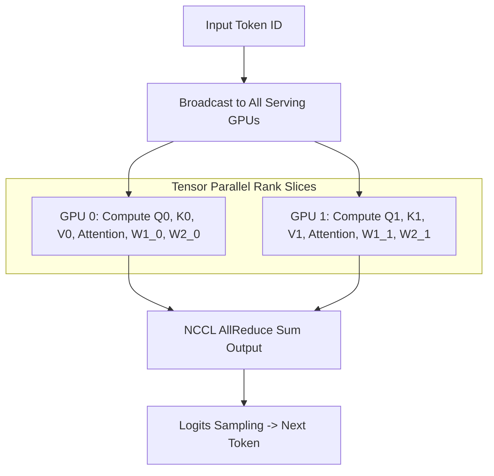

# Module 09: Production Benchmarking, SLA Budgeting & Autoscaling


## Distributed Multi-GPU Tensor Parallel Inference Serving



## 1. Statistical Telemetry & Performance Benchmarking

Enterprise LLM serving systems evaluate performance using continuous statistical profiling across concurrent synthetic traffic generators (e.g. Locust, vLLM Benchmark Suite).

### 1.1 Percentile Calculation & SLA Metrics
Let $L = \{l_1, l_2, \dots, l_n\}$ be sorted request latencies.
$$P_k = L\left[\lceil k \cdot n / 100 \rceil\right]$$
- **TTFT Target**: $P_{99} \le 500 \text{ ms}$
- **TPOT Target**: $P_{99} \le 25 \text{ ms}$

---

## 2. Capacity Planning & Little's Law

In steady-state queuing systems:
$$L = \lambda \cdot W$$
where:
- $L$ is average number of concurrent requests active in the system
- $\lambda$ is arrival rate (requests per second)
- $W$ is average total residence time (prefill time + decode duration)

### 2.1 Kubernetes HPA with AI-Native Prometheus Metrics
```yaml
apiVersion: autoscaling/v2
kind: HorizontalPodAutoscaler
spec:
  metrics:
  - type: External
    external:
      metric:
        name: vllm_num_requests_waiting
      target:
        type: Value
        averageValue: "5"
```