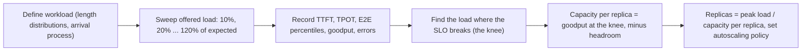

# Module 09: Production Benchmarking, SLAs & Autoscaling

> **Architectural Scope**: Designing LLM load tests that predict production, finding the throughput/latency knee, SLIs/SLOs/SLAs for inference, capacity planning with Little's Law, and autoscaling on the right signals.

---

## Why this module matters

Every earlier module in this course is an optimisation; this module is how you **prove** it helped and how you **keep it helping under real traffic**. LLM serving is easy to benchmark badly: a closed-loop test at batch size 1 says nothing about p99 latency at 80% load, and a throughput number measured with 100-token prompts says nothing about a RAG workload with 8,000-token prompts. A wrong benchmark leads to under-provisioning (outages), over-provisioning (a bill that is double what it should be), or an autoscaler that reacts to the wrong signal and flaps.

## Mental model: find the knee of the curve

Plot **latency vs offered load**. At low load, latency is flat (the GPU has spare capacity). As load approaches capacity, queues form and latency rises sharply: the **knee**. Throughput keeps rising only until saturation, after which extra load just lengthens queues. Your capacity is **the load at which you still meet your SLO**, not the maximum throughput the system can ever achieve.

```mermaid
flowchart LR
    A["Define workload (length distributions, arrival process)"] --> B["Sweep offered load: 10%, 20% ... 120% of expected"]
    B --> C["Record TTFT, TPOT, E2E percentiles, goodput, errors"]
    C --> D["Find the load where the SLO breaks (the knee)"]
    D --> E["Capacity per replica = goodput at the knee, minus headroom"]
    E --> F["Replicas = peak load / capacity per replica, set autoscaling policy"]
```

## 1. Designing a representative benchmark

1. **Workload shape.** Use your real **input and output length distributions**, not a single fixed length. Public proxies: ShareGPT-style conversations for chat, long-document prompts for RAG, code completion traces for IDE use. Prompt length drives prefill (TTFT); output length drives decode (TPOT and E2E). Include shared prefixes if production has them (Module 04), or the prefix cache will be unrealistically absent or present.
2. **Arrival process.** Production traffic is **open-loop**: users arrive whether or not earlier requests finished. Generate arrivals as a **Poisson process** at a target requests-per-second (and test bursts). A **closed-loop** test (N concurrent clients, each waiting for a reply before sending the next) self-throttles when the server slows down, hiding queueing delay. This flaw is known as *coordinated omission* and makes latency look far better than reality.
3. **Warm-up and duration.** Discard the first minute (JIT compilation, CUDA graph capture, cache warm-up) and run long enough to reach steady state (typically 5 to 15 minutes per load level), repeating to measure variance.
4. **Metrics to record:** TTFT, TPOT/ITL and E2E at p50/p90/p95/p99; request and token throughput; **goodput** (requests meeting SLO per second); error and timeout rate; GPU utilisation, memory, **KV-cache utilisation**, queue length, preemption count; and cost per million tokens.
5. **Tools:** vLLM's `benchmark_serving`, NVIDIA `genai-perf`, `guidellm`, SGLang bench scripts, Locust/k6 for HTTP-level tests with streaming. Report the exact hardware, model, engine version, quantisation, batch and scheduler settings.
6. **Compare fairly:** same prompts, same hardware, same SLO. Report the *whole curve*, not a single number.

## 2. SLIs, SLOs and SLAs for inference

- **SLI** (service level indicator): the measured quantity, for example "p95 TTFT over 5 minutes".
- **SLO** (objective): the internal target, for example "p95 TTFT < 500 ms and p95 TPOT < 50 ms for 99.5% of 5-minute windows".
- **SLA** (agreement): the external, usually contractual commitment, with penalties; set looser than the SLO so you have an **error budget** (course 04, Module 25 and the Google SRE book).

LLM-specific advice: define **separate SLOs per traffic class** (interactive chat vs batch summarisation vs agent tool loops), set them on **TTFT and TPOT** (not just E2E, which depends on output length), and measure **goodput**, since raw throughput can rise while users suffer. Include availability (error rate) and, for streaming, *stall rate* (gaps above a threshold between tokens).

## 3. Capacity planning

**Per-replica capacity** `R` = the highest request rate at which p95/p99 SLOs still hold (from the sweep). Size the fleet with headroom for failures, bursts and noisy estimates:

`replicas = ceil( peak_rps / (R x (1 - headroom)) )`.

**Worked example.** Sweep shows `R = 12` req/s per replica at SLO. Peak expected traffic 300 req/s, 30% headroom: `300 / (12 x 0.7) = 35.7`, so **36 replicas**. Sanity-check with **Little's Law** (`L = lambda x W`: average concurrency equals arrival rate times average time in system): at 12 req/s with an average E2E of 6 s, each replica holds about `12 x 6 = 72` concurrent sequences; confirm the KV cache can hold 72 sequences of the average context (Module 02) and that `max_num_seqs` allows it. If it cannot, the real capacity is lower than the sweep suggested (the sweep would have shown preemption or rejected requests).

Remember **tail effects:** capacity at p99 is lower than at p50; and a failed replica removes `R` immediately, so plan N+1 (or N+2) redundancy across availability zones.

## 4. Autoscaling

**Signals that work** (leading indicators of SLO breach):

- **Queue depth / number of waiting requests** at the engine (vLLM exposes `num_requests_waiting`).
- **KV-cache utilisation** (near 100% means admission stalls and preemption).
- **Concurrent running requests** relative to the per-replica capacity.
- **TTFT p95** or request latency from the gateway (lagging, but directly SLO-relevant).

**Signals that mislead:** *GPU utilisation* is a poor autoscaling metric for LLMs: a replica can be at "100% utilised" while healthy (batching works), or at moderate utilisation while memory-bound and queueing. CPU utilisation is irrelevant.

**Mechanics (Kubernetes):** HPA or **KEDA** scaling on Prometheus custom metrics; separate scaling for prefill and decode pools when disaggregated (Module 06); use **stabilisation windows** and different up/down thresholds to avoid flapping; set min replicas for baseline traffic and max for budget/quota.

**The cold-start problem.** Starting a replica means scheduling a GPU node, pulling a large container image, **loading tens to hundreds of GB of weights** into GPU memory, capturing CUDA graphs, warming caches: from tens of seconds to many minutes. So reactive scaling is too slow for sudden spikes. Mitigations:

- keep a **warm pool** or higher minimum replicas, and scale **proactively on a schedule** or forecast (daily peaks);
- pre-pull images and cache weights on local NVMe or a shared fast volume; use fast loaders (`safetensors`, tensorizer, streaming loaders), quantised checkpoints (less to load);
- **scale-to-zero** only for low-priority or latency-tolerant services;
- scale **down** carefully: drain in-flight streams (graceful termination) and avoid evicting caches that are still hot (Module 04).

**Cost controls:** mix reserved capacity for baseline load with on-demand or spot for bursts (spot needs fast failover); set budget alerts; track **cost per million tokens** as a first-class SLI alongside latency.

## 5. Operating in production

- **Observability:** export engine metrics (queue, KV usage, preemptions, TTFT/TPOT histograms), gateway metrics and traces (course 12, Module 08: OpenTelemetry), GPU health (DCGM).
- **Load shedding and backpressure:** reject or queue with limits (HTTP 429/503 with retry-after) rather than letting every request time out; prioritise classes.
- **Canary and rollout:** shift a small fraction of traffic to a new engine version, model or quantisation, and compare the SLO and quality metrics side by side before full rollout (Module 08).
- **Regression benchmarks in CI:** run a fixed workload on each engine upgrade to catch performance regressions.
- **Game days:** test replica failure, node loss, and traffic spikes.

## Common pitfalls

1. **Closed-loop benchmarks** that hide queueing and make p99 look great.
2. **Fixed-length synthetic prompts** that do not match production lengths or prefix sharing.
3. **Reporting peak throughput** instead of goodput at the SLO.
4. **Too-short runs** that miss steady state, or including warm-up.
5. **Autoscaling on GPU utilisation** (or CPU), producing flapping or late scaling.
6. **Ignoring cold-start time** when choosing thresholds and minimum replicas.
7. **No headroom for failures and bursts**; capacity planned to 100% of the knee.
8. **Treating all traffic as one class** so batch jobs break interactive SLOs.
9. **One-off benchmarks**: no regression testing after engine or model changes.

## How this connects

- **Module 01** supplies the metrics; **Modules 02 to 08** supply the optimisations being validated; **Module 05/06** determine the knee's shape.
- **Course 04** (system design) covers load balancing, autoscaling and SRE practice generally; **Course 08, Module 10** applies the same cost thinking to training.
- **Course 12** (evaluation and observability) ensures quality, not just speed, is monitored.

## Go further

- roadmap.sh: *Inference Engineering* nodes **performance benchmarking**, **benchmarking / profiling**, **autoscaling**, **capacity management**, **cold starts**, **scale to zero**, **latency percentiles**, **locust**, **nvidia genai perf**, **sglang genai bench**, **cost estimation**.
- Google SRE book chapters "Service Level Objectives" and "Embracing Risk"; vLLM benchmarking docs; NVIDIA NIM LLM benchmarking guide; Ray Serve and KEDA autoscaling documentation.
- Gil Tene, *How NOT to Measure Latency* (coordinated omission).

---

## Module Study Progression
1. **Beginner Playground**: Read [00_FOUNDATIONS_PLAYGROUND.md](00_FOUNDATIONS_PLAYGROUND.md).
2. **Architecture Theory**: Study this [01_README.md](01_README.md).
3. **Hands-on Project**: Follow [02_PROJECT_GUIDE.md](02_PROJECT_GUIDE.md).
4. **Staff Interview Challenges**: Check [03_SELF_ASSESSMENT_AND_CHALLENGES.md](03_SELF_ASSESSMENT_AND_CHALLENGES.md).
5. **Production Debugging**: Review [04_TROUBLESHOOTING_AND_EDGE_CASES.md](04_TROUBLESHOOTING_AND_EDGE_CASES.md).
