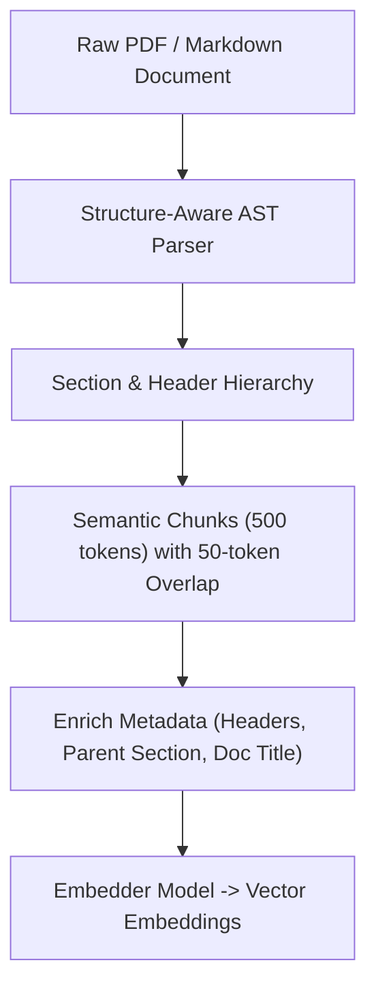

# Module 01: Parsing & Hierarchical Chunking

## Document Parsing & Hierarchical Chunking Pipeline

---

## 🗺️ Recommended Step-by-Step Learning Path

Follow this exact sequence to achieve complete mastery of this module:

| Step | File to Open | What You Will Do |
| :---: | :--- | :--- |
| **1** | **[01_README.md](01_README.md)** | Read conceptual overview, architectural foundations, and mental models. |
| **2** | **[00_FOUNDATIONS_PLAYGROUND.md](00_FOUNDATIONS_PLAYGROUND.md)** | Practice beginner spoonfed micro-drills and line-by-line syntax breakdowns. |
| **3** | **[00_try_it_yourself.py](00_try_it_yourself.py)** | Run in terminal (`python 00_try_it_yourself.py`) for an interactive zero-dependency sandbox. |
| **4** | **[04_TROUBLESHOOTING_AND_EDGE_CASES.md](04_TROUBLESHOOTING_AND_EDGE_CASES.md)** | Study forensic runbooks, edge cases, and real-world failure post-mortems. |
| **5** | **[03_SELF_ASSESSMENT_AND_CHALLENGES.md](03_SELF_ASSESSMENT_AND_CHALLENGES.md)** | Test your knowledge with self-assessment quizzes, challenges, and diagnostic scenarios. |
| **6** | **[02_PROJECT_GUIDE.md](02_PROJECT_GUIDE.md)** | Follow guided project implementation for `starter/` and `project_solution/`. |
| **7** | **[problems/](problems/)** | Solve hands-on problem bank challenges and verify with `pytest problems/tests`. |
| **8** | **[debug_lab/](debug_lab/)** | Diagnose and fix silent production bugs in the Bug Hunter Drill. |

---

## 1. Structural Document Parsing Foundations

Real-world enterprise documents (PDFs, DOCX, Markdown, HTML) are non-linear hierarchical data structures containing titles, headings, bullet lists, code blocks, and multi-column tables.

### 1.1 Naive Fixed-Window vs. Structural Chunking
- **Fixed-Window Chunking**: Chops raw text into character or token slices of size $K$ with overlap $O$. Slices across sentence boundaries, separates table headers from cell data, and destroys Markdown header hierarchies.
- **Structural AST Parsing**: Converts documents into an Abstract Syntax Tree (AST), preserving heading levels ($H_1, H_2, H_3$), code blocks, and table elements as discrete semantic blocks.

---

## 2. Parent-Child Hierarchical Architecture

Let a document $\mathcal{D}$ be partitioned into coarse parent blocks $\mathcal{P} = \{P_1, P_2, \dots, P_m\}$ and fine child blocks $\mathcal{C} = \{c_1, c_2, \dots, c_n\}$:
$$\bigcup_{j \in \text{children}(P_i)} c_j \subseteq P_i$$

1. **Indexing**: Embed only child blocks: $v_j = \text{Embed}(c_j)$. Store $v_j$ in vector index with metadata `{"parent_id": P_i}`.
2. **Querying**: Given user query $q$, compute top-$k$ nearest child vectors:
   $$\mathcal{C}^* = \arg\max_{c \in \mathcal{C}}^{(k)} \text{sim}(\text{Embed}(q), \text{Embed}(c))$$
3. **Context Assembly**: Deduplicate parent IDs $\mathcal{P}^* = \bigcup_{c \in \mathcal{C}^*} \text{parent\_id}(c)$ and inject full parent chunks into LLM context.