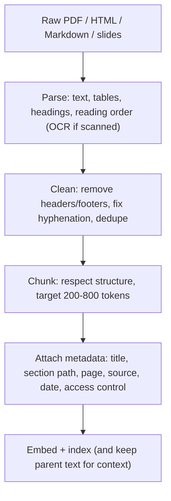

# Module 01: Parsing & Hierarchical Chunking

> **Architectural Scope**: Turning messy documents into clean text and tables, chunking strategies (fixed, recursive, semantic, structure-aware, hierarchical parent-child, late chunking), metadata enrichment, and how to evaluate a chunking choice.

---

## Why this module matters

A retrieval-augmented system can only answer from what it can *find*, and it can only find what was **parsed correctly and split sensibly**. Most "the model hallucinated" complaints in RAG trace back to ingestion: a PDF table flattened into nonsense, a heading separated from the paragraph it explains, a 500-token window that cut a sentence in half, or a chunk that says "it increased by 12%" without saying what "it" is. Better retrieval models and rerankers cannot fix information that was destroyed or fragmented before indexing. Ingestion quality is the foundation of everything else in this course.

## Mental model: cut the book into index cards

Imagine turning a textbook into index cards for a librarian to search. If the cards are too small, each one is a fragment with no context ("the value was 0.3"). If too large, each card mixes many topics, so a search for one fact retrieves a pile of noise and wastes the reader's attention. The best cards respect the book's own structure (chapter, section, paragraph), carry a label saying where they came from, and can point to a bigger card for context.

```mermaid
flowchart TD
    DOC["Raw PDF / HTML / Markdown / slides"] --> PARSE["Parse: text, tables, headings, reading order (OCR if scanned)"]
    PARSE --> CLEAN["Clean: remove headers/footers, fix hyphenation, dedupe"]
    CLEAN --> SPLIT["Chunk: respect structure, target 200-800 tokens"]
    SPLIT --> META["Attach metadata: title, section path, page, source, date, access control"]
    META --> EMB["Embed + index (and keep parent text for context)"]
```

## 1. Parsing: get the text and structure out intact

| Input | Pitfalls | Tools |
|---|---|---|
| Born-digital PDF | multi-column reading order, headers/footers repeated on every page, hyphenated line breaks, tables become word soup | PyMuPDF, pdfplumber, pypdf; layout-aware parsers (Unstructured, Docling, LlamaParse, Azure Document Intelligence, Google Document AI, Marker) |
| Scanned PDF / images | needs OCR; errors in numbers and tables | Tesseract, PaddleOCR, cloud OCR, vision-language models |
| HTML / web | nav bars, cookie banners, boilerplate | trafilatura, readability, BeautifulSoup |
| Office files, slides | slide order, speaker notes, embedded tables | python-docx, python-pptx, Unstructured |
| Markdown / code | headings and fenced code are structure to preserve | AST/markdown parsers, tree-sitter for code |

Principles: preserve **reading order**; keep **tables as tables** (convert to Markdown or HTML, or serialise each row with its header, e.g. "Q3 2024 | revenue | $4.2M" so a row is meaningful alone); extract **headings** to build a section hierarchy; **remove repeated boilerplate** (headers, footers, page numbers) which otherwise pollutes embeddings; describe or caption images and charts if they carry facts (a vision model can generate text for indexing). Always **spot-check parsed output** by eye on a sample of your worst documents.

## 2. Chunking strategies

| Strategy | How | Strength | Weakness |
|---|---|---|---|
| **Fixed-size (tokens) + overlap** | every `n` tokens, overlapping by `o` | trivial, predictable | cuts sentences and sections arbitrarily |
| **Recursive splitter** | split on paragraph, then sentence, then word until under the limit | respects natural boundaries; a good default (LangChain `RecursiveCharacterTextSplitter`) | ignores document structure |
| **Sentence / semantic chunking** | embed sentences; start a new chunk where similarity between neighbours drops | topic-coherent chunks | slower; sensitive to thresholds; not always better in benchmarks |
| **Structure-aware** | split on headings, list items, table boundaries, code functions | each chunk is a coherent unit; section path available | needs good parsing; sections can be huge or tiny |
| **Hierarchical / parent-child ("small-to-big")** | index **small** child chunks (for precise matching) but return the **larger parent** (section) to the LLM | precision of small chunks, context of large | more storage and plumbing |
| **Late chunking** | run a long-context embedding model over the whole document, then pool token embeddings per chunk | every chunk embedding "sees" the document context | needs a long-context embedder |
| **Proposition chunking** | rewrite text into self-contained factual statements | very precise retrieval | extra LLM cost, risk of rewrite errors |

**Size guidance** (tune, do not copy): 200 to 800 tokens for prose, 10 to 20% overlap, shorter for FAQ/QA content, section-sized for long-form reasoning. Check the **embedding model's maximum input** (typically 512 to 8,192 tokens) and note that very long chunks dilute the embedding of any single fact.

**Worked example.** A 10,000-token document, chunk size 500, overlap 50: stride `500 - 50 = 450`, number of chunks `ceil((10,000 - 500) / 450) + 1 = 23`. At 1,024-dimension FP32 vectors that is `23 x 4 KB = 92 KB` of vectors, trivial; a 10M-chunk corpus is about 40 GB of vectors, which is when index choice (course 10, Module 03) starts to matter. With **parent-child** chunking, index 128-token children (about 78 per document) and map each to a 1,024-token parent section; retrieval matches a precise sentence, and the LLM receives the whole section.

## 3. Metadata and context for every chunk

A chunk is much more useful with **metadata**:

- `doc_title`, `section_path` ("Handbook > Benefits > Parental leave"), `page`, `source_url`, `last_updated`, `author`, `language`, `doc_type`.
- **Access-control labels** (tenant, role, classification), so retrieval can filter *before* returning text. Never rely on the LLM to hide restricted content.
- **Prepending context to the chunk text** before embedding (for example the title and section path, or an LLM-generated one-sentence summary of where the chunk sits in the document) makes ambiguous chunks retrievable; this is the idea Module 02 (contextual retrieval) develops.
- Keep **stable chunk IDs** (hash of content + doc version) to support incremental re-indexing, deletions and citations.

## 4. Practical concerns

- **Incremental ingestion:** detect changed documents (hash, modified time), re-chunk and re-embed only those, delete stale chunks, and version the index.
- **Deduplication:** near-duplicate documents and boilerplate chunks (legal footers) crowd out useful results; dedupe by hash or MinHash.
- **Tables and code:** keep a table intact in one chunk when possible (or one chunk per row with headers); chunk code by function/class.
- **Multilingual and multimodal content:** use multilingual embedders; index image captions or use multimodal embeddings.
- **Cost:** parsing with vision models or LLM-based enrichment is expensive at scale; apply it to high-value documents.

## 5. Evaluating chunking

Do not pick chunk parameters by feel. Build a small **evaluation set**: 50 to 200 realistic questions with the document passages that answer them. Then compare strategies on **retrieval metrics** (hit rate / recall@k, MRR, nDCG) and **end-to-end answer quality** (course 12). Vary chunk size, overlap, parent-child on or off, and metadata prefixing, change one thing at a time, and look at failure cases by hand: the missed passages usually reveal the real problem (a split table, a missing heading).

## Common pitfalls

1. **Trusting the parser** without inspecting output for tables, columns and scanned pages.
2. **Fixed-size chunking only**, splitting sentences and sections arbitrarily.
3. **Chunks without context** ("it", "the above") and no title or section label.
4. **One-size-fits-all chunk size** for FAQs, contracts and code alike.
5. **Boilerplate pollution** (repeated headers/footers) distorting embeddings.
6. **No access-control metadata**, then trying to enforce security in the prompt.
7. **No incremental update path**: stale or duplicated chunks accumulate.
8. **Optimising chunking without an evaluation set.**

## How this connects

- **Module 02** adds LLM-generated context to chunks; **Module 03** indexes the resulting vectors; **Module 04** combines vector and keyword retrieval over the same chunks.
- **Module 05 to 08** build on whatever you retrieve; **Module 09** decides how much context to pass to the LLM.
- **Course 03, Module 19** (Lucene/BM25) and **Module 20** (vector databases) store these chunks; **Course 12** evaluates the whole pipeline.

## Go further

- roadmap.sh: *AI Engineer* RAG nodes on **chunking**, **embeddings**, **data preparation**; *Data Engineer* nodes on ingestion pipelines.
- Pinecone "Chunking strategies for LLM applications"; Weaviate "Chunking strategies for RAG"; LangChain text-splitters concepts; Unstructured and Docling documentation.
- Gunther et al., *Late Chunking: Contextual Chunk Embeddings Using Long-Context Embedding Models* (Jina, 2024).

---

## Module Study Progression
1. **Beginner Playground**: Read [00_FOUNDATIONS_PLAYGROUND.md](00_FOUNDATIONS_PLAYGROUND.md).
2. **Architecture Theory**: Study this [01_README.md](01_README.md).
3. **Hands-on Project**: Follow [02_PROJECT_GUIDE.md](02_PROJECT_GUIDE.md).
4. **Staff Interview Challenges**: Check [03_SELF_ASSESSMENT_AND_CHALLENGES.md](03_SELF_ASSESSMENT_AND_CHALLENGES.md).
5. **Production Debugging**: Review [04_TROUBLESHOOTING_AND_EDGE_CASES.md](04_TROUBLESHOOTING_AND_EDGE_CASES.md).
