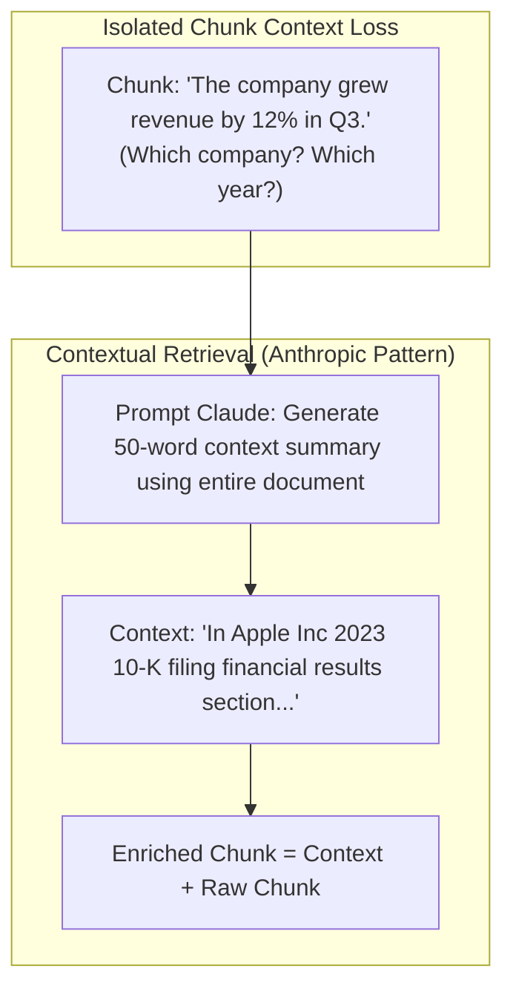

# Module 02: Contextual Retrieval Architecture

## Contextual Retrieval: Prepending Global Context

---

## 🗺️ Recommended Step-by-Step Learning Path

Follow this exact sequence to achieve complete mastery of this module:

| Step | File to Open | What You Will Do |
| :---: | :--- | :--- |
| **1** | **[01_README.md](01_README.md)** | Read conceptual overview, architectural foundations, and mental models. |
| **2** | **[00_FOUNDATIONS_PLAYGROUND.md](00_FOUNDATIONS_PLAYGROUND.md)** | Practice beginner spoonfed micro-drills and line-by-line syntax breakdowns. |
| **3** | **[00_try_it_yourself.py](00_try_it_yourself.py)** | Run in terminal (`python 00_try_it_yourself.py`) for an interactive zero-dependency sandbox. |
| **4** | **[04_TROUBLESHOOTING_AND_EDGE_CASES.md](04_TROUBLESHOOTING_AND_EDGE_CASES.md)** | Study forensic runbooks, edge cases, and real-world failure post-mortems. |
| **5** | **[03_SELF_ASSESSMENT_AND_CHALLENGES.md](03_SELF_ASSESSMENT_AND_CHALLENGES.md)** | Test your knowledge with self-assessment quizzes, challenges, and diagnostic scenarios. |
| **6** | **[02_PROJECT_GUIDE.md](02_PROJECT_GUIDE.md)** | Follow guided project implementation for `starter/` and `project_solution/`. |
| **7** | **[problems/](problems/)** | Solve hands-on problem bank challenges and verify with `pytest problems/tests`. |
| **8** | **[debug_lab/](debug_lab/)** | Diagnose and fix silent production bugs in the Bug Hunter Drill. |

---

## 1. Algorithmic Principles of Contextual Retrieval

Contextual Retrieval (Anthropic, 2024) solves the semantic isolation defect inherent in localized text chunking.

### 1.1 Mathematical Formulation
Let document $\mathcal{D}$ consist of chunks $(c_1, c_2, \dots, c_m)$.
In naive retrieval, embedding is applied to isolated text:
$$v_i = \text{Embed}(c_i)$$

In Contextual Retrieval, an auxiliary model $\mathcal{M}_{\text{context}}$ generates contextual prefix $p_i$:
$$p_i = \mathcal{M}_{\text{context}}(\mathcal{D}, c_i)$$
The augmented chunk $\tilde{c}_i$ is formed:
$$\tilde{c}_i = p_i \circ c_i$$
$$\tilde{v}_i = \text{Embed}(\tilde{c}_i)$$

### 1.2 Dual Indexing: Dense + BM25 Synergy
Contextual augmentation provides compounding benefits across both retrieval channels:
1. **Dense Vector Search**: Moves chunk vectors closer to broad semantic entity clusters (e.g. company names, domain taxonomy).
2. **Sparse Lexical Search (BM25)**: Adds critical exact keyword terms that are otherwise absent from localized pronouns ("the company", "it", "they").
Combining Contextual Dense + Contextual BM25 reduces retrieval failure rate by **up to $49\%$** compared to naive RAG.