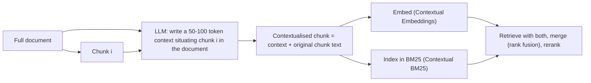

# Module 02: Contextual Retrieval Architecture

> **Architectural Scope**: Why chunks lose their context, Anthropic's Contextual Retrieval technique (contextual embeddings plus contextual BM25), generating chunk context with an LLM and prompt caching, the reported gains, cost, and cheaper alternatives.

---

## Why this module matters

Chunking (Module 01) makes documents searchable, but it has a side effect: **a chunk is read in isolation**. Consider the chunk *"The company's revenue grew by 3% over the previous quarter."* Which company? Which quarter? A user asking "What was ACME Corp's revenue growth in Q2 2023?" will not retrieve it, because neither "ACME" nor "Q2 2023" appears in the chunk. The text was clear in context and ambiguous out of it. **Contextual Retrieval** (Anthropic, 2024) fixes this by giving every chunk a short, LLM-written explanation of where it sits in its document *before* it is embedded or indexed. It is simple, works with any retriever, and in Anthropic's experiments cut retrieval failures by roughly half, or two-thirds with reranking.

## Mental model: a label on every index card

Each index card (chunk) gets a one-sentence label written by someone who has read the whole book: *"This chunk is from ACME Corp's Q2 2023 SEC filing; the previous quarter's revenue was $314M."* The card is now findable by the very words a user would type, and the reader seeing the retrieved card also understands it.


```mermaid
flowchart LR
    D["Full document"] --> C["Chunk i"]
    D --> L["LLM: write a 50-100 token context situating chunk i in the document"]
    C --> L
    L --> CC["Contextualised chunk = context + original chunk text"]
    CC --> E["Embed (Contextual Embeddings)"]
    CC --> B["Index in BM25 (Contextual BM25)"]
    E --> R["Retrieve with both, merge (rank fusion), rerank"]
    B --> R
```

## 1. The technique

For each chunk, prompt an LLM with the **whole document** and the **chunk**, and ask for a short situating context. Anthropic's published prompt is essentially:

```
<document>
{{WHOLE_DOCUMENT}}
</document>
Here is the chunk we want to situate within the whole document
<chunk>
{{CHUNK_CONTENT}}
</chunk>
Please give a short succinct context to situate this chunk within the overall document for the purposes of improving search retrieval of the chunk. Answer only with the succinct context and nothing else.
```

The generated context (typically 50 to 100 tokens) is **prepended to the chunk**, and that combined text is used for two indexes:

1. **Contextual Embeddings:** embed `context + chunk` instead of `chunk` alone.
2. **Contextual BM25:** index `context + chunk` in a keyword (BM25) index, so exact terms like names, dates and identifiers from the context are searchable.

At answer time, you can pass the **original chunk** (or the contextualised version) to the LLM; many systems pass the contextualised text so the model also benefits from the situating sentence.

## 2. Reported results

Anthropic measured the **top-20 retrieval failure rate** (the share of queries where the correct chunk is not in the top 20) across several datasets (codebases, fiction, scientific papers, finance):

| Configuration | Failure rate | Reduction vs baseline |
|---|---|---|
| Standard embeddings | about 5.7% | baseline |
| Contextual Embeddings | about 3.7% | **35%** fewer failures |
| Contextual Embeddings + Contextual BM25 | about 2.9% | **49%** fewer |
| + a reranker on the top 150 candidates, keeping the top 20 | about 1.9% | **67%** fewer |

(Figures are from Anthropic's "Introducing Contextual Retrieval" post; your gains depend on your corpus. Documents whose chunks are already self-contained benefit less.) The takeaways: combining semantic and lexical retrieval matters (Module 04), reranking adds a further large gain (Module 05), and *each layer reduces a different kind of miss*.

## 3. Cost and prompt caching

Calling an LLM once per chunk, with the whole document in each prompt, looks expensive: a 10,000-token document with 20 chunks means 20 calls that each include 10,000 tokens. **Prompt caching** solves this: the document is the **shared prefix** across all of that document's chunk calls, so after the first call it is read from the cache at a fraction of the normal input price, and only the small chunk-specific suffix is paid at full rate (this is exactly the prefix-caching idea of course 09, Module 04, applied at the API level). Anthropic estimated roughly **$1.02 per million document tokens** for a one-off contextualisation pass with a small, cheap model.

**Worked example.** A 50,000-document corpus of 5,000 tokens each is 250M tokens; at about $1 per million document tokens that is on the order of $250, paid **once at ingestion** (plus re-running for changed documents). Compared with the value of cutting retrieval misses by a third to a half, this is cheap, but it scales linearly with corpus size, so measure the benefit on a sample first.

Practical points:

- Use a **small, fast model** for context generation; the task is easy.
- The whole document must fit in the context window. For very long documents, give the model the surrounding pages or a document summary plus the chunk's neighbourhood instead of the entire text.
- Constrain the output (length cap, "answer only with the context") and spot-check for **hallucinated context**, which would poison both indexes.
- Store the context, the original chunk and metadata separately so you can re-embed with a different model without regenerating contexts.
- Re-generate contexts only for documents that change.

## 4. Cheaper and related alternatives

| Approach | Idea | Trade-off |
|---|---|---|
| **Metadata prefix** | prepend `Title > Section path` to each chunk (Module 01) | nearly free, captures much of the benefit when structure is good |
| **Late chunking** | embed the whole document with a long-context embedder and pool per chunk | no LLM calls; needs a long-context embedding model; embeddings only (BM25 unaffected) |
| **Doc2query / hypothetical questions** | generate questions each chunk answers and index them | improves question-style recall; extra LLM calls |
| **Chunk summaries** | embed a summary alongside the chunk | similar cost to contextual retrieval |
| **Parent-child retrieval** | match small chunks, return larger sections | gives the *reader* context but does not fix the *matching* problem for ambiguous chunks |

Contextual Retrieval is the most general fix for the *matching* problem, and it composes with all of the above.

## 5. Where it fits in a pipeline

1. **Ingest:** parse, chunk (Module 01), **generate context per chunk** (this module), embed and BM25-index.
2. **Query:** run vector search and BM25 search in parallel, **fuse** the rankings (Module 04), take about the top 100 to 150, **rerank** (Module 05), pass the top 5 to 20 to the LLM (Module 09 on how many).
3. **Evaluate:** measure recall@k before and after; check end-to-end answers (course 12).

## Common pitfalls

1. **Contextualising only the embeddings** and forgetting BM25 (the lexical side gains a lot from names and dates in the context).
2. **Not using prompt caching**, making ingestion far more expensive than necessary.
3. **Letting the context model hallucinate** facts not in the document.
4. **Long, verbose contexts** that dominate the chunk's embedding; keep them to 50 to 100 tokens.
5. **Assuming gains transfer** from published numbers; always measure on your own questions.
6. **Re-contextualising the entire corpus** on every small update.
7. **Ignoring document-length limits** by sending documents larger than the model's context window.

## How this connects

- **Module 01** supplies chunks and metadata; **Module 03** indexes the embeddings; **Module 04** merges semantic and BM25 results; **Module 05** reranks.
- **Course 09, Module 04**: prompt caching is prefix caching at the API level.
- **Course 12**: use retrieval metrics and answer-quality evaluation to prove the gain.

## Go further

- roadmap.sh: *AI Engineer* nodes on **RAG**, **embeddings**, **vector databases**, **chunking**.
- Anthropic, "Introducing Contextual Retrieval" (September 2024) and the accompanying cookbook notebook; Anthropic prompt caching documentation.
- Gunther et al., *Late Chunking* (2024); Nogueira et al., *Document Expansion by Query Prediction* (doc2query, 2019).

---

## Module Study Progression
1. **Beginner Playground**: Read [00_FOUNDATIONS_PLAYGROUND.md](00_FOUNDATIONS_PLAYGROUND.md).
2. **Architecture Theory**: Study this [01_README.md](01_README.md).
3. **Hands-on Project**: Follow [02_PROJECT_GUIDE.md](02_PROJECT_GUIDE.md).
4. **Staff Interview Challenges**: Check [03_SELF_ASSESSMENT_AND_CHALLENGES.md](03_SELF_ASSESSMENT_AND_CHALLENGES.md).
5. **Production Debugging**: Review [04_TROUBLESHOOTING_AND_EDGE_CASES.md](04_TROUBLESHOOTING_AND_EDGE_CASES.md).
