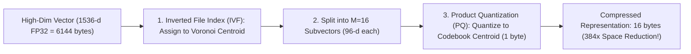

# Module 03: Vector Database Internals (HNSW & Product Quantization)

## Vector Database Internals: IVF-PQ Compression

## 1. Algorithmic Architecture of HNSW

Hierarchical Navigable Small World (HNSW; Malkov & Yashunin, IEEE TPAMI 2018) is the premier graph-based Approximate Nearest Neighbor (ANN) search index.

### 1.1 Multi-Layer Skip-Graph Mechanics
HNSW constructs a hierarchy of proximity graphs $\mathcal{G} = \{G_0, G_1, \dots, G_{L_{\text{max}}}\}$.
- The bottom layer $G_0$ contains all $N$ data vectors.
- Each upper layer $G_l$ contains an exponentially smaller subset of nodes. Node maximum layer assignment follows geometric distribution:
  $$l = \lfloor -\ln(\text{uniform}(0, 1)) \cdot m_L \rfloor, \quad m_L = \frac{1}{\ln(M)}$$
- Average graph degree is bounded by parameter $M$ ($M_0 = 2M$ for layer 0).

### 1.2 Greedy Routing Algorithm
Given query vector $q$:
1. Start at entry point node $v_{\text{entry}}$ at top layer $L_{\text{max}}$.
2. At layer $l$: evaluate cosine distance between $q$ and all neighbors of current node. Greedily step to the closest neighbor. Repeat until a local minimum is reached.
3. Drop down to layer $l-1$, using the local minimum as the new entry point.
4. At layer 0, expand search using a priority queue of size `efSearch` to return top-$k$ nearest neighbors.