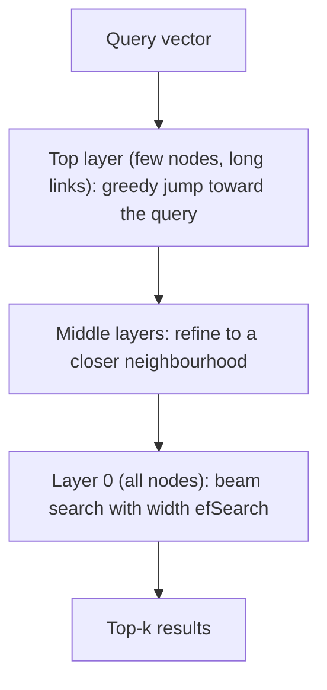

# Module 03: Vector Database Internals (HNSW & Product Quantization)

> **Architectural Scope**: Exact vs approximate nearest-neighbour search, the HNSW graph index (layers, `M`, `efConstruction`, `efSearch`), product quantization and IVF-PQ, other compression (scalar, binary), filtered search, memory sizing, and index operations.

---

## Why this module matters

Retrieval turns a question into a vector and asks: *which of my millions of stored vectors are closest?* Doing that exactly means comparing against every vector, which is far too slow at scale. Vector databases (Pinecone, Qdrant, Weaviate, Milvus, pgvector, FAISS, Elasticsearch/OpenSearch k-NN) all rely on **approximate nearest-neighbour (ANN)** indexes that trade a small, controllable loss in accuracy for orders of magnitude of speed. Knowing how HNSW and product quantization work lets you set parameters sensibly, estimate memory and cost, and diagnose why recall dropped or latency spiked.

## Mental model: a road network and a compressed map

- **HNSW** is like a road network with **highways on top and local streets below**. To reach a destination you take a highway to the right region, exit to progressively smaller roads, and finish on the streets, never visiting most of the map.
- **Product quantization** is like replacing each exact address with a **short code** that points to the nearest landmark in each of several small dictionaries: much smaller, slightly approximate, and distances can be computed from the codes directly.

```mermaid
flowchart TD
    Q["Query vector"] --> T["Top layer (few nodes, long links): greedy jump toward the query"]
    T --> M["Middle layers: refine to a closer neighbourhood"]
    M --> B["Layer 0 (all nodes): beam search with width efSearch"]
    B --> R["Top-k results"]
```

## 1. The baseline: exact search and distance metrics

**Exact (brute-force / "flat")** search computes the distance from the query to all `N` vectors of dimension `d`: `O(N d)` work. For `N = 10M` and `d = 1024` that is 10 billion multiply-adds per query: fine on a GPU for small `N`, but too slow and costly for interactive high-QPS search at large scale. It remains the **ground truth** for measuring ANN recall and is perfectly adequate below a few hundred thousand vectors.

**Metrics:** **cosine similarity**, **dot product** and **Euclidean (L2)** distance. If vectors are L2-normalised, cosine, dot and L2 give the **same ranking**, so normalise and use dot product (fastest). Use the metric your embedding model was trained for.

## 2. HNSW: Hierarchical Navigable Small World graphs

HNSW (Malkov and Yashunin, 2016) builds a **multi-layer proximity graph**:

- **Layer 0** contains every vector, each linked to its nearby neighbours.
- Higher layers contain exponentially fewer vectors (each node's top layer is drawn randomly, like a skip list, Course 02, Module 15) with longer-range links.
- **Search:** start at an entry point in the top layer; greedily move to the neighbour closest to the query until no improvement; drop one layer and repeat; on layer 0 run a **best-first beam search** keeping the `efSearch` best candidates, then return the top `k`.
- **Insert:** pick a random top layer for the new node, search down to find neighbours, connect to the best `M` (with a neighbour-selection heuristic that favours diverse directions), pruning links that exceed the limit.

Search cost grows roughly **logarithmically** in `N`.

**Parameters**

| Parameter | Meaning | Effect |
|---|---|---|
| `M` | links per node (layer 0 keeps up to `2M`) | higher: better recall and robustness, more memory, slower build (typical 8 to 64, default 16) |
| `efConstruction` | candidate list size while building | higher: better graph quality, slower build (typical 100 to 400) |
| `efSearch` (`ef`) | candidate list size at query time | the **recall/latency dial**: higher gives more recall and more latency; must be at least `k` |

**Memory:** HNSW is **memory-hungry and RAM-resident**. Per vector you store the vector itself (`4 d` bytes in FP32) plus links (about `2 M x 4` bytes on layer 0 plus upper layers): for `d = 1024`, `M = 16`, about `4,096 + 128 + a little = ~4.3 KB`. The vectors dominate, so compressing them (below) is the main memory lever.

Strengths: excellent recall/latency, supports incremental inserts, simple to use. Weaknesses: RAM cost, slower to build for huge sets, **deletions** are typically soft (tombstones, with periodic rebuild or compaction), and pre-filtering by metadata can hurt connectivity (below).

## 3. Product quantization (PQ) and IVF

**Product quantization** (Jegou et al., 2011) compresses vectors:

1. Split each `d`-dimensional vector into `m` sub-vectors of `d/m` dimensions.
2. For each sub-space, run k-means to learn a **codebook** of `256` centroids (so each sub-vector is represented by a one-byte ID).
3. Store each vector as `m` bytes.

**Worked example.** `d = 1024` in FP32 is 4,096 bytes. With `m = 64` sub-spaces, each vector becomes **64 bytes**: a **64x compression**. 100M vectors of dimension 768 in FP32 are `100M x 3,072 B = 307 GB`; with PQ at 64 bytes per vector it is **6.4 GB**, which fits in one machine's RAM instead of a cluster's.

**Distances without decompressing:** *asymmetric distance computation (ADC)* precomputes, for the query, a table of distances to every centroid in every sub-space; the distance to a stored vector is then the sum of `m` table lookups. Very fast and cache-friendly. The cost is quantisation error, so recall drops (typically recovered by **re-scoring** the top candidates with the original full-precision vectors from disk or RAM).

**IVF (inverted file index)** partitions the space with k-means into `nlist` clusters; a query only scans the `nprobe` nearest clusters. **IVF-PQ** combines both: IVF to avoid scanning everything, PQ to compress what is scanned. It is the classic billion-scale design (FAISS), with a lower RAM footprint than HNSW and somewhat lower recall at equal latency; `nprobe` is its recall/latency dial.

## 4. Other compression and index families

| Technique | Compression | Notes |
|---|---|---|
| **Scalar quantisation** (FP32 to INT8) | 4x | small recall loss, simple, widely supported |
| **Binary quantisation** (1 bit per dimension) | 32x | fast Hamming distance; best with high-dimensional models and **re-scoring** with full vectors |
| **Matryoshka embeddings** | truncate dimensions (for example 1024 to 256) | requires a model trained for it; big memory/speed savings |
| **DiskANN / Vamana** | graph on SSD, compressed vectors in RAM | billion-scale on one node with modest RAM |
| **ScaNN** (anisotropic quantisation), **SPANN** | optimised for inner-product recall or disk-based IVF | specialised high-scale options |

## 5. Filtering, hybrid use and operations

- **Metadata filtering** (tenant, date, permissions): *post-filtering* (search then filter) can return fewer than `k` results; *pre-filtering* (restrict first) can break graph connectivity or force brute force. Modern engines use **filter-aware traversal**, partitioned indexes per tenant, or hybrid strategies; test recall **with** your real filters, especially selective ones.
- **Sharding and replication:** shard by count or tenant for scale; replicate for QPS and availability; each shard is searched and results merged.
- **Updates:** HNSW supports inserts online; deletes are tombstones; heavy churn needs compaction/rebuild. Many systems use **segments** that are periodically merged (like LSM storage, Course 03).
- **Persistence and cost:** RAM-resident indexes are expensive; use quantisation, memory-mapped or disk-based indexes, and tiering when cost matters.
- **Choosing:** under about 100K to 1M vectors, flat or pgvector HNSW is simplest; up to tens of millions, HNSW (possibly with scalar quantisation); beyond that, IVF-PQ/DiskANN or a managed distributed vector database.

## 6. Measuring quality

- **Recall@k** against exact search on a sample of queries (what fraction of the true top-`k` the ANN index returned). Typical targets are 0.95 to 0.99.
- **Latency percentiles and QPS** at that recall. Always compare indexes **at equal recall**, plotting recall vs latency while sweeping `efSearch` or `nprobe`.
- **End-to-end retrieval quality** (does the relevant chunk appear?) matters more than ANN recall alone: a 0.99-recall index of a bad embedding is still bad.

## Common pitfalls

1. **Tuning `efSearch` without measuring recall**, or comparing indexes at different recall levels.
2. **Forgetting memory**: raw vectors dominate; compute `N x d x bytes` before provisioning.
3. **Using cosine vs dot vs L2 inconsistently** with how the embeddings were trained or normalised.
4. **Heavily selective filters** silently destroying recall or latency.
5. **Rebuild-heavy workloads on HNSW** (frequent deletes) without a compaction plan.
6. **PQ without re-scoring**, accepting avoidable recall loss.
7. **Mixing embedding model versions** in one index.
8. **Assuming ANN replaces keyword search**; it complements it (Module 04).

## How this connects

- **Module 01/02** produce the chunks that get embedded; **Module 04** fuses vector results with BM25; **Module 05** reranks the candidates this index returns; **Module 06** (ColBERT) stores *many vectors per document*.
- **Course 03, Module 20** (pgvector, Qdrant) and **Course 04, Module 21** (Milvus/Pinecone) apply these internals in real systems; **Course 02, Module 15** (skip lists) is the ancestor of HNSW's layered idea.

## Go further

- roadmap.sh: *AI Engineer* nodes **embeddings**, **vector databases**, **RAG**; *Inference Engineering* **embedding model inference**.
- Malkov and Yashunin, *Efficient and Robust ANN Search Using HNSW Graphs* (2016); Jegou et al., *Product Quantization for Nearest Neighbor Search* (2011); Subramanya et al., *DiskANN* (2019).
- Pinecone "Faiss: The Missing Manual" series (HNSW, PQ, IVF); FAISS wiki; Qdrant indexing documentation; ann-benchmarks.com.

---

## Module Study Progression
1. **Beginner Playground**: Read [00_FOUNDATIONS_PLAYGROUND.md](00_FOUNDATIONS_PLAYGROUND.md).
2. **Architecture Theory**: Study this [01_README.md](01_README.md).
3. **Hands-on Project**: Follow [02_PROJECT_GUIDE.md](02_PROJECT_GUIDE.md).
4. **Staff Interview Challenges**: Check [03_SELF_ASSESSMENT_AND_CHALLENGES.md](03_SELF_ASSESSMENT_AND_CHALLENGES.md).
5. **Production Debugging**: Review [04_TROUBLESHOOTING_AND_EDGE_CASES.md](04_TROUBLESHOOTING_AND_EDGE_CASES.md).
