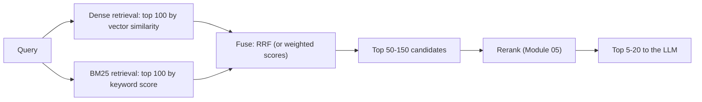

# Module 04: Hybrid Search & Reciprocal Rank Fusion (RRF)

> **Architectural Scope**: Why keyword and semantic retrieval fail in different ways, BM25 refresher, learned sparse retrieval, fusing ranked lists with Reciprocal Rank Fusion and weighted score fusion, candidate sizing, and implementations in common search engines.

---

## Why this module matters

Dense (embedding) retrieval understands meaning: "how do I reset my password?" matches "steps to recover account access". But it can miss **exact tokens** that matter: a product code `SKU-48213`, an error string `ECONNRESET`, a person's name, a rare acronym, a legal clause number. Keyword search (**BM25**) is the opposite: superb at exact and rare terms, blind to paraphrase. Real queries mix both, so the strongest practical default for production retrieval is **hybrid search**: run both and merge. The merging step is subtle because the two systems produce scores on incomparable scales; **Reciprocal Rank Fusion** solves that elegantly.

## Mental model: two experts, one committee

One expert has an excellent memory for exact words (BM25); the other understands what you *mean* (embeddings). Asked for the best documents, each hands over a ranked list. The committee does not try to compare their raw confidence numbers (which mean different things); it looks at **how high each document appears in each list**. A document both experts rank highly is almost certainly good.

## 1. BM25 in brief

BM25 scores a document `D` for query terms `q`:

`score(D, Q) = sum over q of IDF(q) x  f(q, D) x (k1 + 1) / ( f(q, D) + k1 x (1 - b + b x |D| / avgdl) )`

- **IDF** rewards rare terms (appearing in few documents).
- **Term-frequency saturation** (`k1`, typically 1.2 to 2.0): the 10th occurrence of a word adds much less than the 1st.
- **Length normalisation** (`b`, typically 0.75): long documents are not unfairly favoured.

It needs an **inverted index** (Course 03, Module 19), no training, handles any new vocabulary instantly, is cheap, and is explainable. **Learned sparse** models (SPLADE, BGE-M3 sparse) produce weighted term vectors with *expansion* (adding related terms), keeping the inverted-index infrastructure while capturing some semantics.

## 2. Where each retriever wins

| Query type | BM25 | Dense |
|---|---|---|
| Exact identifiers, error codes, SKUs, names, rare jargon | **strong** | often weak (embeddings blur rare tokens) |
| Paraphrase, synonyms, natural-language questions | weak (vocabulary mismatch) | **strong** |
| Multilingual / cross-lingual | weak | strong with multilingual models |
| Very short keyword queries | strong | variable |
| Long descriptive queries | moderate | strong |
| Out-of-domain vocabulary | robust | depends on training |

Because their errors are largely **uncorrelated**, fusing them recovers documents either one alone would miss. Benchmarks (BEIR, MTEB retrieval, vendor evaluations) consistently show hybrid at or above the better single method across diverse query sets.

## 3. Fusing the lists

### Option A: score fusion (weighted sum)

Normalise each system's scores to a common range (min-max or z-score) and combine: `score = alpha x dense_norm + (1 - alpha) x bm25_norm`. Pros: uses score magnitudes and a tunable `alpha`. Cons: scores are **not comparable** across systems or even across queries (BM25 scores are unbounded and corpus-dependent; cosine is bounded), normalisation is fragile (one outlier skews min-max), and `alpha` needs tuning per dataset.

### Option B: Reciprocal Rank Fusion (RRF)

Use only **ranks**. For each document `d` and each ranked list `r`:

`RRF(d) = sum over lists r of 1 / (k + rank_r(d))`

with a smoothing constant `k` (60 in Cormack et al., 2009; also the default in Elasticsearch and many engines). Documents are sorted by `RRF(d)`; a document missing from a list contributes nothing from it.

**Worked example** (`k = 60`):

| Document | Vector rank | BM25 rank | RRF score |
|---|---|---|---|
| A | 1 | 5 | `1/61 + 1/65 = 0.01639 + 0.01538 = 0.03177` |
| B | 2 | 1 | `1/62 + 1/61 = 0.01613 + 0.01639 = 0.03252` |
| C | 3 | not in top list | `1/63 = 0.01587` |
| D | not in list | 2 | `1/62 = 0.01613` |

Final order: **B, A, D, C**. B wins because it is near the top of *both* lists even though A was the dense system's favourite. A document ranked high by only one system (C, D) lands below documents ranked decently by both.

Why RRF is popular: **no score calibration**, nothing to normalise, robust to outliers, works across any number of lists (multiple retrievers, query rewrites, multiple embedding models), needs almost no tuning. Its weakness: it discards score *magnitudes* (a huge gap between rank 1 and rank 2 counts the same as a tiny one), and `k` slightly changes how much agreement matters (larger `k` flattens the influence of top ranks). **Weighted RRF** multiplies each list's contribution by a weight when you know one retriever is more trustworthy for your data.

## 4. Practical recipe

1. Retrieve **50 to 200 candidates from each** retriever (more candidates give fusion and the reranker more to work with; cost is mostly the reranker).
2. **Fuse** with RRF (default `k = 60`) or a tuned weighted sum.
3. Take the top `N` (often 50 to 150) as candidates for the **reranker** (Module 05), then the top 5 to 20 for the LLM.
4. Apply **metadata filters** in both retrievers consistently (permissions, tenant, date).
5. Include **query-side tricks** where useful: for BM25, analyzers (stemming, stop words, language), phrase boosts, synonym lists; for dense, query instructions/prefixes required by the embedding model.
6. **Evaluate on your own queries** (recall@k, nDCG, MRR) comparing BM25 only, dense only, hybrid; tune `alpha` or weights and candidate counts using that set (course 12).

**Where to run it:** Elasticsearch/OpenSearch (RRF retriever, hybrid query with normalisation), Weaviate (`hybrid` with `alpha` and fusion type), Qdrant (fusion/`Query` API with RRF), Pinecone (sparse-dense vectors), Vespa, Milvus (hybrid search with RRF/weighted rankers), PostgreSQL (`tsvector`/`ts_rank` or ParadeDB BM25 plus pgvector, fused in SQL with a `FULL OUTER JOIN` and an RRF expression).

## 5. Related ideas

- **Multi-query retrieval:** generate several rewrites of the query (Module 08), retrieve for each, and RRF-fuse all lists.
- **Contextual BM25** (Module 02): context-augmented chunks improve the lexical side.
- **Late interaction** (Module 06) can be fused the same way as another list.
- **Learning to rank** can replace hand-built fusion when you have click or judgement data.

## Common pitfalls

1. **Summing raw scores from different systems** without normalisation (BM25 dominates or vanishes).
2. **Too few candidates** per retriever, so fusion cannot recover anything.
3. **Applying filters in only one retriever**, leaking or dropping results inconsistently.
4. **Ignoring tokenisation/analyzers for BM25** (case, stemming, language, code identifiers split badly).
5. **Treating default `alpha` or `k` as optimal** without evaluation.
6. **Assuming hybrid always wins**: on purely conversational queries a strong embedder alone may do as well; measure.
7. **Forgetting duplicates**: the same chunk from both lists must be merged by ID, not double-counted as two items.

## How this connects

- **Module 02** (contextual BM25 and embeddings) feeds both retrievers; **Module 03** is the vector side; **Course 03, Module 19** is the BM25/Lucene side.
- **Module 05** reranks the fused candidates; **Module 08** adds multi-query lists; **Course 12** measures whether hybrid improved end-to-end quality.

## Go further

- roadmap.sh: *AI Engineer* RAG nodes; *Elasticsearch* roadmap for analyzers, BM25 and `rrf`.
- Cormack, Clarke, Buettcher, *Reciprocal Rank Fusion outperforms Condorcet and individual Rank Learning Methods* (SIGIR 2009); Formal et al., *SPLADE* (2021).
- Pinecone "Hybrid search" intro; Weaviate "Hybrid search explained"; Elasticsearch RRF documentation; Microsoft Azure AI Search "Hybrid search ranking".

---

## Module Study Progression
1. **Beginner Playground**: Read [00_FOUNDATIONS_PLAYGROUND.md](00_FOUNDATIONS_PLAYGROUND.md).
2. **Architecture Theory**: Study this [01_README.md](01_README.md).
3. **Hands-on Project**: Follow [02_PROJECT_GUIDE.md](02_PROJECT_GUIDE.md).
4. **Staff Interview Challenges**: Check [03_SELF_ASSESSMENT_AND_CHALLENGES.md](03_SELF_ASSESSMENT_AND_CHALLENGES.md).
5. **Production Debugging**: Review [04_TROUBLESHOOTING_AND_EDGE_CASES.md](04_TROUBLESHOOTING_AND_EDGE_CASES.md).
