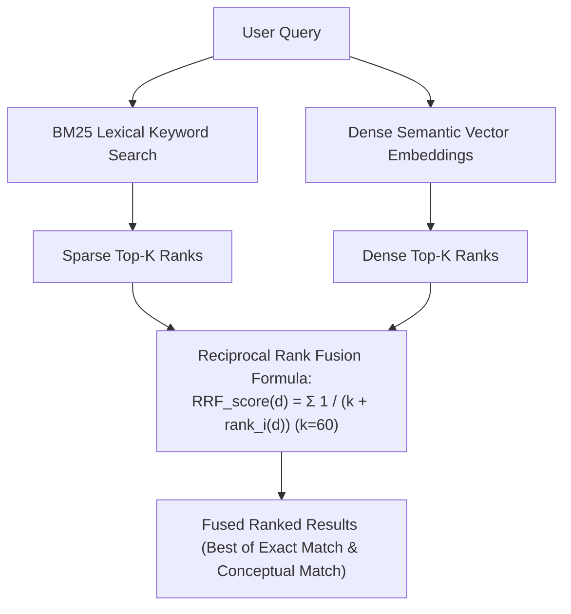

# Module 05: Multi-Stage Retrieval & Cross-Encoder Reranking

## Hybrid Search Reciprocal Rank Fusion (RRF)

## 1. Architecture of Two-Stage Search Pipelines

To balance sub-50ms latency SLAs with high Normalized Discounted Cumulative Gain (NDCG@10), production RAG architectures employ a staged retrieval cascade.

### 1.1 Bi-Encoder vs. Cross-Encoder Mechanics
- **Bi-Encoder**:
  $$s(q, d) = \langle f(q), g(d) \rangle$$
  $f(q)$ and $g(d)$ are computed independently. All document embeddings $g(d)$ are pre-computed offline. Query latency is bounded by fast vector index lookups ($O(\log N)$). However, no cross-attention occurs between query tokens and document tokens.
- **Cross-Encoder**:
  $$s(q, d) = \mathcal{M}_{\text{cross}}([q \circ d])$$
  Full self-attention is evaluated across all cross-token pairs $(t_{q,i}, t_{d,j})$:
  $$\text{Complexity} = O((|q| + |d|)^2)$$
  Computational cost prohibits evaluating all $N$ corpus documents.

### 1.2 Two-Stage Funnel Optimization
$$\mathcal{C} = \text{Retrieve}_{\text{Bi-Encoder}}(q, N_{\text{corpus}}, K_{\text{candidates}}=100)$$
$$\mathcal{R} = \text{Top}_K(\text{Rerank}_{\text{Cross-Encoder}}(q, \mathcal{C}, K_{\text{final}}=5))$$