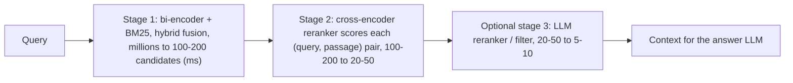

# Module 05: Multi-Stage Retrieval & Cross-Encoder Reranking

> **Architectural Scope**: The recall-then-precision cascade, bi-encoders vs cross-encoders, cross-encoder and LLM rerankers, latency and cost budgeting, handling redundancy and irrelevant results, and training or choosing a reranker.

---

## Why this module matters

First-stage retrieval (vectors, BM25, or both fused) is built to be **fast and to not miss** the right document: it scans millions of items in milliseconds, so it must score each one cheaply and independently of the query's fine detail. That makes it good at recall and mediocre at *ordering*. But an LLM can only read a handful of passages, and the right one needs to be **in that handful, near the top**. A **reranker** takes the first stage's few hundred candidates and re-scores each one with a far more accurate (and far slower) model, so the best few really are the best. In Anthropic's contextual-retrieval experiments, adding reranking to hybrid retrieval cut failures from about 2.9% to about 1.9%, the single biggest step in that pipeline after hybrid itself.

## Mental model: a broad net, then a careful judge

First stage: a fisherman casts a wide net and pulls in 150 fish quickly. Second stage: an expert examines each fish individually and keeps the best five. You cannot have the expert examine the whole ocean (too slow), and the net alone cannot tell a good fish from a mediocre one.

```mermaid
flowchart LR
    Q["Query"] --> S1["Stage 1: bi-encoder + BM25, hybrid fusion, millions to 100-200 candidates (ms)"]
    S1 --> S2["Stage 2: cross-encoder reranker scores each (query, passage) pair, 100-200 to 20-50"]
    S2 --> S3["Optional stage 3: LLM reranker / filter, 20-50 to 5-10"]
    S3 --> L["Context for the answer LLM"]
```

## 1. Bi-encoder vs cross-encoder

| | Bi-encoder (first stage) | Cross-encoder (reranker) |
|---|---|---|
| How | encode query and document **separately** into vectors; compare with dot product | feed `[CLS] query [SEP] passage` **together** into one Transformer; output a relevance score |
| Interaction | none until the final dot product | **full token-level attention between query and passage** |
| Precompute | document vectors computed offline and indexed | impossible; every pair is scored at query time |
| Cost per query | `O(1)` encode + ANN search | `O(candidates)` full forward passes |
| Quality | good, limited by the single-vector bottleneck | substantially better at fine distinctions (negation, entities, exact conditions) |

The cross-encoder can notice that "How do I **not** enable two-factor auth?" is different from a passage about enabling it, because the query tokens attend to the passage tokens directly. The price is that it cannot be indexed. ColBERT-style late interaction (Module 06) is a middle path.

## 2. Types of rerankers

- **Cross-encoder models:** compact, often 20M to 500M parameters (MiniLM-based `ms-marco` cross-encoders, BGE-reranker, mixedbread, Jina reranker, Cohere Rerank API, Voyage rerank). Fast, cheap, a strong default.
- **LLM rerankers:** ask a language model to judge relevance.
  - *Pointwise:* "Is this passage relevant to the query? yes/no" and use the probability.
  - *Listwise* (RankGPT, RankZephyr): give the model the query and many passages and ask for a ranked list. Highest quality, highest cost and latency, and subject to position bias and context limits.
  - *Pairwise:* compare two passages at a time (expensive, `O(n log n)` or more).
- **Hybrid cascade:** a cheap cross-encoder narrows 150 to 30, then an LLM listwise rerank orders the 30 (or simply decides which to keep).

## 3. Latency and cost budget

Reranking cost scales with `candidates x (query + passage length)`.

**Worked example.** A cross-encoder of MiniLM size on a GPU can score a batch of pairs at roughly 1 to 3 ms per 300-token pair when batched (varies widely with hardware and batch size), so 100 candidates take about 100 to 300 ms on a modest GPU, or tens of ms on a good one; on CPU it can be seconds. A budget for a 1-second time-to-first-answer pipeline might be: query embedding 10 ms, vector search 20 ms, BM25 15 ms (parallel), fusion 1 ms, **rerank 100 to 150 ms**, LLM prefill and first token 400 to 600 ms. An LLM listwise reranker on 50 passages of 200 tokens is `50 x 200 = 10,000` input tokens per query, several hundred milliseconds to seconds and real money at high QPS.

Levers: rerank **fewer** candidates (50 instead of 200 once fusion is good), **truncate** passages to what matters (the first 256 to 512 tokens), use smaller or quantised rerankers, batch aggressively, run on GPU, cache scores for repeated (query, passage) pairs, and use **early exit** (skip reranking when first-stage scores show an obvious winner).

## 4. Designing the cascade

1. **Stage 1 sized for recall.** Pick `N` so that *recall@N* of the first stage is high (95%+). Measure recall@50, @100, @200 with your evaluation set; reranking cannot recover a passage that was never retrieved.
2. **Stage 2 sized for precision.** Rerank those `N`, keep the top `k` (5 to 20) for the LLM. Measure **nDCG@k, MRR, precision@k** before and after.
3. **Threshold, don't always return `k`.** If the best reranker score is low, the corpus may not contain the answer. Returning *nothing* (or "I don't know") beats feeding irrelevant passages to the LLM. Calibrate a score threshold on labelled data.
4. **Diversity.** Top results are often near-duplicates; use **MMR** (maximal marginal relevance) or dedupe so the limited context covers different facts.
5. **Ordering for the LLM.** Models tend to use information at the start and end of a long context better than the middle (Module 09: "lost in the middle"); put the strongest passages first (and sometimes last).
6. **Keep metadata:** reranker input can include the title or section path, not just the body, which helps disambiguate.

## 5. Choosing or training a reranker

- Start with a strong off-the-shelf reranker; compare 2 to 3 on **your** data (public leaderboards such as BEIR/MTEB rerank sets are a guide, not a guarantee).
- **Fine-tune** when you have domain data: train with **hard negatives** (passages that look relevant but are not; mine them from your first stage) using pairwise or listwise loss; **distil** an expensive LLM reranker into a small cross-encoder to get most of the quality at a fraction of the cost.
- Watch the **maximum input length** (commonly 512 tokens): long passages get truncated; chunk sizes from Module 01 should fit.
- **Multilingual** needs a multilingual reranker.
- Version and monitor the reranker like any model; re-evaluate after changing chunking or embeddings.

## Common pitfalls

1. **Reranking too few candidates**, so the right passage never reaches stage 2.
2. **Reranking too many**, blowing the latency budget with little gain.
3. **Ignoring truncation**: the answer sits beyond the reranker's input limit.
4. **Always passing the top `k` regardless of score**, feeding noise to the LLM.
5. **Evaluating only end-to-end answer quality** and never measuring retrieval separately, so you cannot tell which stage failed.
6. **Using an LLM listwise reranker without handling position bias** and context-limit overflow.
7. **Skipping GPU/batching**, which makes a fine reranker look too slow.
8. **Treating reranker scores as probabilities** across queries without calibration.

## How this connects

- **Module 04** supplies the fused candidates; **Module 06** (ColBERT) is a cheaper intermediate scorer; **Module 08** (query transformation) improves what stage 1 sees; **Module 09** decides how much of the reranked output to pass on and in what order.
- **Course 12** supplies retrieval and end-to-end evaluation; **Course 09** covers serving rerankers efficiently (batching, quantisation).

## Go further

- roadmap.sh: *AI Engineer* RAG nodes; *Inference Engineering* **embedding model inference**.
- Nogueira and Cho, *Passage Re-ranking with BERT* (2019); Sun et al., *Is ChatGPT Good at Search? (RankGPT)* (2023); Reimers, Sentence-Transformers "Retrieve and Re-Rank"; Pinecone "Rerankers and two-stage retrieval"; Weaviate "Cross-encoders as reranker".
- Carbonell and Goldstein, *The Use of MMR, Diversity-Based Reranking* (SIGIR 1998).

---

## Module Study Progression
1. **Beginner Playground**: Read [00_FOUNDATIONS_PLAYGROUND.md](00_FOUNDATIONS_PLAYGROUND.md).
2. **Architecture Theory**: Study this [01_README.md](01_README.md).
3. **Hands-on Project**: Follow [02_PROJECT_GUIDE.md](02_PROJECT_GUIDE.md).
4. **Staff Interview Challenges**: Check [03_SELF_ASSESSMENT_AND_CHALLENGES.md](03_SELF_ASSESSMENT_AND_CHALLENGES.md).
5. **Production Debugging**: Review [04_TROUBLESHOOTING_AND_EDGE_CASES.md](04_TROUBLESHOOTING_AND_EDGE_CASES.md).
