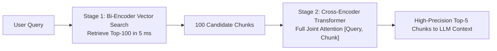

# Module 06: ColBERTv2 & Late Interaction


## Two-Stage Retrieval & Cross-Encoder Reranker



---

## 🗺️ Recommended Step-by-Step Learning Path

Follow this exact sequence to achieve complete mastery of this module:

| Step | File to Open | What You Will Do |
| :---: | :--- | :--- |
| **1** | **[01_README.md](01_README.md)** | Read conceptual overview, architectural foundations, and mental models. |
| **2** | **[00_FOUNDATIONS_PLAYGROUND.md](00_FOUNDATIONS_PLAYGROUND.md)** | Practice beginner spoonfed micro-drills and line-by-line syntax breakdowns. |
| **3** | **[00_try_it_yourself.py](00_try_it_yourself.py)** | Run in terminal (`python 00_try_it_yourself.py`) for an interactive zero-dependency sandbox. |
| **4** | **[04_TROUBLESHOOTING_AND_EDGE_CASES.md](04_TROUBLESHOOTING_AND_EDGE_CASES.md)** | Study forensic runbooks, edge cases, and real-world failure post-mortems. |
| **5** | **[03_SELF_ASSESSMENT_AND_CHALLENGES.md](03_SELF_ASSESSMENT_AND_CHALLENGES.md)** | Test your knowledge with self-assessment quizzes, challenges, and diagnostic scenarios. |
| **6** | **[02_PROJECT_GUIDE.md](02_PROJECT_GUIDE.md)** | Follow guided project implementation for `starter/` and `project_solution/`. |
| **7** | **[problems/](problems/)** | Solve hands-on problem bank challenges and verify with `pytest problems/tests`. |
| **8** | **[debug_lab/](debug_lab/)** | Diagnose and fix silent production bugs in the Bug Hunter Drill. |

---

## 1. Mathematical Formulation of Late Interaction

ColBERT (Khattab & Zaharia, SIGIR 2020) decouples query token encoding from document token encoding while preserving fine-grained token-level cross interactions through the **MaxSim** operator.

### 1.1 The MaxSim Operator
Let $E_q \in \mathbb{R}^{|Q| \times d}$ denote L2-normalized query token embeddings and $E_d \in \mathbb{R}^{|D| \times d}$ denote L2-normalized document token embeddings:
$$S(Q, D) = \sum_{i=1}^{|Q|} \max_{j \in \{1, \dots, |D|\}} \langle E_q^{(i)}, E_d^{(j)} \rangle$$

```
Query Tokens E_q:
[ q_1 ] ------(dot products with all d_j)------> max score: 0.85
[ q_2 ] ------(dot products with all d_j)------> max score: 0.92
[ q_3 ] ------(dot products with all d_j)------> max score: 0.74
                                                  ----------------
                                                  Sum = 2.51 (Score)
```

### 1.2 ColBERTv2 Residual Compression
To store billions of token vectors in memory:
1. **Centroid Codebook**: Group document token vectors into $K=32,768$ clusters with centroids $C$.
2. **Residual Quantization**:
   $$E_d^{(j)} = C_{k} + r_j$$
   Store 16-bit centroid ID $k$ and compress residual vector $r_j$ with 1-bit or 2-bit quantization.
3. Memory consumption collapses from $128 \text{ bytes}$ per token vector down to **$1.5 - 2 \text{ bytes}$**, enabling billion-scale in-memory indexing.