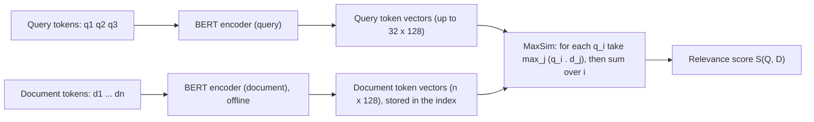

# Module 06: ColBERTv2 & Late Interaction

> **Architectural Scope**: Single-vector bottleneck, token-level late interaction with the MaxSim operator, ColBERT indexing and search, ColBERTv2 residual compression and denoised training, PLAID retrieval, storage maths, and when multi-vector retrieval is worth its cost.

---

## Why this module matters

Module 05 contrasted two ways to score a (query, passage) pair: a **bi-encoder** (fast, one vector per text, but the whole passage is squeezed into a single point) and a **cross-encoder** (accurate, but nothing can be precomputed). **Late interaction**, introduced by ColBERT, sits between them: keep **one vector per token**, precompute and index them offline, and compare query and passage tokens *late*, at search time, with a cheap operator. You get much of the cross-encoder's fine-grained matching with a bi-encoder-like ability to precompute, and it often generalises better to new domains and rare terms. ColBERTv2's compression made it practical at scale.

## Mental model: matching every query word to its best partner

A single-vector model summarises "red running shoes for flat feet" and "lightweight trainers with arch support" each as one point and measures the distance. ColBERT instead keeps a vector for every word. For each query word it finds the **most similar word in the document** (the best partner), and adds up those best-match scores. "Flat feet" finds "arch support"; "running" finds "trainers"; each query idea gets credit wherever it is covered in the document, and an unmatched query term costs score.

```mermaid
flowchart LR
    Q["Query tokens: q1 q2 q3"] --> E1["BERT encoder (query)"] --> EQ["Query token vectors (up to 32 x 128)"]
    D["Document tokens: d1 ... dn"] --> E2["BERT encoder (document), offline"] --> ED["Document token vectors (n x 128), stored in the index"]
    EQ --> M["MaxSim: for each q_i take max_j (q_i . d_j), then sum over i"]
    ED --> M
    M --> S["Relevance score S(Q, D)"]
```

## 1. The MaxSim operator

Let the query have token vectors `E_q = [q_1 ... q_m]` and a document `E_d = [d_1 ... d_n]`, all L2-normalised (typically `128` dimensions after a linear projection from BERT's 768). The relevance score is

`S(Q, D) = sum over i = 1..m of ( max over j = 1..n of  q_i . d_j )`.

**Worked example.** Three query tokens; the largest dot products against the document's tokens are 0.85, 0.92 and 0.74. Score `= 0.85 + 0.92 + 0.74 = 2.51`. A document that matches only two of the three ideas, say 0.85, 0.92 and 0.20, scores 1.97. A single-vector model has no explicit mechanism to reward *covering every part of the query*.

Properties:

- **Late:** query and document are encoded **independently** (so documents can be precomputed) and only interact at the end through MaxSim.
- **Cheap interaction:** `m x n` dot products per pair, with `m <= 32` (queries are padded with `[MASK]` tokens to a fixed length, a trick called **query augmentation** that lets the model add soft expansion terms).
- **Interpretable:** you can see which document token each query token matched.
- Trained end-to-end with a contrastive/ranking loss so token vectors become good at fine-grained matching.

## 2. Indexing and search in ColBERT

- **Index:** every token of every passage becomes a stored vector. For a corpus like MS MARCO (about 8.8M passages) that is roughly **600 million** token vectors.
- **Search (PLAID in ColBERTv2):**
  1. **Candidate generation:** for each query token vector, find its nearest **centroids** (from a k-means codebook, below) and collect the passages that contain tokens assigned to those centroids.
  2. **Centroid interaction and pruning:** approximate each candidate's score using only centroid IDs (very cheap), and prune weak candidates.
  3. **Exact scoring:** for the survivors, **decompress** their token vectors and compute exact MaxSim; return the top `k`.
- ColBERT can be used as a **first-stage retriever** (as above) or, much more cheaply, as a **reranker** over candidates from BM25 or dense retrieval, scoring only those documents' stored token vectors (then no ANN index is needed over tokens).

## 3. ColBERTv2: residual compression

Storing 600M vectors at 128 dimensions in FP16 is `600M x 256 B = ~154 GB`, far too much. ColBERTv2 (Santhanam et al., 2022) compresses with **residual quantisation**:

1. Run k-means over a sample of token vectors to learn a codebook of **centroids** (their number is proportional to the square root of the total vector count, on the order of tens to hundreds of thousands).
2. Store each token vector as **(a) the ID of its nearest centroid** and **(b) a heavily quantised residual**, the difference between the vector and its centroid, keeping only **1 or 2 bits per dimension**.
3. To score, reconstruct `centroid + dequantised residual`.

Storage per token vector (128 dimensions): **2-bit residual = 32 bytes + centroid ID of about 4 bytes = about 36 bytes**; **1-bit residual = 16 bytes + ID = about 20 bytes**. Compared with 256 bytes in FP16, that is roughly **7x to 13x smaller** (the paper reports 6x to 10x index reduction) with little quality loss, because most of the information is in *which centroid* and the residual only has to correct a small error. (Some older teaching material quotes "1.5 to 2 bytes per vector"; that would be far below what 128 dimensions at even 1 bit each require. A 128-bit residual alone is 16 bytes.)

**Storage example.** A 128-token passage: uncompressed FP16 token vectors = `128 x 256 B = 32 KiB`; ColBERTv2 at 2 bits = `128 x 36 B = 4.5 KiB`; at 1 bit = `128 x 20 B = 2.5 KiB`. For comparison, a single 768-dimensional FP32 embedding is 3 KiB: compressed late interaction costs about the same order as a single-vector index per passage, but stores many vectors instead of one.

## 4. ColBERTv2 training: denoised supervision

ColBERTv2 also improves training: it uses **hard negatives** mined with an earlier ColBERT model, and **distils** relevance scores from a **cross-encoder** teacher into the late-interaction student (a KL-divergence loss over a list of candidate passages). This pairs the cross-encoder's accuracy with late interaction's efficiency and made ColBERTv2 strong **out of domain**, where single-vector models often drop sharply.

## 5. When to use it

| Strengths | Costs and limits |
|---|---|
| Better **out-of-domain** and rare-term matching than single-vector dense retrieval | Larger and more complex index than single-vector (though compression closes much of the gap) |
| Fine-grained matching of entities, negation and conditions | Fewer managed services support multi-vector natively (Vespa, Qdrant multivector, Weaviate, Elasticsearch late-interaction/rank-vectors, RAGatouille / Stanford ColBERT, Jina-ColBERT-v2, PyLate) |
| Interpretable token-level matches | Query-time work grows with candidates and query length |
| Can serve as an efficient reranker | Model choice matters: multilingual and long-document variants vary in quality |
| **ColPali**-style models extend the idea to page images for visually rich documents | Chunk lengths: very long passages produce many vectors |

Practical guidance: if your hybrid + cross-encoder pipeline (Modules 04 and 05) meets quality targets, you may not need it. Try ColBERT when (a) your domain is far from the training data of off-the-shelf embedders, (b) rare terminology and exact conditions matter, or (c) you want a cheaper, better-than-bi-encoder reranking stage than a full cross-encoder. Evaluate on your own queries, and consider **fusing** it with BM25 and dense results using RRF (Module 04).

## Common pitfalls

1. **Comparing storage using single vectors only**: remember late interaction stores `n` vectors per passage.
2. **Using uncompressed token vectors at scale** (hundreds of GB).
3. **Applying MaxSim without normalising** the vectors (scores become length-dependent).
4. **Chunking long documents poorly**: huge passages mean huge numbers of vectors and diluted matching.
5. **Expecting the cross-encoder's accuracy**: ColBERT is usually a notch below a full cross-encoder, much cheaper.
6. **Mismatching query augmentation or tokeniser** between training and inference.
7. **Treating it as a drop-in vector-DB index**: it needs a multi-vector-aware engine or ColBERT/PLAID tooling.

## How this connects

- **Module 03** covers the single-vector indexes ColBERT's centroid search resembles (IVF/PQ ideas); **Module 05** is the cross-encoder it approximates; **Module 04**'s RRF can fuse ColBERT results with others.
- **Course 06, Module 06** (attention) provides the BERT-style encoders underneath.

## Go further

- roadmap.sh: *AI Engineer* RAG and embeddings nodes.
- Khattab and Zaharia, *ColBERT: Efficient and Effective Passage Search via Contextualized Late Interaction over BERT* (SIGIR 2020); Santhanam et al., *ColBERTv2* (NAACL 2022) and *PLAID* (CIKM 2022); Faysse et al., *ColPali* (2024).
- Weaviate "Late interaction overview"; Stanford ColBERT repository; Jina ColBERT documentation.

---

## Module Study Progression
1. **Beginner Playground**: Read [00_FOUNDATIONS_PLAYGROUND.md](00_FOUNDATIONS_PLAYGROUND.md).
2. **Architecture Theory**: Study this [01_README.md](01_README.md).
3. **Hands-on Project**: Follow [02_PROJECT_GUIDE.md](02_PROJECT_GUIDE.md).
4. **Staff Interview Challenges**: Check [03_SELF_ASSESSMENT_AND_CHALLENGES.md](03_SELF_ASSESSMENT_AND_CHALLENGES.md).
5. **Production Debugging**: Review [04_TROUBLESHOOTING_AND_EDGE_CASES.md](04_TROUBLESHOOTING_AND_EDGE_CASES.md).
