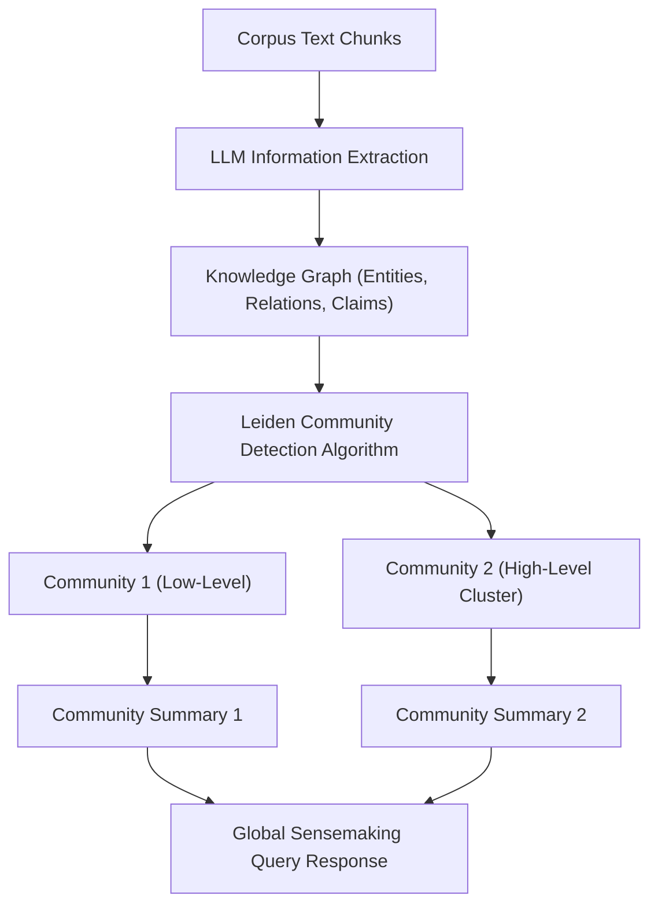

# Module 07: Microsoft GraphRAG & Knowledge Graphs

## GraphRAG Knowledge Graph & Community Summarization

---

## 🗺️ Recommended Step-by-Step Learning Path

Follow this exact sequence to achieve complete mastery of this module:

| Step | File to Open | What You Will Do |
| :---: | :--- | :--- |
| **1** | **[01_README.md](01_README.md)** | Read conceptual overview, architectural foundations, and mental models. |
| **2** | **[00_FOUNDATIONS_PLAYGROUND.md](00_FOUNDATIONS_PLAYGROUND.md)** | Practice beginner spoonfed micro-drills and line-by-line syntax breakdowns. |
| **3** | **[00_try_it_yourself.py](00_try_it_yourself.py)** | Run in terminal (`python 00_try_it_yourself.py`) for an interactive zero-dependency sandbox. |
| **4** | **[04_TROUBLESHOOTING_AND_EDGE_CASES.md](04_TROUBLESHOOTING_AND_EDGE_CASES.md)** | Study forensic runbooks, edge cases, and real-world failure post-mortems. |
| **5** | **[03_SELF_ASSESSMENT_AND_CHALLENGES.md](03_SELF_ASSESSMENT_AND_CHALLENGES.md)** | Test your knowledge with self-assessment quizzes, challenges, and diagnostic scenarios. |
| **6** | **[02_PROJECT_GUIDE.md](02_PROJECT_GUIDE.md)** | Follow guided project implementation for `starter/` and `project_solution/`. |
| **7** | **[problems/](problems/)** | Solve hands-on problem bank challenges and verify with `pytest problems/tests`. |
| **8** | **[debug_lab/](debug_lab/)** | Diagnose and fix silent production bugs in the Bug Hunter Drill. |

---

## 1. Algorithmic Architecture of GraphRAG

GraphRAG (Edge et al., Microsoft Research 2024) unifies Knowledge Graph extraction with hierarchical community detection to enable global dataset-wide summarization.

### 1.1 Ingestion & Graph Construction Pipeline
1. **Source Document Chunking**: Raw corpus $\mathcal{D}$ is partitioned into text chunks $c_i$.
2. **Entity & Relationship Extraction**: An extraction LLM identifies typed entities $\mathcal{E}$ and directed relationships $\mathcal{R} \subseteq \mathcal{E} \times \mathcal{E}$.
3. **Hierarchical Community Clustering (Leiden Algorithm)**:
   The graph is partitioned into a hierarchy of non-overlapping communities $C_1, C_2, \dots, C_k$ by maximizing modularity:
   $$\mathcal{H} = \sum_{c} \left[ \frac{e_c}{2m} - \gamma \left(\frac{K_c}{2m}\right)^2 \right]$$
4. **Community Report Generation**: An LLM writes structured natural language reports for each cluster at varying levels of abstraction (macro, meso, micro).

### 1.2 Global Search vs. Local Search Execution
- **Global Search (Map-Reduce)**: For high-level thematic queries, community reports at layer $L$ are scored, selected, and aggregated in parallel via Map-Reduce summarization.
- **Local Search**: For entity-focused queries, the graph traverses immediate 1-hop and 2-hop neighborhoods, combining graph context with raw text chunks.