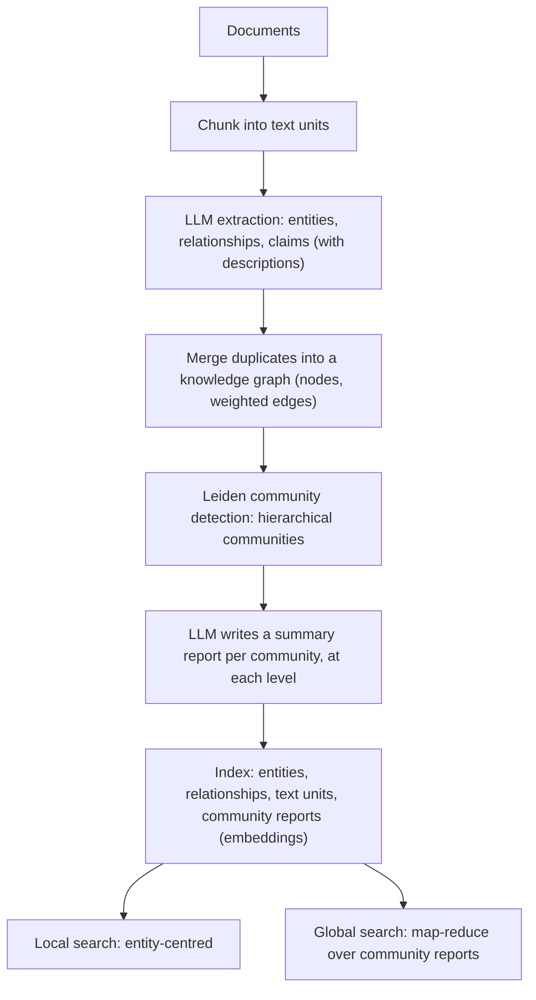

# Module 07: Microsoft GraphRAG & Knowledge Graphs

> **Architectural Scope**: Limits of chunk-based RAG for relational and corpus-wide questions, the GraphRAG indexing pipeline (entity and relationship extraction, graph construction, Leiden community detection, community summaries), local vs global search, cost and evaluation, and when a knowledge graph is the right tool.

---

## Why this module matters

Standard RAG retrieves the few chunks most similar to the question. That works for *"What is our refund window?"* but fails for two families of questions: **global** questions about a whole corpus (*"What are the main themes across these 5,000 support tickets?"*, *"How have attitudes to the merger evolved?"*) where no single chunk contains the answer and top-`k` retrieval samples a tiny, biased slice; and **multi-hop relational** questions (*"Which suppliers of our delayed product are also owned by the company we are suing?"*) where the answer requires connecting facts scattered across documents. **GraphRAG** (Microsoft Research, Edge et al., 2024) addresses both by building a **knowledge graph** from the text with an LLM, clustering it into **communities**, and pre-writing **summaries** at several levels, which become retrievable evidence for different kinds of questions.

## Mental model: a map of who and what is connected, with chapter summaries per neighbourhood

Plain RAG is a search engine over paragraphs. GraphRAG first draws a **map**: places (entities such as people, organisations, products, events), roads (relationships between them), and neighbourhoods (communities of densely connected entities). For each neighbourhood a writer prepares a one-page briefing. Then, to answer "what are the big themes?", you read the neighbourhood briefings; to answer a question about one person, you look at that person, their neighbours, and the relevant source paragraphs.

```mermaid
flowchart TD
    DOCS["Documents"] --> CH["Chunk into text units"]
    CH --> EX["LLM extraction: entities, relationships, claims (with descriptions)"]
    EX --> KG["Merge duplicates into a knowledge graph (nodes, weighted edges)"]
    KG --> CD["Leiden community detection: hierarchical communities"]
    CD --> CS["LLM writes a summary report per community, at each level"]
    CS --> IDX["Index: entities, relationships, text units, community reports (embeddings)"]
    IDX --> LS["Local search: entity-centred"]
    IDX --> GS["Global search: map-reduce over community reports"]
```

## 1. The indexing pipeline

1. **Text units:** split documents into chunks (Module 01); these remain the ground-truth provenance.
2. **Extraction:** prompt an LLM on each chunk to list **entities** (name, type, description) and **relationships** (source, target, description, strength), and optionally **claims** (factual statements about entities). Multiple **"gleaning"** passes (asking "did you miss any?") raise recall at extra cost. Few-shot examples tuned to your domain matter a lot.
3. **Graph construction:** merge extractions across chunks; identical entity names are unified (entity resolution), descriptions are summarised, edge weights count how often relationships were seen. The result is a graph with entities as nodes and relationships as weighted edges.
4. **Community detection:** run the **Leiden algorithm** (a refinement of Louvain modularity clustering) to partition the graph into densely connected **communities**, recursively, producing a **hierarchy**: level 0 has a few large communities (broad themes), deeper levels have many small ones (specific topics).
5. **Community reports:** an LLM writes a structured **summary report** for every community at every level (title, summary, key entities, findings), using the community's entities, relationships and claims. These reports are what make corpus-level reasoning possible.
6. **Embed and store** entities, relationship descriptions, text units and community reports for retrieval.

## 2. Query modes

**Global search** (for sensemaking questions): run a **map-reduce** over community reports. In the *map* step, an LLM answers the question from each batch of reports and rates how helpful each partial answer is; in the *reduce* step, the highest-rated partial answers are combined into the final response. You choose a hierarchy level (higher = broader and cheaper, lower = more detail and more expensive). This lets the system "read the whole corpus" through its summaries.

**Local search** (for specific questions about entities): embed the question, find the most relevant **entities**, then gather their **neighbouring entities, relationships, covariates (claims), associated text units and the community reports** they belong to, rank and trim to a token budget, and give that mixed context to the LLM. This supports multi-hop reasoning because related facts are linked through the graph even if they were in different documents.

**DRIFT search** combines them: start from community-level information to generate follow-up questions, then drill down locally.

In Microsoft's evaluation on podcast and news corpora of roughly a million tokens, GraphRAG's global answers beat naive RAG on **comprehensiveness** and **diversity** in LLM-judged comparisons, commonly in the range of about 70 to 80% win rates, while using far fewer context tokens at query time for root-level summaries than summarising the full source text.

## 3. Costs and trade-offs

| Aspect | GraphRAG | Plain chunk RAG |
|---|---|---|
| Indexing cost | **high**: LLM calls for every chunk (extraction, gleanings) and every community report | low: embeddings only |
| Query cost | global search is multi-call and slower; local search is moderate | single retrieval + one generation |
| Best questions | corpus-wide themes, relational and multi-hop, "connect the dots" | specific factual lookups |
| Freshness | updating needs re-extraction and possibly re-clustering (incremental pipelines exist) | simple upserts |
| Failure modes | extraction errors and hallucinated entities/edges propagate into summaries; entity-resolution mistakes; domain-mismatched prompts | wrong chunk retrieved |

**Worked example (order of magnitude).** A 1M-token corpus split into about 1,700 chunks of 600 tokens: entity extraction with two gleaning passes is roughly 3 LLM calls per chunk, each with a prompt (instructions plus few-shot examples, around 1,500 tokens) plus the chunk, i.e. about `1,700 x 3 x ~2,100 = ~11M` input tokens, plus output tokens and community reports. With a small, cheap model that is typically a few dollars to a few tens of dollars; with a frontier model it can be an order of magnitude more, and it scales roughly linearly with corpus size. This is why cost-reduced variants exist (**LazyGraphRAG** defers LLM use to query time, **LightRAG**, **nano-graphrag**, using smaller models for extraction), and why you should test on a sample before indexing everything.

## 4. Alternatives and complements

- **Graph databases** (Neo4j, Memgraph, Amazon Neptune): store a graph and query with Cypher/SPARQL. **Text-to-Cypher** lets an LLM write graph queries for structured questions; **hybrid graph + vector** retrieval (vector search to find entry nodes, then graph traversal) is common (course 03, Module 16).
- **Curated ontologies / enterprise knowledge graphs:** higher precision and governance than LLM-extracted graphs, at the cost of manual modelling.
- **Hierarchical summarisation without a graph** (RAPTOR-style tree of cluster summaries): simpler, helpful for long documents.
- **Agentic multi-hop RAG** (Module 08): iterate retrieval steps instead of precomputing a graph; no heavy indexing, but more query-time calls.

## 5. Practical guidance

1. **Decide whether you need it.** If users mostly ask specific questions, start with hybrid retrieval plus reranking (Modules 04 and 05). Add GraphRAG when you see **global or relational questions failing**.
2. **Tune extraction prompts** to your domain's entity types and relationship vocabulary; inspect samples manually.
3. **Control cost:** a small model for extraction, caching, and incremental indexing.
4. **Evaluate** with questions of both kinds (local and global) and judge comprehensiveness, diversity, faithfulness and groundedness (course 12); compare against a strong plain-RAG baseline.
5. **Keep provenance:** answers should cite source text units, not just graph summaries, so claims can be verified.
6. **Plan updates:** how will new documents change entities, edges and communities?

## Common pitfalls

1. **Using GraphRAG for simple lookup workloads**, paying heavy indexing cost for no gain.
2. **Unreviewed extraction**: hallucinated relationships become "facts" in summaries.
3. **Poor entity resolution** (the same company under five names, or two different people merged).
4. **Not testing indexing cost on a sample** before running the whole corpus.
5. **Ignoring staleness**: summaries drift out of date as documents change.
6. **Judging only with global questions** (or only local ones) and missing regressions.
7. **Dropping provenance**, so users cannot verify answers.

## How this connects

- **Module 01** supplies the text units; **Module 03** indexes entity and report embeddings; **Module 04/05** remain the retrieval backbone for local search; **Module 08** (agentic RAG) is the query-time alternative; **Module 09** limits how much community context to pass.
- **Course 03, Module 16** (Neo4j, index-free adjacency) covers graph storage; **Course 11** agents often use graph and vector memory together; **Course 12** measures groundedness.

## Go further

- roadmap.sh: *AI Engineer* RAG nodes; *AI Agents* memory/retrieval nodes.
- Edge et al., *From Local to Global: A Graph RAG Approach to Query-Focused Summarization* (Microsoft Research, 2024) and the GraphRAG documentation (microsoft.github.io/graphrag); Traag et al., *From Louvain to Leiden* (2019); Sarthi et al., *RAPTOR* (2024).
- Neo4j "What is GraphRAG?" and the Cypher manual.

---

## Module Study Progression
1. **Beginner Playground**: Read [00_FOUNDATIONS_PLAYGROUND.md](00_FOUNDATIONS_PLAYGROUND.md).
2. **Architecture Theory**: Study this [01_README.md](01_README.md).
3. **Hands-on Project**: Follow [02_PROJECT_GUIDE.md](02_PROJECT_GUIDE.md).
4. **Staff Interview Challenges**: Check [03_SELF_ASSESSMENT_AND_CHALLENGES.md](03_SELF_ASSESSMENT_AND_CHALLENGES.md).
5. **Production Debugging**: Review [04_TROUBLESHOOTING_AND_EDGE_CASES.md](04_TROUBLESHOOTING_AND_EDGE_CASES.md).
