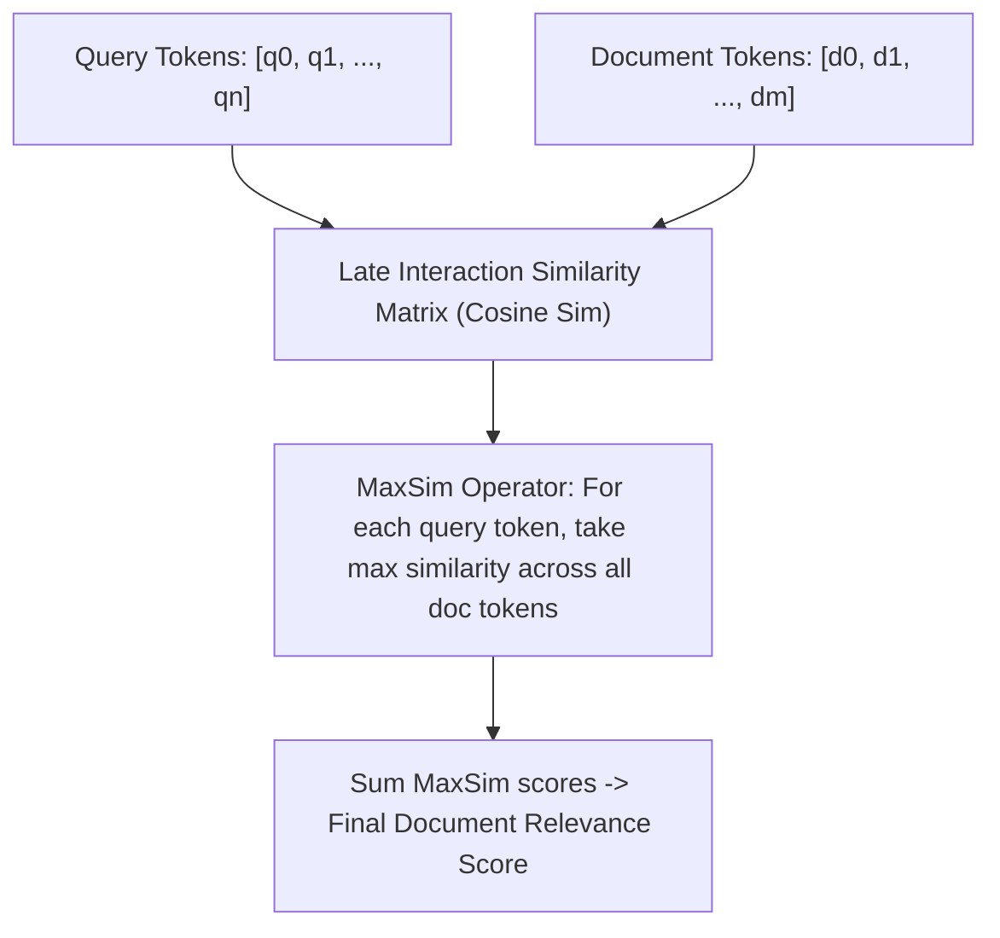

# Module 08: Query Transformation & Agentic RAG

## ColBERT Late Interaction Token Similarity Matrix

---

## 🗺️ Recommended Step-by-Step Learning Path

Follow this exact sequence to achieve complete mastery of this module:

| Step | File to Open | What You Will Do |
| :---: | :--- | :--- |
| **1** | **[01_README.md](01_README.md)** | Read conceptual overview, architectural foundations, and mental models. |
| **2** | **[00_FOUNDATIONS_PLAYGROUND.md](00_FOUNDATIONS_PLAYGROUND.md)** | Practice beginner spoonfed micro-drills and line-by-line syntax breakdowns. |
| **3** | **[00_try_it_yourself.py](00_try_it_yourself.py)** | Run in terminal (`python 00_try_it_yourself.py`) for an interactive zero-dependency sandbox. |
| **4** | **[04_TROUBLESHOOTING_AND_EDGE_CASES.md](04_TROUBLESHOOTING_AND_EDGE_CASES.md)** | Study forensic runbooks, edge cases, and real-world failure post-mortems. |
| **5** | **[03_SELF_ASSESSMENT_AND_CHALLENGES.md](03_SELF_ASSESSMENT_AND_CHALLENGES.md)** | Test your knowledge with self-assessment quizzes, challenges, and diagnostic scenarios. |
| **6** | **[02_PROJECT_GUIDE.md](02_PROJECT_GUIDE.md)** | Follow guided project implementation for `starter/` and `project_solution/`. |
| **7** | **[problems/](problems/)** | Solve hands-on problem bank challenges and verify with `pytest problems/tests`. |
| **8** | **[debug_lab/](debug_lab/)** | Diagnose and fix silent production bugs in the Bug Hunter Drill. |

---

## 1. Architectural Foundations of Query Translation

Raw user inputs often suffer from semantic underspecification, multi-hop dependencies, and vocabulary mismatch.

### 1.1 Decomposition Algorithms
Given complex query $Q$:
$$\mathcal{Q} = \text{Decompose}(Q) = \{q_1, q_2, \dots, q_k\}$$
Sub-queries are dispatched concurrently to retrieval channels, and candidate sets are unified via union or reciprocal rank fusion.

### 1.2 Hypothetical Document Embeddings (HyDE; Gao et al., 2022)
Instead of embedding user query $q \in \mathbb{R}^{d}$:
1. Generate hypothetical document: $\hat{d} = \mathcal{M}_{\text{gen}}(q)$.
2. Embed the hypothetical document: $v_{\hat{d}} = \text{Embed}(\hat{d})$.
3. Retrieve documents nearest to $v_{\hat{d}}$:
   $$\mathcal{D}^* = \arg\max_{d \in \mathcal{D}} \langle v_{\hat{d}}, \text{Embed}(d) \rangle$$
HyDE shifts the search representation from question space to answer space, eliminating the asymmetric distance distortion in bi-encoder embeddings.