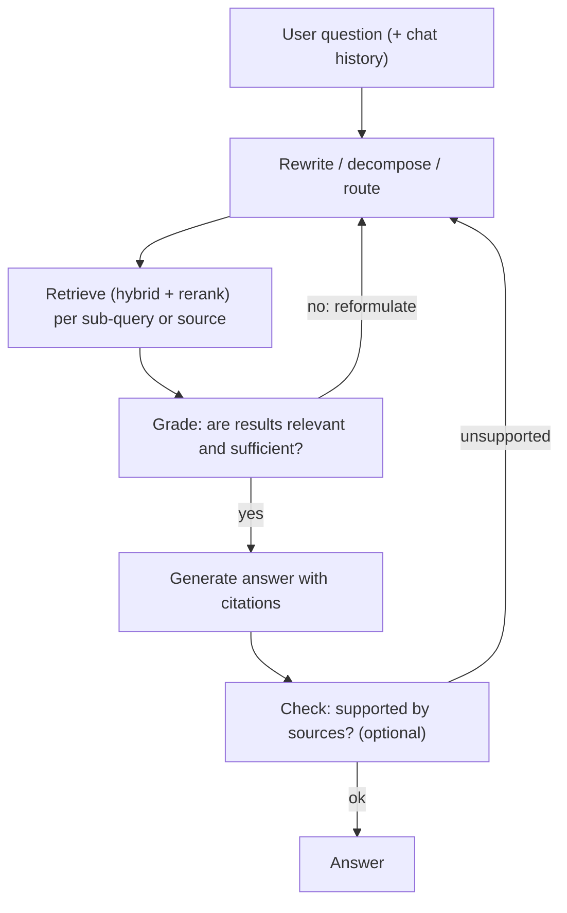

# Module 08: Query Transformation & Agentic Multi-Hop RAG

> **Architectural Scope**: Why the raw user query is a poor retrieval query, query rewriting, multi-query, HyDE, step-back, decomposition, routing and self-querying, and agentic RAG loops (corrective RAG, Self-RAG, iterative multi-hop retrieval) with their cost and failure modes.

---

## Why this module matters

Everything so far improved the **index** and the **ranking**. But retrieval quality also depends on the **query**, and the user's words are rarely the best query. In a chat, "what about the second one?" is meaningless without history. A vague question retrieves vague passages. A multi-part question ("Compare the 2022 and 2023 refund policies and say which is stricter") needs several different documents, which one search can't deliver. And some questions don't need retrieval at all. **Query transformation** improves what is sent to the retriever; **agentic RAG** lets the model *decide* what to retrieve, check what came back, and try again.

## Mental model: a good research assistant, not a search box

A search box takes your exact words once. A research assistant rephrases your request, breaks a big question into parts, decides whether to check the database, the manuals or the web, reads what they found, notices when it is not enough, and goes back for more, then stops when they can answer. Query transformation is the rephrasing and planning; agentic RAG is the loop.

```mermaid
flowchart TD
    U["User question (+ chat history)"] --> R["Rewrite / decompose / route"]
    R --> RET["Retrieve (hybrid + rerank) per sub-query or source"]
    RET --> G["Grade: are results relevant and sufficient?"]
    G -->|"no: reformulate"| R
    G -->|"yes"| A["Generate answer with citations"]
    A --> C["Check: supported by sources? (optional)"]
    C -->|"unsupported"| R
    C -->|"ok"| OUT["Answer"]
```

## 1. Query transformation toolbox

| Technique | What it does | Use when |
|---|---|---|
| **Condense chat history** | rewrite the latest turn into a **standalone** query using prior messages ("what about the second one?" becomes "What is the pricing of the Pro plan?") | any conversational RAG (the most important and cheapest fix) |
| **Query rewriting / expansion** | clean typos, expand acronyms, add synonyms and domain terms, make implicit constraints explicit | short or vague queries |
| **Multi-query** | generate several paraphrases, retrieve for each, **merge with RRF** (Module 04) | recall matters; ambiguous queries |
| **HyDE** (Hypothetical Document Embeddings, Gao et al. 2022) | have an LLM write a *hypothetical answer*, embed that instead of the question | question and answer look different in embedding space; zero-shot domains. Risk: a confidently wrong hypothesis misleads retrieval |
| **Step-back prompting** | ask a more general question first ("What are the principles of X?"), retrieve background, then answer the specific one | specific questions needing conceptual context |
| **Decomposition** | split a complex question into sub-questions, retrieve for each, then synthesise | multi-part and multi-hop questions |
| **Routing** | classify the query and pick the right **index, tool or source** (vector store, SQL database, API, web search, or no retrieval) | multiple data sources, mixed workloads |
| **Self-querying** | LLM extracts **structured metadata filters** ("papers after 2021 by Smith about retrieval") plus the semantic query | filterable corpora (dates, authors, categories) |

Each is an **LLM call** (added latency and cost, often 0.3 to 2 s) and each can fail by distorting the question, so apply only what your failure analysis shows is needed, use a small fast model, and keep the **original query** in the mix (for example fuse results from the original and the rewrites).

**Worked example (decomposition).** *"Which of our two cloud vendors had fewer outages last year, and what did the contract say about credits?"* Decompose into: (1) outage counts for vendor A last year, (2) outage counts for vendor B last year, (3) service-credit clause in each contract. Retrieve for each (outage reports, contracts), then synthesise. A single embedding of the whole sentence would pull mostly one of these topics.

## 2. From pipeline to agent: agentic RAG

A fixed pipeline always does the same steps. **Agentic RAG** puts an LLM in control of a loop with tools (search, SQL, calculator, web) and lets it:

1. **Decide whether to retrieve** and from which source.
2. **Grade** retrieved passages for relevance (and sufficiency).
3. **Reformulate** and retrieve again when the evidence is poor or incomplete.
4. **Check** that the final answer is **supported** by the retrieved text.
5. Stop when enough evidence is gathered or a budget is exhausted.

Notable patterns:

- **Corrective RAG (CRAG):** a lightweight evaluator scores retrieved documents as correct, ambiguous or incorrect; poor results trigger query rewriting and a fallback such as **web search**, and good results are filtered to the relevant passages.
- **Self-RAG** (Asai et al., 2023): the model is trained to emit **reflection tokens** deciding *whether to retrieve*, and critiquing *relevance*, *support* and *usefulness* of its own output.
- **Iterative / interleaved retrieval** (IRCoT, ReAct-style): alternate reasoning steps and retrieval calls, where each retrieved fact informs the next query, which is the natural fit for **multi-hop** questions (*"Who is the CEO of the company that acquired the startup founded by X?"*: you must first find the startup's acquirer, then its CEO).
- **LangGraph agentic RAG**: model the loop as a state graph with nodes (route, retrieve, grade, rewrite, generate) and conditional edges, with loop limits (course 11, Module 02).

## 3. Costs, risks and controls

| Risk | What happens | Control |
|---|---|---|
| **Latency and cost** | each loop iteration is one or more LLM calls plus retrievals; 3 to 5 iterations can take 5 to 20 s and 5x the tokens | cap iterations (for example max 3), use small models for grading/routing, run independent sub-queries **in parallel**, cache, stream partial answers |
| **Infinite or wasteful loops** | the agent keeps searching | hard step/budget limits, stop criteria, detect repeated queries |
| **Compounding errors** | a bad decomposition or wrong intermediate answer corrupts later steps | validate intermediate results, keep evidence with citations, allow backtracking |
| **Over-retrieval** | agent retrieves when the model already knew the answer | routing step with a "no retrieval" option |
| **Prompt injection via retrieved text** | a document says "ignore your instructions and..." and the agent obeys | treat retrieved content as untrusted data, isolate it from instructions, restrict tool permissions, filter outputs (course 12, Modules 04 and 06) |
| **Evaluation difficulty** | non-deterministic multi-step behaviour | evaluate retrieval per step, final answer faithfulness, tool-call correctness and cost per query (course 11, Module 08; course 12) |

## 4. A sensible progression

1. **Baseline:** condense history, hybrid retrieval, rerank (Modules 04 and 05).
2. **Add** multi-query or HyDE only if recall is the measured problem.
3. **Add routing** when you have several sources, and **self-querying** when metadata filters matter.
4. **Add decomposition and a bounded agent loop** when multi-hop or multi-part questions fail, with strict budgets.
5. **Measure** after each step: recall@k, answer faithfulness, latency, cost per query. Keep what pays for itself.

## Common pitfalls

1. **Skipping history condensation** in chat (the cheapest big win).
2. **Replacing the original query** with a rewrite instead of fusing both, so one bad rewrite loses the answer.
3. **Trusting HyDE** where the model has no domain knowledge (it hallucinates a plausible but wrong target).
4. **Unbounded agent loops** and runaway cost.
5. **Always using an agent** where a fixed pipeline would be faster, cheaper and more predictable.
6. **No grading step**, so irrelevant context is passed on.
7. **Ignoring prompt injection** from retrieved content.
8. **Evaluating only the final answer**, not retrieval at each step.

## How this connects

- **Module 04** (RRF) merges multi-query results; **Module 05** reranks per sub-query; **Module 07** (GraphRAG) is the precomputed alternative for relational questions; **Module 09** limits and orders the gathered context.
- **Course 11** (agents, ReAct, LangGraph, tool use) supplies the loop machinery; **Course 12** supplies evaluation and guardrails.

## Go further

- roadmap.sh: *AI Engineer* RAG nodes; *AI Agents* nodes **planner executor**, **tool invocation**, **chain of thought (CoT)**.
- Gao et al., *Precise Zero-Shot Dense Retrieval without Relevance Labels (HyDE)* (2022); Zheng et al., *Take a Step Back* (2023); Yan et al., *Corrective Retrieval Augmented Generation* (2024); Asai et al., *Self-RAG* (2023); Trivedi et al., *IRCoT* (2023).
- LangChain "Query transformations" blog and retrieval concepts; LangGraph agentic RAG tutorial.

---

## Module Study Progression
1. **Beginner Playground**: Read [00_FOUNDATIONS_PLAYGROUND.md](00_FOUNDATIONS_PLAYGROUND.md).
2. **Architecture Theory**: Study this [01_README.md](01_README.md).
3. **Hands-on Project**: Follow [02_PROJECT_GUIDE.md](02_PROJECT_GUIDE.md).
4. **Staff Interview Challenges**: Check [03_SELF_ASSESSMENT_AND_CHALLENGES.md](03_SELF_ASSESSMENT_AND_CHALLENGES.md).
5. **Production Debugging**: Review [04_TROUBLESHOOTING_AND_EDGE_CASES.md](04_TROUBLESHOOTING_AND_EDGE_CASES.md).
