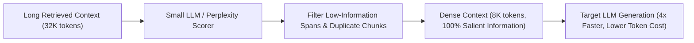

# Module 09: Context Optimization & Needle-in-a-Haystack (NIAH) Testing

## Attention-Based Context Pruning & Compression

---

## 1. Context Distribution & Attention Sinks

Attention analysis across decoder Transformers reveals asymmetric attention weight concentration at the sequence extremes:
1. **Initial Token Attention Sinks**: The first few tokens absorb significant attention score mass regardless of semantic content.
2. **Recency Bias**: Tokens closest to the final generation position experience stronger attention retention.
3. **Middle Attention Decay**: Central positions suffer from dispersion, causing retrieval accuracy degradation (Lost in the Middle).

### 1.1 U-Shaped Reordering Algorithm
Let retrieved candidate passages be ordered by relevance score: $D = (d_1, d_2, d_3, \dots, d_k)$, where $d_1$ is most relevant.
Construct optimized prompt context sequence $D^*$:
$$D^* = (d_2, d_4, \dots, d_{\text{even}}, \dots, d_5, d_3, d_1)$$
- $d_1$ sits immediately adjacent to the generation prompt.
- $d_2$ sits at the absolute beginning of the context block.
- Weakest passages are relegated to the central attention valley.

---

## 2. Needle-in-a-Haystack (NIAH) Protocol

The NIAH benchmark rigorously quantifies long-context retrieval capabilities:
1. Generate synthetic background text ("haystack") of variable token length $L \in [4\text{k}, 128\text{k}]$.
2. Insert a localized synthetic fact ("needle", e.g. *"The secret access PIN is 84920"* ) at depth percentage $P \in [0\%, 100\%]$.
3. Query the model and record binary success rate.
4. Render an $L \times P$ heatmap to identify attention blindspots.