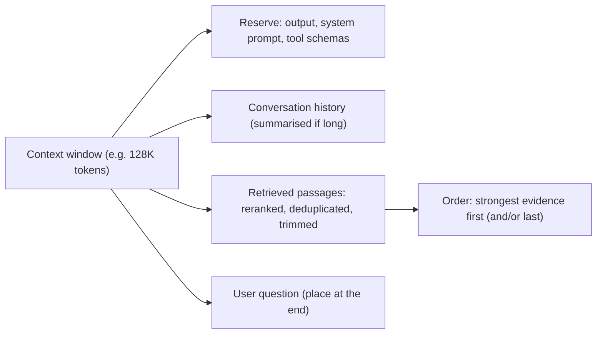

# Module 09: Context Optimization & Needle-in-a-Haystack (NIAH) Testing

> **Architectural Scope**: The gap between advertised and effective context length, position effects ("lost in the middle"), NIAH and harder long-context benchmarks (RULER), context budgeting, selection, ordering and compression techniques, cost and latency of long prompts, and how to test your own pipeline.

---

## Why this module matters

You have retrieved and reranked the best passages. Now you must decide **how much to put in the prompt, in what order, and in what form**. Context windows have grown from 4K to 128K, 1M and beyond tokens, which tempts a "just stuff everything in" approach. But a larger window does not mean the model *uses* it well: accuracy often degrades as the prompt grows, information in the middle is used less reliably than at the edges, irrelevant text distracts the model, and every extra token costs money, time and KV-cache memory (course 09). Context engineering is the discipline of giving the model **the smallest sufficient, best-organised context**, and testing, not assuming, that it works.

## Mental model: a desk, not a warehouse

A model's context is its **desk**. A bigger desk lets you spread out more papers, but if the desk is littered with irrelevant documents the important page gets overlooked, and clearing and refilling it takes time. A good assistant puts only the relevant pages on the desk, arranged so the key ones are easy to see, and keeps a short summary of everything else.

```mermaid
flowchart LR
    W["Context window (e.g. 128K tokens)"] --> RES["Reserve: output, system prompt, tool schemas"]
    W --> HIST["Conversation history (summarised if long)"]
    W --> RET["Retrieved passages: reranked, deduplicated, trimmed"]
    W --> Q["User question (place at the end)"]
    RET --> ORD["Order: strongest evidence first (and/or last)"]
```

## 1. Advertised vs effective context

- **Context window** is the maximum the model *accepts*; **effective context** is the length over which it still performs well on your task. They differ, often substantially.
- **Lost in the middle** (Liu et al., 2023): on multi-document QA, accuracy was highest when the relevant document was at the **beginning or end** of the context and dropped when it was in the **middle** (a U-shaped curve), even for models with long windows. Newer models are better but position sensitivity has not vanished.
- **Distraction:** irrelevant or near-miss passages reduce accuracy; adding more retrieved text can *lower* answer quality after a point.
- **Task difficulty matters:** finding one fact is much easier than combining several facts, tracing references, or aggregating across the context.

## 2. Needle-in-a-Haystack (NIAH) testing

The **NIAH** test (Greg Kamradt, 2023) hides a short fact (the "needle", for example *"The best thing to do in San Francisco is eat a sandwich in Dolores Park"*) at a chosen **depth** inside long filler text (the "haystack") of a chosen **length**, asks the model to retrieve it, and scores correct/incorrect. Sweeping depth (0% to 100%) against length (1K up to the window limit) produces a **heatmap** showing where the model forgets. Many vendors report near-perfect NIAH scores for long-context models.

**Limits of vanilla NIAH:** it tests only **verbatim lookup of one fact**, with filler that is semantically unrelated to the needle (so it is easy to spot), which overstates real capability. Harder variants and benchmarks:

- **Multi-needle** (find several facts) and **with distractors** (similar but wrong needles).
- **RULER** (Hsieh et al., 2024): adds multi-hop tracing, aggregation (counting/common words) and QA tasks at configurable lengths; found that many models' *effective* length is well below their claimed window.
- **LongBench**, **NoLiMa** (needles with minimal lexical overlap, requiring semantic matching), **HELMET**, and domain tasks like long-document QA and summarisation.

Run these on **your model, your prompt format and your data**: a model's NIAH curve with your retrieved chunks, your instructions and your language can differ from the published one.

## 3. Context budgeting

Treat the window as a budget and allocate it explicitly:

| Component | Typical share | Notes |
|---|---|---|
| Output reserve | 1K to 8K | reasoning and long answers need more |
| System prompt + instructions | 1K to 3K | keep stable (cacheable) |
| Tool/function schemas | 1K to 5K | grows quickly with many tools; load only relevant tools |
| Conversation history | variable | summarise old turns |
| **Retrieved evidence** | the flexible part | the lever you tune |
| User question | small | put it **last** |

**Worked example.** A 128K window: reserve 4K output, 2K system, 3K tools, 6K summarised history, leaving about 113K. You *could* fill it, but evaluation shows quality peaks with about 8 to 10K of reranked evidence. Cost and latency for the two options (illustrative: `$3` per million input tokens, an 8B-class model prefilling at about 400 TFLOP/s effective): 100K tokens of context costs `100K x $3/M = $0.30` per query and about `2 x 8e9 x 1e5 / 4e14 = 4 s` of prefill; 8K tokens costs `$0.024` and about 0.3 s: **12x cheaper and over 10x faster to first token**, and typically *more* accurate.

## 4. Techniques to optimise what goes in

1. **Select less, better.** Tune `k` and use **reranker score thresholds** (Module 05) rather than a fixed `k`; evaluate answer quality as a function of context size.
2. **Order deliberately.** Put the strongest passages **first** (and optionally repeat the most critical one at the **end**); avoid burying key evidence in the middle.
3. **Deduplicate and diversify.** Remove near-duplicates and use MMR so the budget covers different facts.
4. **Compress.**
   - *Extractive:* keep only the sentences relevant to the query (contextual compression).
   - *Abstractive:* summarise passages or documents.
   - *Token-level:* prompt compressors such as **LLMLingua** drop low-information tokens (up to several-fold reduction with modest accuracy loss).
   - *History:* maintain a **rolling summary** of older turns plus the most recent turns verbatim; store durable facts in memory (course 11, Module 04).
5. **Structure the prompt.** Use clear delimiters (XML-style tags like `<document id="3">`), give each passage an ID and ask the model to **cite IDs**, which also helps verification. For long documents, place the **documents at the top and the question at the end**; Anthropic's long-context guidance reports this ordering can improve quality noticeably, especially for complex multi-document inputs.
6. **Ask the model to extract first.** For very long inputs, a two-step prompt ("first quote the relevant passages, then answer") grounds the answer and improves accuracy.
7. **Cache the stable parts.** System prompt, tool schemas and shared documents go at the **beginning** so **prompt/prefix caching** applies (course 09, Module 04); put volatile content last.
8. **Prefer retrieval over stuffing for large corpora.** If the whole corpus fits in tens of thousands of tokens and is queried rarely, stuffing may be simplest; for large or frequently queried corpora, RAG is cheaper, scalable, updateable and citable. Hybrid designs retrieve broadly and then pass a trimmed, ordered set.

## 5. Building your own long-context evaluation

1. **Define realistic tasks**: your questions, your documents, with distractors similar to what retrieval returns.
2. **Vary** context length (for example 2K, 8K, 32K, 128K), needle/evidence **position**, and **number of distractors**.
3. **Measure** accuracy, citation correctness and faithfulness (course 12), plus latency and cost.
4. **Plot** the curves and choose the operating point (context size and ordering policy) at the knee of quality vs cost.
5. **Re-run** when the model, prompt template, retriever or chunking changes.

## Common pitfalls

1. **Equating context window with usable context** and filling it by default.
2. **Relying on vanilla NIAH scores** as proof of long-context reasoning.
3. **Burying critical evidence in the middle** of a long prompt.
4. **Passing a fixed `k` of passages** regardless of relevance, flooding the prompt with noise.
5. **Putting dynamic content at the start of the prompt**, defeating prefix caching.
6. **Ignoring cost and latency**: long prompts multiply per-query cost and TTFT.
7. **Summarising away needed detail** (numbers, names) in aggressive compression.
8. **No measurement**: tuning context size by intuition.

## How this connects

- **Module 05** supplies ranked, scored passages and thresholds; **Module 02** and **Module 08** shape what is retrieved; **Module 07** (GraphRAG) produces compact summaries that suit tight budgets.
- **Course 09** explains why long prompts cost memory and latency (KV cache, prefill) and how caching helps; **Course 11, Module 04** covers agent memory and history management; **Course 12** provides the evaluation methods.

## Go further

- roadmap.sh: *AI Engineer* nodes on **RAG**, **embeddings**, **prompt engineering**; *Inference Engineering* **long context handling**.
- Liu et al., *Lost in the Middle: How Language Models Use Long Contexts* (2023); Kamradt's `LLMTest_NeedleInAHaystack` repository; Hsieh et al., *RULER* (2024); Jiang et al., *LLMLingua* (2023); Anthropic's long-context prompting tips.

---

## Module Study Progression
1. **Beginner Playground**: Read [00_FOUNDATIONS_PLAYGROUND.md](00_FOUNDATIONS_PLAYGROUND.md).
2. **Architecture Theory**: Study this [01_README.md](01_README.md).
3. **Hands-on Project**: Follow [02_PROJECT_GUIDE.md](02_PROJECT_GUIDE.md).
4. **Staff Interview Challenges**: Check [03_SELF_ASSESSMENT_AND_CHALLENGES.md](03_SELF_ASSESSMENT_AND_CHALLENGES.md).
5. **Production Debugging**: Review [04_TROUBLESHOOTING_AND_EDGE_CASES.md](04_TROUBLESHOOTING_AND_EDGE_CASES.md).
