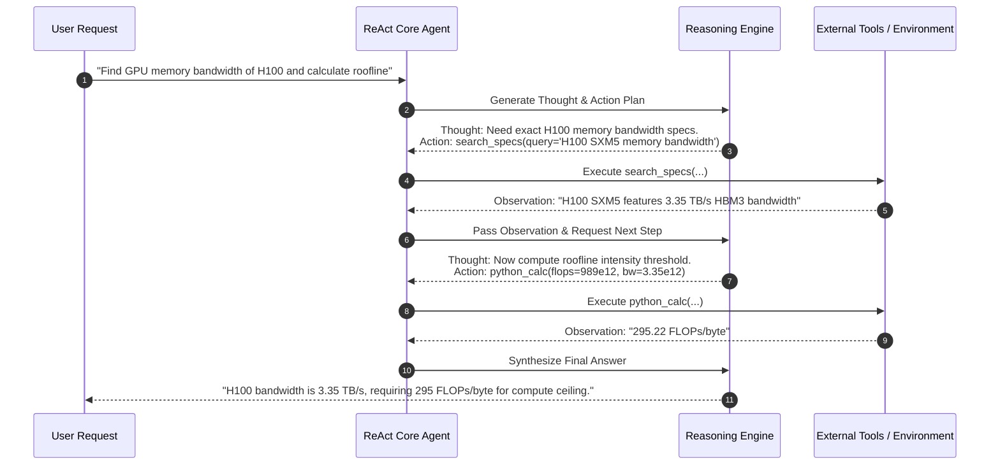

# Beginner Playground: Agent Cognitive Architectures & Loops


> 💡 **Try It in the Live Runner:** You can run and modify any snippet in this playground directly in your browser! Click the **`▶ Run`** button in the header of any code block to test it instantly on the side, or toggle **`Live Runner`** in the top navigation bar to experiment with Python, PowerShell, and CLI commands while reading.

Welcome to the foundational playground for Autonomous Agents! Here you will master the core cognitive control loop that transforms a static LLM into an autonomous problem-solving agent.

---


## ReAct Agent Cognitive Loop Architecture



## 1. The Core Mental Model: The ReAct Loop

A standard LLM is a single-turn completion engine:
$$\text{Input Prompt} \longrightarrow \text{LLM} \longrightarrow \text{Response}$$

An **Autonomous Agent** wraps the LLM inside a stateful feedback cycle known as **ReAct** (Reasoning + Acting):

```
       +--------------------------------------------+
       |                                            |
       v                                            |
 [ Thought ] --> [ Action / Tool Call ] --> [ Environment / Observation ]
       |
       +--> [ Final Answer ] (Terminates loop)
```

1. **Thought (Reasoning)**: The LLM analyzes the current goal, past steps, and observations to decide what to do next.
2. **Action (Acting)**: The LLM outputs a structured tool invocation (e.g., `Search("NVIDIA H100 TDP")`).
3. **Observation (Feedback)**: The environment executes the tool and injects the ground-truth result back into the agent's context.
4. **Reflexion (Self-Correction)**: If an action produces an error or fails to make progress, the agent reflects on the failure and selects an alternative strategy.

---

## 2. Interactive Pure-Python Experiment: Zero-Dependency ReAct Agent

Run this zero-dependency pure Python script to watch a ReAct agent reason, query tools, observe results, and reach a final answer:

```python
import re
from typing import Dict, Any, Callable

class SimpleReActAgent:
    def __init__(self, tools: Dict[str, Callable[[str], str]], max_iterations: int = 5):
        self.tools = tools
        self.max_iterations = max_iterations
        self.trajectory = []

    def execute(self, user_goal: str) -> str:
        context = f"Goal: {user_goal}\n"
        print(f"[*] Starting ReAct Loop for Goal: {user_goal}\n")

        for step in range(1, self.max_iterations + 1):
            print(f"--- Step {step} ---")
            thought, action_name, action_arg = self._mock_llm_reasoning(context, step)
            print(f"Thought: {thought}")
            self.trajectory.append({"step": step, "thought": thought})

            if action_name == "FINISH":
                print(f"Final Answer: {action_arg}\n")
                return action_arg

            if action_name in self.tools:
                tool_func = self.tools[action_name]
                observation = tool_func(action_arg)
                print(f"Observation: {observation}\n")
                context += f"Thought: {thought}\nAction: {action_name}({action_arg})\nObservation: {observation}\n"
                call_str = f"{action_name}({action_arg})"
                self.trajectory[-1]["action"] = call_str
                self.trajectory[-1]["observation"] = observation
            else:
                observation = f"Error: Tool '{action_name}' does not exist."
                print(f"Observation: {observation}\n")
                context += f"Observation: {observation}\n"

        return "Max iterations reached without resolution."

    def _mock_llm_reasoning(self, context: str, step: int):
        # Deterministic simulation of an LLM deciding tool actions
        if "Observation: 700 Watts" in context:
            return (
                "Now that I know the TDP is 700 Watts, I can calculate energy consumed in 24 hours.",
                "Calculator",
                "700 * 24 / 1000"
            )
        elif "Observation: 16.8" in context:
            return (
                "16.8 kWh is the total energy consumed in 24 hours.",
                "FINISH",
                "An NVIDIA H100 GPU running at full 700W TDP consumes 16.8 kWh in 24 hours."
            )
        else:
            return (
                "I need to look up the maximum TDP (Thermal Design Power) of an NVIDIA H100 GPU.",
                "Search",
                "NVIDIA H100 TDP"
            )

# Interactive Tools
def mock_search(query: str) -> str:
    if "H100" in query:
        return "700 Watts maximum TDP for SXM5 board."
    return "No search results found."

def mock_calculator(expression: str) -> str:
    try:
        return str(eval(expression, {"__builtins__": None}, {}))
    except Exception as e:
        return f"Calc Error: {e}"

tools = {"Search": mock_search, "Calculator": mock_calculator}
agent = SimpleReActAgent(tools)
result = agent.execute("How many kWh does an NVIDIA H100 GPU consume in 24 hours at max load?")
print(f"Agent Finished with Result: {result}")
```

---

## 3. Key Takeaways
1. **Loop Termination**: Every ReAct loop must enforce an explicit `max_iterations` counter and cycle detection to prevent runaway API spend.
2. **Observation Grounding**: Observations must be strictly parsed and injected into the prompt context to keep the LLM grounded in real-world facts.
3. **Reflexion**: Real agents need fallback logic when tools return runtime exceptions or empty responses.