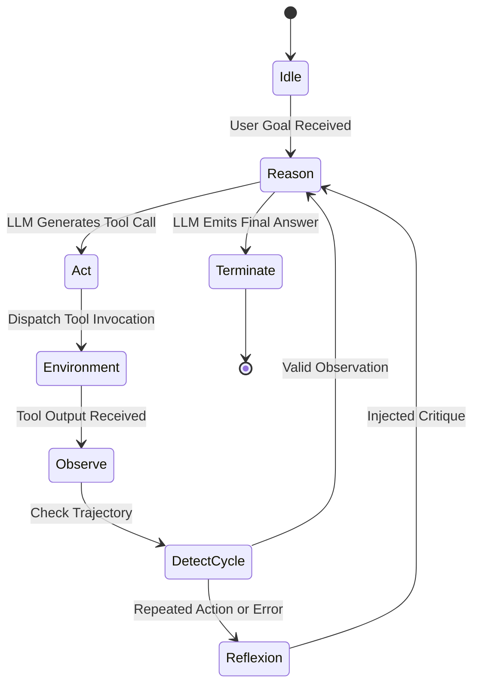

# Module 01: Agent Cognitive Architectures and Loops

## 1. Theoretical Foundations & Architectural Overview

Autonomous agents extend Large Language Models (LLMs) from passive text predictors into active, goal-directed problem solvers. At the core of every agent is a **cognitive control loop** that governs perception, reasoning, decision making, tool execution, and self-reflection.

### 1.1 Taxonomy of Cognitive Agent Frameworks

| Paradigm | Control Topology | Key Mechanism | Best Use Case |
| :--- | :--- | :--- | :--- |
| **ReAct** (Yao et al., 2022) | Interleaved step-by-step | `Thought -> Action -> Observation` cycle | Tool use, dynamic exploration, interactive debugging |
| **Plan-and-Solve** (Wang et al., 2023) | Two-stage (Decompose then execute) | Static plan generation $\rightarrow$ sequential execution | Math reasoning, multi-step code refactoring |
| **Reflexion** (Shinn et al., 2023) | Episodic retrospective critique | Evaluates trial outcome $\rightarrow$ writes natural language critique $\rightarrow$ retries | Code generation, benchmark evaluation (SWE-bench) |
| **Tree of Thoughts** (Yao et al., 2023) | Tree search (BFS/DFS) | Explores multiple reasoning branches with heuristic pruning | Complex combinatorial puzzles, architecture design |

---

## 2. Mathematical Formulation & Complexity Analysis

### 2.1 The ReAct Markov Decision Process (POMDP)
We model the agent's interaction with the tool environment as a Partially Observable Markov Decision Process defined by the tuple $\langle \mathcal{S}, \mathcal{A}, \mathcal{T}, \mathcal{R}, \Omega, \mathcal{O}, \gamma \rangle$:
- $\mathcal{S}$: True environment state (filesystem, database, external APIs).
- $\mathcal{A} = \mathcal{A}_{thought} \cup \mathcal{A}_{tool}$: Union of internal reasoning thoughts and external tool calls.
- $\mathcal{O}$: Observations returned by tool executions.
- History context at step $t$:
  $$H_t = (q, a_1, o_1, a_2, o_2, \dots, a_{t-1}, o_{t-1})$$
- Agent policy:
  $$\pi_\theta(a_t \mid H_t) = \text{LLM}_{\theta}(\text{Prompt}(H_t))$$

### 2.2 Token Complexity & Quadratic Context Growth
Because each iteration appends the previous $(a_i, o_i)$ pair to $H_t$, the prompt token length $|H_t|$ grows linearly:
$$|H_t| = |H_0| + \sum_{i=1}^{t-1} (|a_i| + |o_i|)$$
For a transformer with standard attention, compute cost over $T$ steps scales quadratically:
$$\text{Total Compute Cost} \propto \sum_{t=1}^T |H_t|^2 = \mathcal{O}(T^3 \cdot \Delta L^2)$$
where $\Delta L$ is the average step payload length. Therefore, production agent loops must implement context compaction or sliding window pruning.

---

## 3. Production Architecture & Cycle Detection

### 3.1 Cycle & Stagnation Detection
A notorious failure mode of LLM agents is **action looping**: the LLM repeats the same tool call with identical arguments due to high-confidence sampling or uninformative tool error messages.

Cycle detection is implemented via an action fingerprint hash table:
$$\text{Fingerprint}(a_t) = \text{SHA256}(\text{ToolName} \parallel \text{CanonicalJSON}(\text{Args}))$$
If $\text{Count}(\text{Fingerprint}(a_t)) \ge K_{\text{threshold}}$ (typically $K=2$), the engine interrupts the normal cycle and forces a **Reflexion prompt**:
> *"Warning: You have called {tool_name} with identical parameters {args} {count} times with no state change. You must reflect on why this approach failed and choose an entirely different tool or strategy."*

---

## 4. Production Implementation Blueprint

In this module, you build `ReActLoopEngine`:
1. **Typed Action Parsing**: Extracts Thought, Action Name, Action Input, and Final Answer.
2. **Cycle & Infinite Loop Guard**: Tracks fingerprint frequencies and enforces `max_steps`.
3. **Reflexion Trigger**: Intercepts tool errors or stagnation and synthesizes corrective feedback.
4. **Trajectory Logging**: Emits structured JSONL telemetry compatible with LangSmith and Phoenix.
