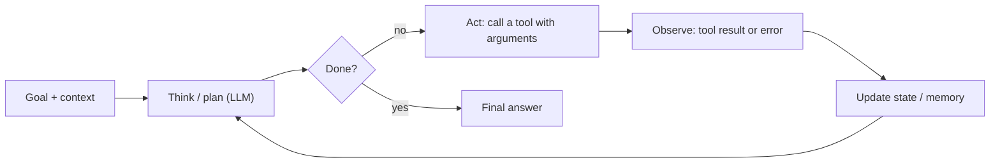

# Module 01: Agent Cognitive Architectures & Loops (ReAct)

> **Architectural Scope**: What makes an LLM application an *agent*, the perceive-reason-act-observe loop, Chain-of-Thought and ReAct, planner-executor and reflection patterns, workflows vs agents, reliability maths, stopping conditions and budgets.

---

## Why this module matters

A plain LLM call maps text to text. An **agent** wraps the model in a loop that lets it *do things*: call tools, look at the results, and decide what to do next until a goal is reached. That loop is what turns "write me SQL" into "investigate why revenue dropped, run the queries, notice the data gap, and report back". It is also where most of the new failure modes come from: infinite loops, wrong tool choices, compounding errors, runaway cost, and actions with real-world consequences. Every later module in this course (graphs, tools, memory, multi-agent, sandboxing, human oversight, evaluation) is machinery around this core loop, so the loop itself must be understood precisely.

## Mental model: a new employee with a to-do list and a toolbox

Give an employee a goal. They think about what to do, pick a tool (search the wiki, run a script, email a colleague), look at the result, update their understanding, and either continue or declare the job done. An agent is that cycle, with the LLM as the brain, **tools** as hands, **messages/state** as short-term memory, and **you** as the manager who sets limits.


```mermaid
flowchart LR
    G["Goal + context"] --> T["Think / plan (LLM)"]
    T --> D{"Done?"}
    D -->|"no"| A["Act: call a tool with arguments"]
    A --> O["Observe: tool result or error"]
    O --> M["Update state / memory"]
    M --> T
    D -->|"yes"| F["Final answer"]
```

## 1. Reasoning building blocks

- **Chain-of-Thought (CoT)** (Wei et al., 2022): prompting the model to write intermediate reasoning steps ("let's think step by step") before answering substantially improves multi-step arithmetic, logic and planning. Variants: **zero-shot CoT** (just the instruction), **few-shot CoT** (worked examples), **self-consistency** (sample several chains and take the majority answer), **Tree of Thoughts** (explore and evaluate multiple reasoning branches, backtracking when a branch looks bad). Modern **reasoning models** (o-series, extended-thinking models, DeepSeek-R1) are trained to produce long internal reasoning, so explicit CoT prompting matters less, but the idea of spending tokens on thinking is the same.
- **ReAct** (Yao et al., 2022): interleave **Reasoning** and **Acting**. The model alternates `Thought` (what do I need?), `Action` (a tool call), and `Observation` (the tool's result, injected by the harness). Reasoning is grounded by real observations, which reduces hallucination compared with CoT alone, and the transcript is a readable audit trail.

```
Thought: I need the current price before I can compare.
Action: get_price(ticker="ACME")
Observation: {"price": 42.17}
Thought: Now compare with last week's price.
Action: get_price_history(ticker="ACME", days=7)
...
Final Answer: ACME is up 3.1% this week.
```

Today most APIs implement ReAct natively through **tool/function calling** (Module 03): the model emits a structured tool call instead of free-text "Action:", but the loop is the same.

## 2. The minimal agent loop

```python
def run_agent(goal, tools, llm, max_steps=10):
    messages = [{"role": "system", "content": SYSTEM_PROMPT},
                {"role": "user", "content": goal}]
    for step in range(max_steps):                           # hard budget
        reply = llm(messages, tools=tools)                  # model decides: answer or call tools
        messages.append(reply)
        if not reply.tool_calls:                            # stop condition: no more actions
            return reply.content
        for call in reply.tool_calls:
            try:
                fn = tools[call.name]
                result = fn(**call.args)                    # act (validate args first!)
            except Exception as e:
                result = f"ERROR: {e}"                      # errors are observations, not crashes
            messages.append({"role": "tool", "tool_call_id": call.id, "content": str(result)})
    return "Stopped: step budget exhausted"
```

Everything production-grade is an elaboration of these 12 lines: validate tool arguments, truncate large observations, track token and dollar budgets, persist state, add timeouts, log every step, require approval for risky actions, and handle parallel tool calls.

## 3. Cognitive architecture patterns

| Pattern | Idea | Use when |
|---|---|---|
| **ReAct (single loop)** | decide the next step each iteration | exploratory tasks with unpredictable steps |
| **Plan-and-execute / planner-executor** (also ReWOO) | a planner writes a multi-step plan first; an executor runs the steps (possibly with a cheaper model); re-plan if a step fails | longer tasks; saves tokens and gives a reviewable plan |
| **Reflection / self-critique** (Reflexion, Self-Refine) | after an attempt, the model critiques its own output or failure and retries with the lesson | code that fails tests, writing quality, search refinement |
| **Router** | a first call classifies the request and dispatches to a specialist prompt/tool | many distinct request types |
| **Orchestrator-workers** | a lead model decomposes the task and delegates to workers, then merges (Module 05) | open-ended multi-part work, research |
| **Evaluator-optimizer** | one model generates, another evaluates, loop until accepted | when clear quality criteria exist |

## 4. Workflows vs agents

Anthropic's "Building effective agents" draws a useful line. **Workflows** orchestrate LLMs and tools through **predefined code paths** (prompt chaining, routing, parallelisation, orchestrator-workers, evaluator-optimizer). **Agents** let the LLM **dynamically direct its own process and tool use**. Guidance: **use the simplest thing that works**. Prefer a single well-prompted call, then a workflow, and reach for a fully autonomous agent only when the number of steps and the path cannot be predicted in advance, and when you can tolerate higher cost, latency and variance. Most production "agents" are workflows with a few agentic steps.

## 5. Reliability: errors compound

If each step succeeds with probability `p`, an `n`-step task succeeds with `p^n`:

| Per-step success | 5 steps | 10 steps | 20 steps |
|---|---|---|---|
| 95% | 77% | 60% | 36% |
| 99% | 95% | 90% | 82% |
| 99.9% | 99.5% | 99.0% | 98.0% |

So reliability engineering for agents means **raising per-step success** (clear tool descriptions, constrained outputs, validation, examples), **reducing the number of steps** (better tools that do more per call, planning), **catching and recovering from errors** (retries, alternative strategies, checkpoints), and **adding verification** (tests, assertions, evaluator steps, human approval for high-stakes actions).

## 6. Design principles

1. **Simple, composable patterns first**; add complexity only when measured results justify it.
2. **Tools are the interface** (the "agent-computer interface"): few, well-named tools with precise descriptions, typed parameters, helpful error messages, and outputs sized for a model to read. Poorly designed tools are the most common cause of agent failure (Module 03).
3. **Make state explicit**: what the agent knows, what it has done, what remains (Modules 02 and 04).
4. **Budget everything:** max steps, max tokens, wall-clock timeout, cost ceiling, tool-call rate limits.
5. **Stop conditions:** a final-answer action, no tool calls, goal verified, budget hit, repeated identical actions (loop detection), or human escalation.
6. **Transparency and observability:** log thoughts (where available), tool calls, arguments, results and costs; trace each run (course 12, Module 08).
7. **Least privilege and human oversight** for anything irreversible (Modules 06 and 07).
8. **Evaluate end to end and per step** (Module 08).

## Worked example: cost and latency of a loop

A support agent averages 6 loop iterations; each LLM call has a 3,000-token prompt (history grows) and 200 output tokens, taking about 2 s. Latency is about `6 x 2 s = 12 s` plus tool time; with a model charging `$3`/M input and `$15`/M output tokens, one run costs about `6 x (3,000 x 3e-6 + 200 x 15e-6) = 6 x (0.009 + 0.003) = $0.072`. Because the prompt **grows each iteration** (history is re-sent), cost grows roughly quadratically with steps; prompt caching (course 09, Module 04) and trimming old tool outputs keep it in check. A step budget of 10 caps the worst case.

## Common pitfalls

1. **Using an agent where a workflow would do**: more cost, less predictability.
2. **No step, token or time budget**, so a confused agent loops forever.
3. **Returning huge tool outputs** that flood context and bury the useful part.
4. **Crashing on tool errors** instead of feeding them back as observations.
5. **Vague tool descriptions**, so the model picks wrong tools or invents arguments.
6. **No loop detection**: the agent repeats the same failing call.
7. **Believing the model's self-reported success** without verification (run the tests, check the output).
8. **Giving broad permissions** because "the model is smart".

## How this connects

- **Module 02** formalises the loop as a state graph; **Module 03** is the tool interface; **Module 04** is memory; **Module 05** scales to several agents; **Module 06 and 07** are safety and oversight; **Module 08** is evaluation.
- **Course 10, Module 08** (agentic RAG) is this loop specialised for retrieval; **Course 12** covers guardrails and tracing.

## Go further

- roadmap.sh: *AI Agents* nodes **chain of thought (CoT)**, **planner executor**, **acting / tool invocation**, **agents usecases**; *Prompt Engineering* nodes **chain of thought**, **tree of thoughts (ToT)**.
- Yao et al., *ReAct* (2022); Wei et al., *Chain-of-Thought Prompting* (2022); Yao et al., *Tree of Thoughts* (2023); Shinn et al., *Reflexion* (2023); Lilian Weng, *LLM Powered Autonomous Agents*; Anthropic, *Building effective agents*.

---

## Module Study Progression
1. **Beginner Playground**: Read [00_FOUNDATIONS_PLAYGROUND.md](00_FOUNDATIONS_PLAYGROUND.md).
2. **Architecture Theory**: Study this [01_README.md](01_README.md).
3. **Hands-on Project**: Follow [02_PROJECT_GUIDE.md](02_PROJECT_GUIDE.md).
4. **Staff Interview Challenges**: Check [03_SELF_ASSESSMENT_AND_CHALLENGES.md](03_SELF_ASSESSMENT_AND_CHALLENGES.md).
5. **Production Debugging**: Review [04_TROUBLESHOOTING_AND_EDGE_CASES.md](04_TROUBLESHOOTING_AND_EDGE_CASES.md).
