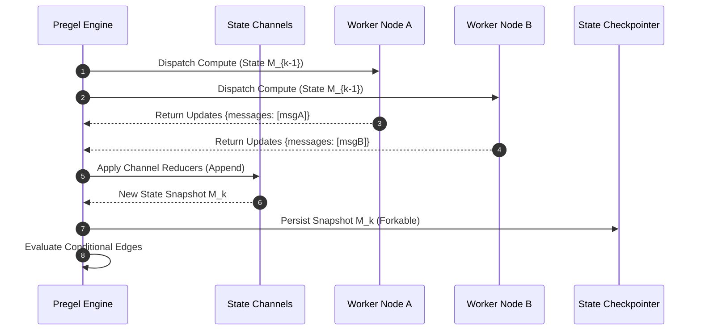

# Module 02: State Machine Graphs & LangGraph Internals

---

## 1. Architectural Foundations: Google Pregel to LangGraph

LangGraph is built upon the **Pregel** message-passing computation model, originally developed by Google for large-scale graph processing. Rather than treating an agent as a continuous string of tokens, Pregel models an agent as an iterative, multi-actor state graph executed in **Supersteps**.

### 1.1 The Anatomy of a Superstep

Each Superstep $S_k$ consists of three synchronized phases:
1. **Compute**: All active nodes in step $k$ execute concurrently, reading from state snapshot $M_{k-1}$.
2. **Channel Reduction**: Node outputs are submitted to typed state channels where reducer functions combine them.
3. **Routing**: Conditional and static edges evaluate the updated state $M_k$ to determine which nodes will be activated in step $k+1$.

---

## 2. Channel Reducers & State Concurrency

### 2.1 Overwrite vs Append Channels
In standard state management, concurrent node updates produce race conditions. In a Pregel graph, every field in `AgentState` is backed by an explicit **Channel Reducer**:

$$\text{Channel}(V, \oplus): \quad S_{new} = S_{old} \oplus \Delta V$$

- **Last-Value Channel**: $\Delta V \oplus S = \Delta V$ (Default overwrite behavior).
- **Additive Channel**: $\Delta V \oplus S = S + \Delta V$ (For lists, token counters, or append-only message logs).
- **Custom Reducer**: e.g., Set union or dictionary merge with key collision rules.

---

## 3. Checkpointing, Time Travel, and Resumption

By persisting the exact state snapshot $M_k$ after every superstep to a persistent checkpointer (e.g. SQLite, PostgreSQL), the system gains:
1. **Fault Tolerance**: If a node crashes mid-execution, the engine resumes from the last completed superstep.
2. **Time Travel**: Developers can inspect, fork, or rewind the state graph to superstep $k-3$, modify an input, and re-run.
3. **Human-in-the-Loop Interrupts**: Execution halts at defined breakpoint nodes, waiting for human approval or payload injection before proceeding to $S_{k+1}$.
