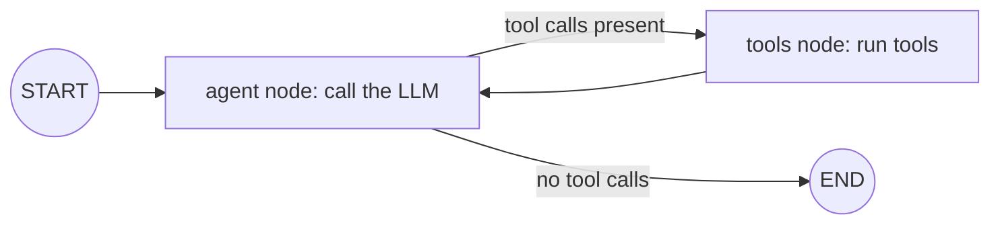

# Module 02: State Machine Graphs & LangGraph Internals

> **Architectural Scope**: Modelling an agent as a stateful graph with cycles, typed state and reducers, nodes and (conditional) edges, the Pregel superstep execution model, checkpointing and thread IDs, dynamic fan-out with `Send`, subgraphs, streaming, and loop limits.

---

## Why this module matters

The simple loop from Module 01 breaks down as agents grow: you need branching ("if the tool failed, retry; if the answer is low-confidence, escalate"), parallel work, long-running tasks that survive crashes, the ability to pause for a human, and a way to inspect or rewind what happened. Writing that with ad-hoc `while` loops and global variables becomes unmaintainable. **LangGraph** (and similar frameworks) treats an agent as an explicit **state machine**: a graph whose nodes are steps, whose edges decide what runs next, and whose **state** is a typed object that is saved at every step. That structure is what makes persistence, human-in-the-loop and time travel (Module 07) possible. Understanding the model, not just the API, lets you design agents that are debuggable and resumable.

## Mental model: a flowchart that remembers where it is

Picture a flowchart where each box does some work and writes to a shared notebook (the state), and arrows (some conditional) point to the next box. After every round of boxes, the notebook is photographed and filed under a conversation ID. If the process crashes, you resume from the last photo; if a person needs to approve something, you pause after a photo and continue later; if you want to see what happened, you flip through the photos.


```mermaid
flowchart LR
    S(("START")) --> A["agent node: call the LLM"]
    A -->|"tool calls present"| T["tools node: run tools"]
    T --> A
    A -->|"no tool calls"| E(("END"))
```

This is the canonical ReAct agent as a graph, and note the **cycle** (`agent -> tools -> agent`): unlike a DAG workflow engine, agent graphs are allowed to loop.

## 1. The core pieces

```python
from typing import Annotated, TypedDict
from langgraph.graph import StateGraph, START, END
from langgraph.graph.message import add_messages
from langgraph.checkpoint.memory import InMemorySaver

class State(TypedDict):
    messages: Annotated[list, add_messages]   # reducer: append / merge messages by id
    attempts: int                             # no reducer: last write wins

def agent(state: State):
    reply = llm_with_tools.invoke(state["messages"])
    return {"messages": [reply], "attempts": state.get("attempts", 0) + 1}   # partial update

def route(state: State) -> str:
    return "tools" if state["messages"][-1].tool_calls else "end"

g = StateGraph(State)
g.add_node("agent", agent)
g.add_node("tools", tool_node)                # executes the requested tool calls
g.add_edge(START, "agent")
g.add_conditional_edges("agent", route, {"tools": "tools", "end": END})
g.add_edge("tools", "agent")

app = g.compile(checkpointer=InMemorySaver())
cfg = {"configurable": {"thread_id": "user-42"}, "recursion_limit": 25}
result = app.invoke({"messages": [("user", "Find the cheapest flight to Oslo")]}, cfg)
```

- **State** is a schema (`TypedDict`, dataclass or Pydantic model). Every node reads the current state and returns a **partial update**, not the whole state.
- **Reducers** (the `Annotated[..., reducer]` part) define how updates to a key are combined. With no reducer, a key is **overwritten** (last write wins). `operator.add` **appends** lists; `add_messages` appends *and* de-duplicates/updates messages by ID (so a corrected message replaces the earlier one).
- **Nodes** are ordinary functions (sync or async), including LLM calls, tool executors, validators, or whole **subgraphs**.
- **Edges:** *static* (`add_edge`) always go to the next node; *conditional* (`add_conditional_edges`) call a routing function on the state. A node can also return a `Command(update=..., goto="node")` to update state and choose the next node in one step.
- **`compile()`** validates the graph and turns it into an executable runtime, optionally with a **checkpointer**.

## 2. Execution model: Pregel supersteps

LangGraph's runtime is inspired by Google's **Pregel** message-passing model for graph computation. Execution proceeds in discrete **supersteps**:

1. **Plan:** determine which nodes are triggered by the previous step's writes.
2. **Execute:** run all triggered nodes **in parallel**, each reading the **same state snapshot**.
3. **Update:** gather their outputs and apply them to the state through the reducers, atomically, at the end of the step.
4. **Checkpoint:** save the new state (if a checkpointer is configured), then repeat until no node is triggered or `END` is reached.

Consequences you must design around:

- **Parallel branches are deterministic** because updates are applied together via reducers, but if two parallel nodes write the **same key without a reducer**, LangGraph raises an error (there is no defined winner). Give such keys an appending or merging reducer.
- **Nodes in the same step cannot see each other's writes**; they see the snapshot from before the step.
- **State is the only communication channel.** Hidden global variables break replay, resume and time travel.

## 3. Persistence: checkpoints and threads

A **checkpointer** (`InMemorySaver` for development; SQLite or **Postgres** savers for production; Redis and cloud options exist) saves a **checkpoint**, a snapshot of the state plus metadata and what runs next, after **every superstep**, keyed by a **`thread_id`** (a conversation or job ID). This provides:

- **Memory across turns:** invoking again with the same `thread_id` continues from the saved state (short-term memory, Module 04).
- **Fault tolerance / durable execution:** after a crash, resume from the last checkpoint; completed nodes of a partially finished superstep are not re-run (their writes are stored).
- **Human-in-the-loop:** pause at an `interrupt`, persist, and resume hours later (Module 07).
- **Time travel:** list `get_state_history(config)`, pick an earlier checkpoint, optionally edit state with `update_state`, and **fork** a new run from it (Module 07).
- **Debugging and audit:** every step is inspectable.

A **store** (separate from checkpoints) holds **long-term, cross-thread memory** such as user preferences (Module 04).

## 4. Dynamic and compositional structure

- **Fan-out with `Send`:** a conditional edge can return a list of `Send("worker", payload)` objects to launch a *dynamic number* of parallel worker invocations (map-reduce): for example one worker per retrieved document or per sub-task; a reducer merges their results.
- **Subgraphs:** a compiled graph can be a node in a parent graph, with its own state schema (mapped to the parent's). Use them to build reusable modules, or per-agent graphs in multi-agent systems (Module 05).
- **Streaming:** `stream` modes emit `values` (full state after each step), `updates` (just the changes), `messages` (LLM tokens as they are generated) and custom events, which is essential for responsive UIs (see "streamed vs unstreamed responses" in the AI Agents roadmap).
- **Prebuilt helpers:** `create_react_agent` builds the loop above; use it to start, then drop to a custom graph when you need control.

## 5. Cycles, limits and safety

Cycles are a feature and a hazard. Guard them with:

- **`recursion_limit`** (default 25 supersteps): exceeding it raises an error rather than looping forever; set it deliberately.
- **Explicit counters in state** (`attempts`, `tool_calls`) and routing logic that exits after a threshold or on repeated identical actions.
- **Budgets** on tokens, cost and wall-clock time, checked in the routing function.
- **Idempotent, retried nodes:** nodes can be retried on failure (retry policies), so side-effecting tools must be safe to run twice (use idempotency keys, course 04).

## 6. Choosing a framework

| Framework | Style | Notes |
|---|---|---|
| **LangGraph** | explicit graph, low-level, durable | strong persistence, HITL, streaming; more code |
| **OpenAI Agents SDK**, **Google ADK**, **Claude Agent SDK** | opinionated agent loops, handoffs, tools, guardrails | quicker to start; vendor-aligned |
| **CrewAI** | role-based "crews" of agents and tasks | high-level multi-agent abstraction |
| **AutoGen / AG2** | conversational multi-agent | flexible group chats |
| **LlamaIndex Workflows**, **Pydantic AI**, **smolagents** | event-driven / typed / lightweight | different trade-offs |
| **Plain code** | a loop and some functions | often enough for simple agents |

Whichever you choose, the architectural questions are the same: what is the **state**, how are updates **merged**, when is it **persisted**, and how are **loops bounded**?

## Worked example: why reducers matter

A research graph fans out three search workers in parallel, each returning `{"findings": ["..."]}`. With `findings: list` and no reducer, the three writes collide in the same superstep and LangGraph raises an invalid-update error. With `findings: Annotated[list, operator.add]` the three lists are concatenated in a deterministic order, and the next node (the synthesiser) sees all of them. The same state definition also decides how a retry or a resumed run behaves: because updates are *data*, replaying a checkpoint reproduces the result.

## Common pitfalls

1. **Parallel writes to a key without a reducer.**
2. **Hidden state outside the graph state** (module globals, in-memory caches) that is lost on resume.
3. **Forgetting a `thread_id`**, so each call starts fresh (or conversations bleed together if reused).
4. **Unbounded cycles**: no recursion limit or counters.
5. **Non-idempotent side effects in nodes** that may be retried or replayed (double emails, double charges).
6. **Putting huge objects in state**, bloating every checkpoint; store references (IDs/URLs) instead.
7. **Using `InMemorySaver` in production**: state disappears on restart.
8. **Schema changes between versions** that make old checkpoints unloadable; plan migrations.

## How this connects

- **Module 01** supplies the loop this graph formalises; **Module 03** is the tool node; **Module 04** uses checkpoints and the store for memory; **Module 05** composes graphs into multi-agent systems; **Module 07** builds human-in-the-loop and time travel on checkpoints.
- **Course 04** (idempotency, sagas, workflows) applies directly to side-effecting nodes; **Course 12, Module 08** traces graph runs with OpenTelemetry/LangSmith.

## Go further

- roadmap.sh: *AI Agents* roadmap (frameworks, memory, state); *Backend* nodes on workflow/queues.
- LangGraph documentation: concepts (graph API, persistence, streaming, interrupts, time travel); Malewicz et al., *Pregel: A System for Large-Scale Graph Processing* (SIGMOD 2010).
- LangChain blog "LangGraph" announcement; Anthropic, *Building effective agents* (workflow patterns).

---

## Module Study Progression
1. **Beginner Playground**: Read [00_FOUNDATIONS_PLAYGROUND.md](00_FOUNDATIONS_PLAYGROUND.md).
2. **Architecture Theory**: Study this [01_README.md](01_README.md).
3. **Hands-on Project**: Follow [02_PROJECT_GUIDE.md](02_PROJECT_GUIDE.md).
4. **Staff Interview Challenges**: Check [03_SELF_ASSESSMENT_AND_CHALLENGES.md](03_SELF_ASSESSMENT_AND_CHALLENGES.md).
5. **Production Debugging**: Review [04_TROUBLESHOOTING_AND_EDGE_CASES.md](04_TROUBLESHOOTING_AND_EDGE_CASES.md).
