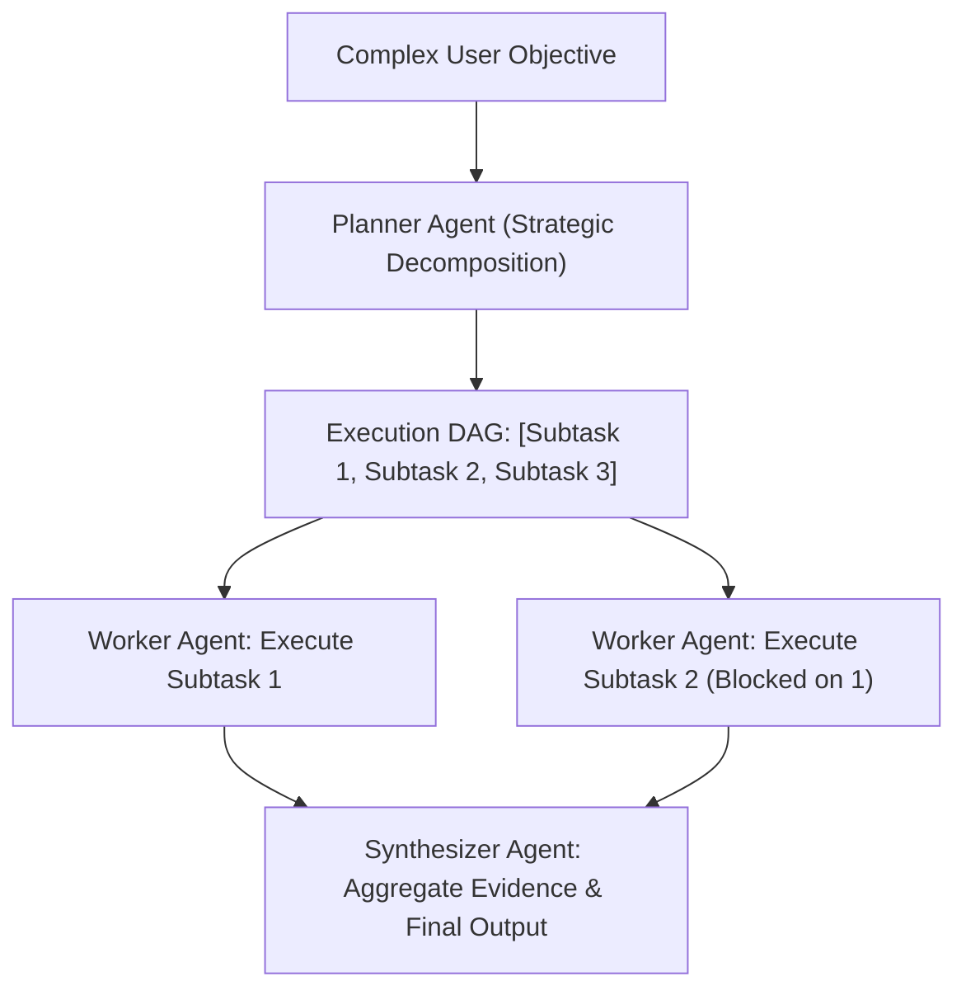

# Beginner Playground: Structured Tool Execution & Validation


> 💡 **Try It in the Live Runner:** You can run and modify any snippet in this playground directly in your browser! Click the **`▶ Run`** button in the header of any code block to test it instantly on the side, or toggle **`Live Runner`** in the top navigation bar to experiment with Python, PowerShell, and CLI commands while reading.

Welcome to Tool Execution! LLMs generate raw text, but real-world systems require strictly validated function calls with typed parameters.

---


## Plan-and-Solve Hierarchical Agent Architecture



## 1. The Core Mental Model: From Prompt to Type-Checked Call

```
 [ Python Function ]  --(Introspect Type Hints)--> [ JSON Schema ]
                                                          |
                                                          v
                                                  [ Injected in Prompt ]
                                                          |
                                                          v
 [ Python Tool Dispatch ] <-- (Pydantic Validate) <-- [ LLM JSON Output ]
```

1. **Schema Introspection**: Automatically extract parameters, types, defaults, and docstrings into OpenAI/Anthropic tool schemas.
2. **Type Coercion & Validation**: Verify that the arguments provided by the LLM match expected types (e.g. converting `"42"` to `42`, ensuring required keys exist).
3. **Sandboxed Execution**: Enforce timeouts and catch exceptions to prevent agent crashes.

---

## 2. Interactive Pure-Python Experiment: Zero-Dependency Tool Dispatcher

```python
import inspect
from typing import get_type_hints

def get_stock_price(symbol: str, exchange: str = "NASDAQ") -> str:
    """Fetch the current stock price of a company.
    :param symbol: Ticker symbol (e.g. AAPL, NVDA)
    :param exchange: Target stock exchange
    """
    return f"Stock {symbol} on {exchange} is currently $145.50"

def introspect_tool(fn):
    sig = inspect.signature(fn)
    hints = get_type_hints(fn)
    doc = inspect.getdoc(fn) or ""

    properties = {}
    required = []
    for name, param in sig.parameters.items():
        p_type = hints.get(name, str).__name__
        json_type = "integer" if p_type == "int" else ("number" if p_type == "float" else "string")
        properties[name] = {"type": json_type}
        if param.default == inspect.Parameter.empty:
            required.append(name)

    return {
        "name": fn.__name__,
        "description": doc.split("\n")[0],
        "parameters": {
            "type": "object",
            "properties": properties,
            "required": required
        }
    }

schema = introspect_tool(get_stock_price)
print("Generated Tool Schema:\n", schema)
```