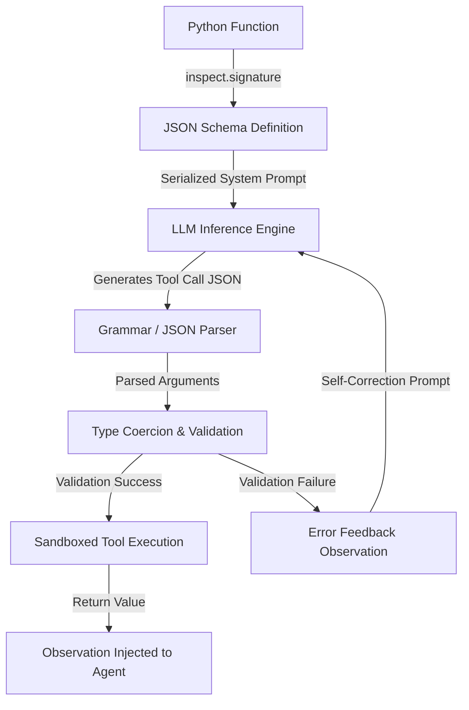

# Module 03: Tool Execution and Constrained Generation

---

## 🗺️ Recommended Step-by-Step Learning Path

Follow this exact sequence to achieve complete mastery of this module:

| Step | File to Open | What You Will Do |
| :---: | :--- | :--- |
| **1** | **[01_README.md](01_README.md)** | Read conceptual overview, architectural foundations, and mental models. |
| **2** | **[00_FOUNDATIONS_PLAYGROUND.md](00_FOUNDATIONS_PLAYGROUND.md)** | Practice beginner spoonfed micro-drills and line-by-line syntax breakdowns. |
| **3** | **[00_try_it_yourself.py](00_try_it_yourself.py)** | Run in terminal (`python 00_try_it_yourself.py`) for an interactive zero-dependency sandbox. |
| **4** | **[04_TROUBLESHOOTING_AND_EDGE_CASES.md](04_TROUBLESHOOTING_AND_EDGE_CASES.md)** | Study forensic runbooks, edge cases, and real-world failure post-mortems. |
| **5** | **[03_SELF_ASSESSMENT_AND_CHALLENGES.md](03_SELF_ASSESSMENT_AND_CHALLENGES.md)** | Test your knowledge with self-assessment quizzes, challenges, and diagnostic scenarios. |
| **6** | **[02_PROJECT_GUIDE.md](02_PROJECT_GUIDE.md)** | Follow guided project implementation for `starter/` and `project_solution/`. |
| **7** | **[problems/](problems/)** | Solve hands-on problem bank challenges and verify with `pytest problems/tests`. |
| **8** | **[debug_lab/](debug_lab/)** | Diagnose and fix silent production bugs in the Bug Hunter Drill. |

---

## 1. Architectural Foundations: Function Calling & Constrained Decoding

Modern agent architectures rely on tools to interact with APIs, databases, and operating systems. Ensuring that an LLM outputs syntactically and semantically valid tool arguments requires two complementary mechanisms:
1. **Logit-Level Constrained Generation**: Constraining next-token sampling to tokens that satisfy Context-Free Grammars (CFGs) or JSON Schema (e.g., Outlines, llama.cpp GBNF).
2. **Deterministic Schema Validation & Coercion**: A host-side dispatcher that validates parameters against Pydantic / JSON Schema contracts before execution.

---

## 2. Tool Schema Protocol & Execution Lifecycle

---

## 3. Sandboxing & Timeout Management

Tools often perform network I/O, database queries, or OS subprocess calls. Unbounded tool execution will deadlock agent worker threads.

Key production invariants:
- **Strict Wall-Clock Timeouts**: Every tool execution must run inside an isolated thread or subprocess bounded by a hard ceiling (e.g., 5.0 seconds).
- **Graceful Error Encapsulation**: A tool must never raise an unhandled exception to the main loop; exceptions must be caught, formatted as descriptive strings, and returned to the LLM as an observation so it can self-heal.
