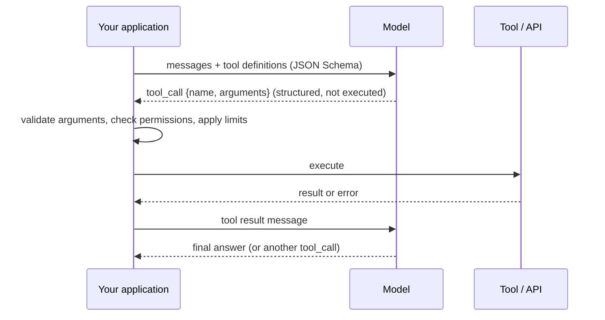

# Module 03: Function Calling, Structured Tool Execution & Constrained Generation

> **Architectural Scope**: The function-calling protocol, JSON Schema tool definitions, structured outputs and grammar-constrained decoding, validation and retry, tool design principles, safe execution, and the Model Context Protocol (MCP) for standardised tool servers.

---

## Why this module matters

A model can only *talk*. Tools are how it **acts**: querying a database, calling an API, running code, sending a message. The interface between a probabilistic text generator and deterministic software is therefore the most failure-prone and security-sensitive seam in any agent. If the model emits malformed JSON, picks the wrong function, invents an argument, or is tricked into calling a dangerous tool with attacker-controlled parameters, the agent breaks or causes harm. This module covers how tool calls work, how to **force valid structure**, how to **design tools models can use reliably**, how to **execute them safely**, and how **MCP** standardises tool integration.

## Mental model: a form the model fills in, which your code validates and runs

You give the model a catalogue of forms (tools), each with a name, a plain-language description, and typed fields. The model decides whether a form is needed and fills one in. **Your code, not the model, executes it**, after checking the form is valid and allowed, then hands the result back as a new message.


```mermaid
sequenceDiagram
    participant App as Your application
    participant LLM as Model
    participant Tool as Tool / API
    App->>LLM: messages + tool definitions (JSON Schema)
    LLM-->>App: tool_call {name, arguments} (structured, not executed)
    App->>App: validate arguments, check permissions, apply limits
    App->>Tool: execute
    Tool-->>App: result or error
    App->>LLM: tool result message
    LLM-->>App: final answer (or another tool_call)
```

## 1. The function-calling protocol

1. You describe tools: `name`, `description`, and `parameters` as **JSON Schema** (types, enums, required fields, descriptions).
2. The model returns either text or one or more **tool calls** (`name` plus a JSON `arguments` object), possibly **in parallel** when calls are independent.
3. You execute them and return **tool result** messages matched by call ID.
4. The model continues until it answers without calling tools.

```json
{
  "name": "get_order_status",
  "description": "Look up the shipping status of a customer order. Use only when the user provides or confirms an order ID.",
  "parameters": {
    "type": "object",
    "properties": {
      "order_id": {"type": "string", "description": "Order ID such as 'A-10293'"},
      "include_history": {"type": "boolean", "default": false}
    },
    "required": ["order_id"]
  }
}
```

**Tool-choice controls** (names vary by provider): `auto` (model decides), `required`/`any` (must call some tool), a specific tool, or `none`. Use `required` for extraction workflows where you always want structure.

## 2. Getting reliably structured output

| Method | Guarantee | Notes |
|---|---|---|
| Prompt only ("reply in JSON") | none | brittle: extra prose, trailing commas, wrong keys |
| **JSON mode** | valid JSON syntax | does not guarantee your schema |
| **Tool/function calling** | usually schema-shaped | model may still omit or misformat arguments |
| **Structured outputs / constrained decoding** | **output conforms to the schema** | enforced during generation |
| Validate + **retry with the error message** | eventual correctness | library support: Pydantic, Instructor |

### Constrained (grammar-guided) decoding

At each decoding step the model produces a probability distribution over the vocabulary. A **constrained decoder** compiles your JSON Schema (or regex, or a context-free grammar) into a **state machine**; at every step it computes which tokens are *valid next* given the text so far and sets all other tokens' logits to `-infinity` (a **mask**) before sampling. The output **cannot** violate the grammar. Implementations: OpenAI Structured Outputs (`strict: true`), Gemini and Anthropic structured/strict tool use, and open-source engines (**Outlines**, **XGrammar**, **llguidance**, `lm-format-enforcer`, vLLM and SGLang guided decoding, llama.cpp GBNF grammars).

**Worked example.** Schema: `{"status": "approved" | "rejected", "score": integer 0-100}`. After the model has emitted `{"status": "`, only the tokens that begin `approved` or `rejected` are unmasked; after the value and a comma, only `"score"` is valid; after `"score": ` only digits. The model's *semantic* choice (approved vs rejected, which number) is still its own; the grammar only forbids illegal characters.

Limits to remember:

- **Syntax is not semantics:** valid JSON can still contain wrong values. Validate business rules separately.
- Constraining can slightly **reduce quality** if the schema forces an answer before the model has reasoned: include a free-text `reasoning` field *before* the answer field (or reason first, then format).
- Providers support only a **subset of JSON Schema** (limits on recursion, optional fields, depth, number of properties); keep schemas simple and flat.
- Grammar compilation has a **first-call latency** cost for new schemas (cached afterwards).

## 3. Designing tools models can use

Tool design is **prompt engineering for an API**; it is where most agent failures originate.

1. **Few, purposeful tools.** Dozens of overlapping tools confuse selection. Prefer tools that do a meaningful job in one call (`schedule_meeting`) over many low-level ones (`list_calendars`, `get_slot`, `create_event`...), or load only the relevant subset per request (tool routing).
2. **Names and descriptions as documentation:** say *what it does, when to use it, when not to, and what it returns*. Include example values in parameter descriptions.
3. **Typed, constrained parameters:** enums, formats, min/max, required fields; avoid free-form strings when a choice list exists. Prefer human-meaningful IDs and names over opaque UUIDs where possible.
4. **Return model-friendly output:** concise, relevant fields, readable text or compact JSON; **paginate** and **truncate** large results with a note ("showing 10 of 240; refine the query").
5. **Helpful errors:** tell the model what went wrong *and how to fix it* ("`end_date` must be after `start_date`") so it can self-correct.
6. **Idempotency and safety:** side-effecting tools accept an **idempotency key**; separate **read** tools from **write** tools; make destructive actions require confirmation (Module 07).
7. **Test tools like a user would:** run realistic prompts and read the transcripts to see where the model misuses a tool, then fix the tool (rename a parameter, add an example) rather than patching the prompt.

## 4. Executing tool calls safely

**Treat model output as untrusted input**, exactly like user input to a web form.

- **Validate arguments** against the schema (Pydantic) before running; reject unknown tools and extra fields.
- **Authorise per call:** check that *this user* may perform *this action on this resource*, in your code, not in the prompt.
- **Parameterise** queries (no string-built SQL; see course 01 security and course 03), avoid shell injection, validate URLs (SSRF), constrain file paths.
- **Least privilege:** scoped API keys, read-only database roles, allow-lists of domains and commands.
- **Limits:** timeouts, rate limits, output size caps, per-run call budgets.
- **Sandbox code and shell tools** (Module 06).
- **Beware indirect prompt injection:** tool *results* (web pages, emails, documents) can contain instructions aimed at the agent. Never let tool output alter permissions or trigger high-impact tools without confirmation (course 12, Module 06).
- **Log every call** with arguments, results, user and trace ID.

## 5. Model Context Protocol (MCP)

Without a standard, connecting `M` applications to `N` tools needs `M x N` custom integrations. **MCP** (introduced by Anthropic in late 2024 and now widely adopted) is an open protocol that reduces this to `M + N`: any MCP-capable application can use any MCP server.

| Role | What it is |
|---|---|
| **MCP host** | the AI application the user interacts with (a desktop assistant, an IDE, your agent) |
| **MCP client** | the connector inside the host that maintains a one-to-one connection with a server |
| **MCP server** | a small program exposing capabilities over the protocol |

A server can expose three primitives: **tools** (functions the model may call), **resources** (data the application can read, such as files or database records), and **prompts** (reusable prompt templates). Messages are **JSON-RPC 2.0**; the common transports are **stdio** (local subprocess) and **Streamable HTTP** (remote servers). Clients and servers **negotiate capabilities** at connection time, and the client can list tools dynamically (`tools/list`) and call them (`tools/call`).

A minimal server with the Python SDK:

```python
from mcp.server.fastmcp import FastMCP

mcp = FastMCP("orders")

@mcp.tool()
def get_order_status(order_id: str) -> str:
    """Look up the shipping status of an order by its ID."""
    return lookup(order_id)          # your code

if __name__ == "__main__":
    mcp.run()                        # stdio transport by default
```

Type hints and the docstring become the tool's JSON Schema and description. The host decides which servers to connect and which tool calls require user approval.

**MCP security considerations:** servers run code on your behalf and their tool descriptions go into the model's prompt, so a malicious or compromised server can attempt **tool poisoning** (hidden instructions in descriptions) or return **injected content**; use only trusted servers, pin versions, scope credentials, require user confirmation for sensitive tools, use OAuth-based authorisation for remote servers, and monitor calls. Do not expose a server with broad filesystem or network access to untrusted prompts.

## Common pitfalls

1. **Trusting tool-call arguments** without validation or authorisation.
2. **Too many or overlapping tools**, causing wrong selection.
3. **Vague descriptions** and opaque parameter names.
4. **Returning enormous tool outputs** that flood the context.
5. **Error messages that say only "failed"**, leaving the model nothing to correct.
6. **Assuming JSON mode equals schema compliance.**
7. **Forcing the answer in the first field** of a constrained schema, which prevents reasoning.
8. **Connecting unvetted MCP servers**, or giving them broad permissions.
9. **Side-effecting tools without idempotency keys**, duplicating actions on retry.

## How this connects

- **Module 01** is the loop that calls tools; **Module 02** runs them in a `ToolNode`; **Module 06** sandboxes the dangerous ones; **Module 07** adds approval; **Module 08** evaluates tool-call correctness.
- **Course 01, Module 25** (tool calling basics) and **Course 01, Module 14** (Pydantic) supply validation tooling; **Course 12, Module 06** covers prompt injection through tools.

## Go further

- roadmap.sh: *AI Engineer* nodes **function calling** (Chat Completions/tool use), **building an MCP server**, **building an MCP client**, **MCP host**, **structured outputs**; *AI Agents* nodes **creating MCP servers**, **MCP hosts**, **tool invocation**.
- OpenAI Function Calling and Structured Outputs guides; Anthropic Tool Use documentation; modelcontextprotocol.io (specification and SDKs); Willard and Louf, *Efficient Guided Generation for LLMs* (Outlines, 2023); XGrammar paper (2024).
- Anthropic, *Writing tools for agents* (engineering blog).

---

## Module Study Progression
1. **Beginner Playground**: Read [00_FOUNDATIONS_PLAYGROUND.md](00_FOUNDATIONS_PLAYGROUND.md).
2. **Architecture Theory**: Study this [01_README.md](01_README.md).
3. **Hands-on Project**: Follow [02_PROJECT_GUIDE.md](02_PROJECT_GUIDE.md).
4. **Staff Interview Challenges**: Check [03_SELF_ASSESSMENT_AND_CHALLENGES.md](03_SELF_ASSESSMENT_AND_CHALLENGES.md).
5. **Production Debugging**: Review [04_TROUBLESHOOTING_AND_EDGE_CASES.md](04_TROUBLESHOOTING_AND_EDGE_CASES.md).
