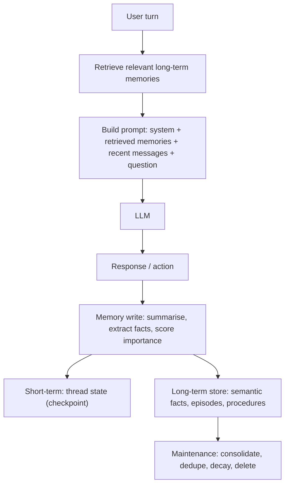

# Module 04: Agent Memory Systems (Short-Term, Episodic & Semantic)

> **Architectural Scope**: Why LLMs are stateless, the memory taxonomy (working/short-term, episodic, semantic, procedural), implementation patterns (buffers, summaries, vector and graph memory, self-editing memory), retrieval scoring, forgetting and aging, privacy and safety, and evaluation.

---

## Why this module matters

A language model has no memory between calls: everything it "remembers" is whatever you put in the prompt. A useful agent must nevertheless keep track of the current conversation, recall that this user prefers metric units and concise answers, remember how a similar task was solved last week, and stay within a finite context window and budget. **Memory design is the set of decisions about what to store, where, how to retrieve it, and when to forget.** Done well it produces agents that feel consistent and personalised; done badly it produces bloated prompts, stale or contradictory "facts", privacy violations, or an agent that confidently remembers something false forever.

## Mental model: a desk, a notebook and a filing cabinet

- **The desk (context window / working memory):** what the model sees right now. Fast, small, expensive per item.
- **The notebook for this job (short-term, thread-scoped memory):** the running record of the current conversation or task.
- **The filing cabinet (long-term memory):** facts, past experiences and learned procedures that persist across sessions, retrieved on demand and placed on the desk when relevant.

## 1. A taxonomy of agent memory

Borrowed from cognitive science and formalised for agents (for example in the CoALA framework):

| Type | What it holds | Example | Typical implementation |
|---|---|---|---|
| **Working / short-term** | the current conversation and task state | last 20 messages, the plan, tool results so far | message list in the prompt; thread state persisted by a **checkpointer** (Module 02) |
| **Semantic** | **facts** about the user or world, independent of when learned | "User is a vegetarian", "Project Atlas uses Postgres 16" | a profile document or key-value entries; vector index of extracted facts; knowledge graph |
| **Episodic** | specific **past experiences** and how they went | "Last Tuesday the deploy failed because of a missing env var; fixing X resolved it" | stored transcripts or summaries of episodes, retrieved by similarity; useful as few-shot examples |
| **Procedural** | **how to do things**: skills, rules, prompts | "When writing SQL for this warehouse, always filter by tenant_id" | updated system prompts/instructions, learned tool-use rules, saved code/skills |

## 2. Managing short-term memory

The context window is finite and cost grows with length (course 09), so a growing conversation must be managed:

- **Buffer / sliding window:** keep the last `N` messages (simple; loses early context).
- **Rolling summary:** keep a running summary of older turns plus the recent turns verbatim; periodically fold new turns into the summary.
- **Trimming tool outputs:** replace large old tool results with a one-line note or a reference (store the full output elsewhere).
- **Token-budgeted selection:** keep as many recent messages as fit a budget, always preserving the system prompt and pinned instructions.
- **Persist thread state** (checkpointer, Module 02) so a conversation can resume after a restart or days later.

## 3. Long-term memory patterns

1. **Extracted facts ("memory writing").** After or during the conversation, an LLM extracts durable facts (`{"user_diet": "vegetarian"}`) and writes or updates entries. Two styles: **hot path** (the agent decides to save during the turn, which is visible and immediate but adds latency) and **background** (a separate process consolidates after the conversation, which keeps responses fast).
2. **Vector memory.** Embed memory items and retrieve the top matches for the current query (the same machinery as RAG, course 10), usually with metadata filters (user ID, type, time).
3. **Knowledge-graph memory.** Store entities and relations (Module 07 of course 10, course 03 Module 16) for relational recall ("Alice manages Bob's project").
4. **Profile / document memory.** Maintain one structured profile per user (and per topic) that is rewritten as facts change; small enough to include in every prompt.
5. **Self-editing memory** (MemGPT/Letta): the agent is given tools to **read and write its own memory**, managing a small in-context "core memory" and a large external "archival/recall" store, much like an operating system pages memory in and out. The model itself decides what to remember.
6. **Episodic retrieval for in-context learning:** store successful trajectories and retrieve similar ones as examples for new tasks.

In **LangGraph**, short-term memory is the **checkpointed thread state** (scoped to a `thread_id`), while long-term memory lives in a **store** organised by **namespaces** (for example `("users", user_id, "preferences")`) that is shared across threads; libraries such as LangMem, Mem0 and Zep build memory extraction and consolidation on top.

## 4. Retrieval: what deserves to be recalled?

A simple and influential scoring rule from **Generative Agents** (Park et al., 2023) combines three signals for each memory:

`score = w_r x recency + w_i x importance + w_s x relevance`

- **Recency:** exponentially decaying with time since last access (for example `0.995^hours`).
- **Importance:** an LLM-assigned score (for example 1 to 10 for "how significant is this?") at write time.
- **Relevance:** embedding similarity between the memory and the current context.

**Worked example** (weights 1, importance normalised to 0 to 1): memory A is 2 hours old, importance 8/10, relevance 0.6: recency `0.995^2 = 0.99`, score `0.99 + 0.8 + 0.6 = 2.39`. Memory B is 100 hours old, importance 9/10, relevance 0.8: recency `0.995^100 = 0.61`, score `0.61 + 0.9 + 0.8 = 2.31`. A narrowly wins despite B being more relevant and important: tuning the weights changes which wins, which is why you evaluate retrieval on real conversations. The same paper adds **reflection**: periodically synthesising higher-level insights from recent memories and storing them as new memories.

## 5. Forgetting, aging and consolidation

Memory that only grows becomes slow, expensive and wrong. Maintenance strategies:

- **Decay / aging:** lower the weight of memories not accessed recently; delete below a threshold.
- **TTL (time to live)** for ephemeral facts ("travelling this week").
- **Importance-based retention:** keep high-importance memories longer; prune the rest.
- **Deduplication and merging:** collapse near-identical memories ("likes coffee", "drinks coffee daily") into one.
- **Contradiction resolution:** when a new fact conflicts with an old one ("moved to Berlin" vs "lives in Paris"), update or version the entry and keep timestamps rather than keeping both as equally true.
- **Summarise old episodes** into compact lessons.
- **User control:** let users view, correct and delete what the agent remembers.

## 6. Privacy, security and failure modes

- **Privacy and compliance:** memories contain personal data; store only what is needed, obtain consent, support **deletion and export** (GDPR-style rights), encrypt, and **isolate by user and tenant** (a namespace bug can leak one user's memories to another).
- **Memory poisoning:** an attacker (or a malicious web page the agent read) can plant false "facts" or instructions into long-term memory that influence future sessions. Treat memory writes from untrusted content with suspicion, validate and attribute sources, and avoid storing raw instructions from tool outputs.
- **Staleness and false recall:** old facts persisting after they change; always timestamp and prefer recent evidence.
- **Over-personalisation and leakage into unrelated contexts:** scope memories by task or topic.
- **Hallucinated memories:** LLM-extracted facts can be wrong; keep provenance (which message produced it).

## 7. Evaluating memory

Measure retrieval and behaviour, not just storage: whether the agent **recalls** a fact stated 50 turns or 5 sessions ago, **updates** it when the user corrects it, **ignores** irrelevant memories, and **forgets** on request. Benchmarks include **LoCoMo** and **LongMemEval** (long-term conversational memory); also build your own scenario tests from real transcripts (course 12).

## Common pitfalls

1. **Stuffing the full history into every prompt** until cost and quality degrade.
2. **Storing everything** with no importance filter, dedup or decay.
3. **No provenance or timestamps**, so stale or wrong facts cannot be corrected.
4. **Writing memories from untrusted tool content**, enabling poisoning.
5. **Weak user/tenant isolation** in the memory store.
6. **Summaries that drop critical specifics** (names, numbers, constraints).
7. **Synchronous memory writes on the hot path** that slow every response (when background consolidation would do).
8. **No way for users to inspect or delete memories.**

## How this connects

- **Module 02:** checkpoints (short-term) and stores (long-term); **Module 01:** the loop reads and writes memory each step; **Module 07:** time travel edits state memory; **Module 08:** evaluate recall.
- **Course 10** (vector search, GraphRAG, context optimisation) provides the retrieval machinery; **Course 03** covers the stores (Postgres/pgvector, Redis, Neo4j); **Course 12, Module 06** covers memory poisoning.

## Go further

- roadmap.sh: *AI Agents* nodes on **memory** (short-term, long-term, episodic, semantic), **forgetting / aging strategies**, **summarisation / compression**, **vector databases**.
- Park et al., *Generative Agents: Interactive Simulacra of Human Behavior* (2023); Packer et al., *MemGPT: Towards LLMs as Operating Systems* (2023); Sumers et al., *Cognitive Architectures for Language Agents (CoALA)* (2023); Maharana et al., *LoCoMo* (2024); Wu et al., *LongMemEval* (2024).
- LangGraph memory concepts; Letta, Mem0, Zep and LangMem documentation.

---

## Module Study Progression
1. **Beginner Playground**: Read [00_FOUNDATIONS_PLAYGROUND.md](00_FOUNDATIONS_PLAYGROUND.md).
2. **Architecture Theory**: Study this [01_README.md](01_README.md).
3. **Hands-on Project**: Follow [02_PROJECT_GUIDE.md](02_PROJECT_GUIDE.md).
4. **Staff Interview Challenges**: Check [03_SELF_ASSESSMENT_AND_CHALLENGES.md](03_SELF_ASSESSMENT_AND_CHALLENGES.md).
5. **Production Debugging**: Review [04_TROUBLESHOOTING_AND_EDGE_CASES.md](04_TROUBLESHOOTING_AND_EDGE_CASES.md).
