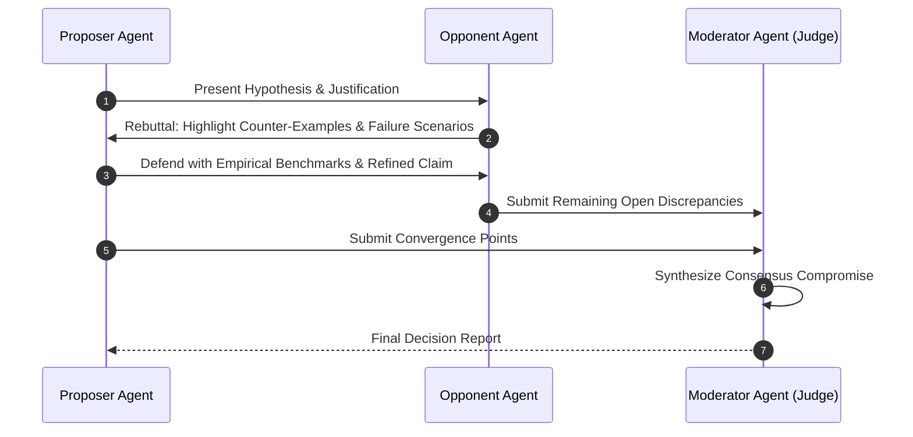

# Beginner Playground: Multi-Agent Swarms & Handoffs


> 💡 **Try It in the Live Runner:** You can run and modify any snippet in this playground directly in your browser! Click the **`▶ Run`** button in the header of any code block to test it instantly on the side, or toggle **`Live Runner`** in the top navigation bar to experiment with Python, PowerShell, and CLI commands while reading.

Welcome to Multi-Agent Collaboration! When tasks become complex, a single agent gets overwhelmed with tool bloat and conflicting instructions. Instead, we compose networks of specialized agents.

---


## Multi-Agent Consensus Debate Protocol



## 1. The Core Mental Model: Swarm Handoffs

In the **OpenAI Swarm** pattern, agents collaborate not via heavy message brokers, but through lightweight **Handoffs**:
- An agent can return another `Agent` object as its tool output!
- When Agent A returns `transfer_to_billing()`, the execution loop immediately switches the active agent to the Billing Agent, transferring the conversation context.

```
 [ User ] ---> [ Triage Agent ]
                     |
         (transfer_to_tech_support)
                     |
                     v
           [ Technical Support Agent ] ---> (Resolves issue)
```

---

## 2. Interactive Pure-Python Experiment: Zero-Dependency Agent Swarm

```python
from typing import Dict, Any, Callable

class Agent:
    def __init__(self, name: str, instructions: str, tools: Dict[str, Callable] = None):
        self.name = name
        self.instructions = instructions
        self.tools = tools or {}

def run_swarm(initial_agent: Agent, user_message: str):
    active = initial_agent
    print(f"[*] Starting Swarm with Active Agent: {active.name}")
    print(f"User: {user_message}\n")

    # Simple triage logic
    if "refund" in user_message.lower():
        print(f"[{active.name}] Transferring to Billing Agent...")
        active = billing_agent
    else:
        print(f"[{active.name}] Handling directly...")

    response = f"Hello from {active.name}! Handling your request: '{user_message}'"
    print(f"Response: {response}")
    return active, response

triage_agent = Agent(name="Triage Agent", instructions="Route user requests to specialists.")
billing_agent = Agent(name="Billing Agent", instructions="Handle refund and invoice inquiries.")

run_swarm(triage_agent, "I need a refund for invoice #9821")
```