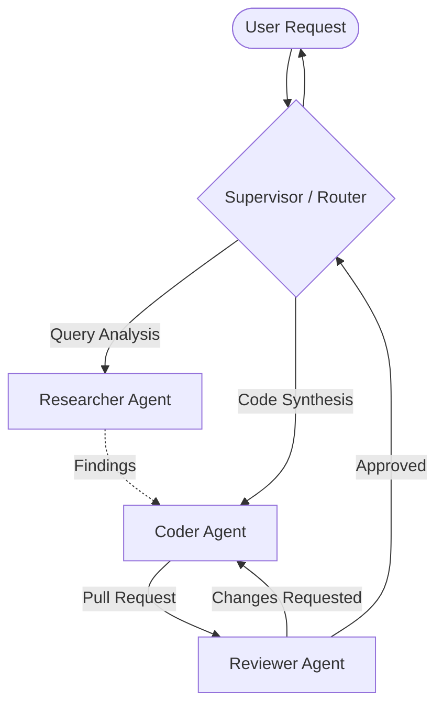

# Module 05: Multi-Agent Collaboration Topologies

---

## 🗺️ Recommended Step-by-Step Learning Path

Follow this exact sequence to achieve complete mastery of this module:

| Step | File to Open | What You Will Do |
| :---: | :--- | :--- |
| **1** | **[01_README.md](01_README.md)** | Read conceptual overview, architectural foundations, and mental models. |
| **2** | **[00_FOUNDATIONS_PLAYGROUND.md](00_FOUNDATIONS_PLAYGROUND.md)** | Practice beginner spoonfed micro-drills and line-by-line syntax breakdowns. |
| **3** | **[00_try_it_yourself.py](00_try_it_yourself.py)** | Run in terminal (`python 00_try_it_yourself.py`) for an interactive zero-dependency sandbox. |
| **4** | **[04_TROUBLESHOOTING_AND_EDGE_CASES.md](04_TROUBLESHOOTING_AND_EDGE_CASES.md)** | Study forensic runbooks, edge cases, and real-world failure post-mortems. |
| **5** | **[03_SELF_ASSESSMENT_AND_CHALLENGES.md](03_SELF_ASSESSMENT_AND_CHALLENGES.md)** | Test your knowledge with self-assessment quizzes, challenges, and diagnostic scenarios. |
| **6** | **[02_PROJECT_GUIDE.md](02_PROJECT_GUIDE.md)** | Follow guided project implementation for `starter/` and `project_solution/`. |
| **7** | **[problems/](problems/)** | Solve hands-on problem bank challenges and verify with `pytest problems/tests`. |
| **8** | **[debug_lab/](debug_lab/)** | Diagnose and fix silent production bugs in the Bug Hunter Drill. |

---

## 1. Architectural Foundations: Multi-Agent Communication Topologies

Multi-agent architectures decompose complex enterprise workflows into networks of specialized LLMs. By scoping each agent's system prompt and toolset, teams eliminate tool hallucination and prompt drift.

### 1.1 Collaboration Topologies

| Topology | Control Flow | Communication Medium | Strengths | Failure Modes |
| :--- | :--- | :--- | :--- | :--- |
| **Supervisor-Worker** | Centralized hierarchical | Direct RPC / function call | Predictable, clear task allocation | Supervisor bottleneck, single point of failure |
| **Swarm Handoff** | Decentralized peer-to-peer | Direct agent object return | Low latency, zero coordinator overhead | Ping-pong handoff cycles |
| **Consensus / Debate** | Parallel peer deliberation | Round-robin message broadcast | High reasoning accuracy, self-checking | $N\times$ token cost, convergence deadlocks |
| **Publish-Subscribe** | Event-driven decoupled | Message queue (Kafka, Redis) | Massive scale, asynchronous | Eventual consistency, debugging difficulty |

---

## 2. Dynamic Handoff Protocols & Memory Transfer

When Agent $A$ hands off control to Agent $B$:
1. **Context Filtering**: Passing the full message history $H_t$ causes context bloat and confuses Agent $B$.
2. **Context Summarization**: Agent $A$ synthesizes a structured transfer payload:
   $$\mathcal{P}_{A \rightarrow B} = \{ \text{Goal}, \text{Key Findings}, \text{Pending Actions}, \text{User Constraints} \}$$
3. **Loop Prevention**: Maintain a handoff stack with a maximum depth ceiling $D_{max}$ (e.g. 5 hops) to detect cyclical delegation loops ($A \rightarrow B \rightarrow A \rightarrow B$).

---

## 3. Consensus & Multi-Agent Debate

In high-stakes domains (e.g., medical diagnosis, security audits), multiple distinct agent personas independently generate hypotheses and critique each other's outputs across $R$ debate rounds:
$$\text{Consensus} = \operatorname{arg\,max}_{y} \sum_{i=1}^{M} w_i \cdot \mathbb{I}(y_i^{(R)} = y)$$
Multi-agent debate significantly reduces sycophancy and factual hallucinations.
