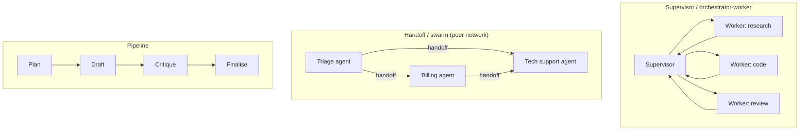

# Module 05: Multi-Agent Collaboration Topologies & Swarms

> **Architectural Scope**: When one agent is not enough, the main collaboration topologies (supervisor/orchestrator-worker, hierarchical, handoff/swarm, pipeline, debate/critic, blackboard), communication and state sharing, frameworks and protocols (LangGraph, CrewAI, AutoGen, Agents SDK handoffs, A2A), cost and failure modes, and design rules.

---

## Why this module matters

A single agent with many tools and a long, cluttered context eventually degrades: it picks the wrong tool, forgets constraints, runs out of context, and cannot work on independent sub-problems at the same time. **Multi-agent systems** split the work across several LLM-driven agents, each with a focused role, prompt, tool set and context, coordinated by some topology. Done right, this improves quality on **broad, parallelisable** tasks (deep research, large codebase changes, multi-step business processes). Done wrong, it multiplies cost, adds coordination bugs, and performs *worse* than a single agent. The skill is knowing when to split and which structure to use.

## Mental model: a small company, with an org chart

Individual employees (agents) have specialties, their own desks (contexts) and tools. How work flows depends on the org chart: a **manager** who assigns tasks and merges results, an **assembly line**, a **team that hands customers off between departments**, or a **committee that debates**. Each structure has overhead (meetings = tokens) and suits different work.

```mermaid
flowchart TD
    subgraph Sup["Supervisor / orchestrator-worker"]
        S["Supervisor"] --> W1["Worker: research"]
        S --> W2["Worker: code"]
        S --> W3["Worker: review"]
        W1 --> S
        W2 --> S
        W3 --> S
    end
    subgraph Net["Handoff / swarm (peer network)"]
        T["Triage agent"] -->|"handoff"| B["Billing agent"]
        T -->|"handoff"| TS["Tech support agent"]
        B -->|"handoff"| TS
    end
    subgraph Pipe["Pipeline"]
        P1["Plan"] --> P2["Draft"] --> P3["Critique"] --> P4["Finalise"]
    end
```

## 1. Topologies

| Topology | How it works | Best for | Watch out for |
|---|---|---|---|
| **Single agent + tools** | one loop, many tools | most tasks; the baseline you must beat | tool overload, context bloat |
| **Supervisor / orchestrator-worker** | a lead agent decomposes the task, delegates to **workers** (often in parallel) with their own contexts, then synthesises | research, breadth-first tasks, independent subtasks | the supervisor is a bottleneck and a single point of failure; weak decomposition wastes work |
| **Hierarchical** | supervisors of supervisors (teams of teams) | very large tasks with natural sub-organisations | latency, communication overhead, error propagation through layers |
| **Handoff / swarm** | agents **transfer control** (and relevant context) to a more suitable agent; no central manager | customer-service routing, triage, specialist escalation | handoff loops, lost context, unclear ownership |
| **Pipeline (sequential)** | fixed stages: plan, draft, review, finalise | predictable workflows (content, code with review) | rigid; one bad stage poisons the rest |
| **Debate / critic / ensemble** | several agents propose answers, a judge picks or merges (or a critic reviews a generator) | reasoning accuracy, evaluator-optimizer loops | token cost multiplies; groupthink if agents share biases |
| **Blackboard / shared workspace** | agents read and write a common state/documents | collaborative document or plan building | write conflicts, noisy shared state |

Many of these are the **workflow patterns** from Module 01 (routing, parallelisation, orchestrator-workers, evaluator-optimizer) with each box implemented by an agent.

## 2. Why split? (and why not)

**Genuine benefits**

- **Context isolation:** each agent sees only what it needs, so prompts stay focused and long tool outputs do not pollute others.
- **Parallelism:** independent subtasks run concurrently, cutting wall-clock time.
- **Specialisation:** per-role prompts, tools and even models (a strong model to plan, cheaper models to execute).
- **Scaling beyond limits:** a handful of tools per agent instead of dozens in one.
- **Separation of concerns and verification:** a reviewer agent with fresh context catches errors the author missed.

**Real costs**

- **Tokens:** Anthropic reported that in its multi-agent research system, agents used about **4x** the tokens of a chat interaction and multi-agent systems about **15x**, so the task's value must justify it. In the same write-up, an orchestrator with sub-agents outperformed a single agent by a large margin (about 90% on their internal research evaluation) on **breadth-first** research questions.
- **Coordination errors:** agents can duplicate work, contradict each other, or act on different assumptions. Cognition's "Don't build multi-agents" essay argues that **sharing full context and decisions** between steps matters so much that for many tasks (especially coding, where subtasks are tightly coupled) a single agent with good context management is more reliable.
- **Harder debugging, evaluation and observability** (non-deterministic multi-party transcripts).

**Heuristic:** use multiple agents when the task is **broad and decomposable into mostly independent parts** (research, many-file migrations, parallel data gathering) and value is high; prefer one agent when steps are **tightly coupled and share lots of state** (a single feature implementation, a delicate debugging session).

## 3. Communication and state

- **Message passing:** agents exchange messages (like a group chat); simple and flexible, but transcripts grow and meaning can be lost.
- **Shared state:** agents read and write a typed state object or a shared file/blackboard (LangGraph state, a shared workspace); explicit and auditable, needs reducers and conflict rules (Module 02).
- **Handoffs:** an agent returns a **handoff** (target agent plus context summary); the framework switches the active agent. Decide *what context transfers*: the whole history, a summary, or just a structured brief.
- **Structured interfaces:** have workers return **structured results** (schemas) rather than prose, so the orchestrator can merge them reliably; include **sources/evidence** for verification.
- **Briefs matter:** the orchestrator must give each worker a clear objective, output format, tool guidance, boundaries and effort budget; vague delegation causes duplicated or off-target work.
- **Open protocols:** MCP standardises agent-to-tool connections (Module 03); **A2A (Agent2Agent)** proposes a standard for agents from different vendors/frameworks to discover each other (agent cards) and exchange tasks.

## 4. Frameworks

- **LangGraph:** multi-agent graphs, subgraphs per agent, the `langgraph-supervisor` and `langgraph-swarm` helpers, handoff tools via `Command(goto=...)` (Module 02).
- **OpenAI Agents SDK (successor of the educational Swarm):** agents with **handoffs**, guardrails and tracing.
- **CrewAI:** role-based "crews" of agents and tasks, process modes (sequential, hierarchical).
- **AutoGen / AG2:** conversational multi-agent teams (group chat, round-robin, selector).
- **Google ADK, Claude Agent SDK (subagents), Semantic Kernel, smolagents:** other approaches with built-in orchestration.

## 5. Failure modes and controls

| Failure | Cause | Control |
|---|---|---|
| **Runaway cost** | many agents, long chats, retries | budgets per agent and overall, caps on worker count and rounds, cheaper models for workers |
| **Infinite delegation / ping-pong handoffs** | agents keep passing the task | max handoffs, termination conditions, a clear "owner" |
| **Error propagation** | a worker's wrong result trusted by others | verification steps, evidence requirements, reviewer agent, tests |
| **Duplicated or conflicting work** | poor task boundaries | explicit non-overlapping assignments, shared task board with locks |
| **Context loss** | handoff summaries drop details | structured handoff schemas, shared artefacts instead of paraphrase |
| **Prompt injection spreading between agents** | one agent's compromised output instructs another | treat inter-agent messages as untrusted, least-privilege tools per agent (Module 06; course 12) |
| **Unobservable behaviour** | scattered transcripts | trace the whole run with parent/child spans (course 12, Module 08) |

## 6. Design checklist

1. **Beat the baseline first:** build a single-agent version and measure; add agents only if you can show a gain on your evaluation set (Module 08).
2. **Define roles and interfaces** (inputs, outputs, tools, stop condition) for every agent.
3. **Choose the simplest topology** that matches the work's dependency structure (parallel? sequential? routing?).
4. **Give each agent the minimum tools and permissions** it needs.
5. **Bound everything:** rounds, agents, tokens, time, cost.
6. **Make results checkable:** structured outputs, citations, tests.
7. **Instrument and replay:** full traces, checkpointed state (Module 02), the ability to rerun one agent.
8. **Keep a human in the loop** for consequential actions (Module 07).

## Worked example: research orchestrator

*"Compare the top five open-source vector databases on filtering performance and licensing."* The lead agent plans five parallel subtasks (one per database) and starts five workers with identical instructions: *find filtered-search benchmarks and the licence; return JSON `{name, license, benchmark_source, qps, recall, caveats}` with URLs; stop after 8 tool calls*. Workers run concurrently in separate contexts (wall-clock time roughly that of the slowest worker rather than the sum of five), return structured results, and the lead merges, flags missing data, and may spawn a verifier to check the two numbers that look inconsistent. Token cost is several times a single-agent run, but the task is broad, independent and valuable enough to justify it. For "fix this one failing test", the same machinery would only add overhead.

## Common pitfalls

1. **Reaching for multi-agent by default**, without a single-agent baseline.
2. **Vague delegation**, giving workers no objective, format or boundaries.
3. **Unbounded rounds/agents**, causing cost explosions.
4. **Paraphrased handoffs** that lose critical details.
5. **Letting agents write the same resource** without coordination.
6. **Trusting other agents' outputs blindly**, so errors and injections propagate.
7. **No tracing**, making failures impossible to localise.
8. **Using identical prompts and models for debaters**, getting correlated errors instead of diversity.

## How this connects

- **Module 01** defines workflows and the single-agent loop; **Module 02** provides subgraphs, shared state and handoffs; **Module 03** gives MCP/tool interfaces; **Module 04** covers shared and private memory; **Module 06** isolates what each agent may execute; **Module 07** adds approvals; **Module 08** measures whether it helped.
- **Course 04** (distributed systems, messaging, sagas, consensus) provides the conceptual toolkit for coordination, idempotency and failure handling; **Course 12** covers guardrails and observability.

## Go further

- roadmap.sh: *AI Agents* nodes on **multi-agent**, **handoffs**, **crewai**, **planner executor**, **agent protocols**.
- Anthropic, *How we built our multi-agent research system* and *Building effective agents*; Cognition, *Don't Build Multi-Agents*; Wu et al., *AutoGen* (2023); Hong et al., *MetaGPT* (2023); LangGraph multi-agent concepts and the supervisor/swarm libraries; Google's A2A protocol specification.

---

## Module Study Progression
1. **Beginner Playground**: Read [00_FOUNDATIONS_PLAYGROUND.md](00_FOUNDATIONS_PLAYGROUND.md).
2. **Architecture Theory**: Study this [01_README.md](01_README.md).
3. **Hands-on Project**: Follow [02_PROJECT_GUIDE.md](02_PROJECT_GUIDE.md).
4. **Staff Interview Challenges**: Check [03_SELF_ASSESSMENT_AND_CHALLENGES.md](03_SELF_ASSESSMENT_AND_CHALLENGES.md).
5. **Production Debugging**: Review [04_TROUBLESHOOTING_AND_EDGE_CASES.md](04_TROUBLESHOOTING_AND_EDGE_CASES.md).
