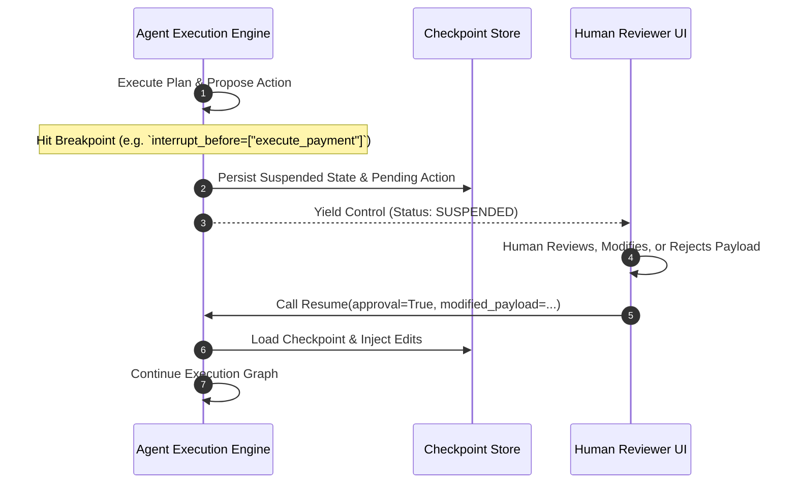

# Module 07: Human-in-the-Loop and Time Travel

---

## 1. Architectural Foundations: Interrupts and Resumption

Enterprise autonomous agents cannot operate as completely closed black boxes. The **Human-in-the-Loop (HITL)** architecture introduces deterministic pause-and-resume control flow:

---

## 2. Time Travel & State Rewind Semantics

Because every superstep generates an immutable snapshot $M_k$:
1. **Rewind**: Restoring state to step $j < k$ allows a developer or auditor to inspect exactly what the agent knew at that instant.
2. **Branching**: A human can edit state variable $S_j['query'] = 'new_query'$ and resume execution, creating a divergent trajectory branch without mutating the historical record.
3. **Optimistic Rollback**: If an agent executes an action that fails verification, the engine rolls back state to $M_{k-1}$ and selects an alternative tool path.
