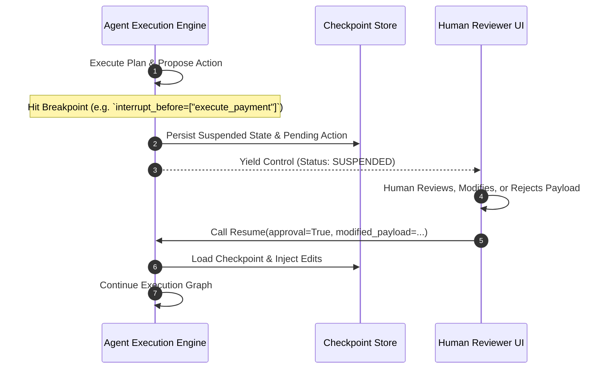

# Module 07: Human-in-the-Loop and Time Travel

---

## 🗺️ Recommended Step-by-Step Learning Path

Follow this exact sequence to achieve complete mastery of this module:

| Step | File to Open | What You Will Do |
| :---: | :--- | :--- |
| **1** | **[01_README.md](01_README.md)** | Read conceptual overview, architectural foundations, and mental models. |
| **2** | **[00_FOUNDATIONS_PLAYGROUND.md](00_FOUNDATIONS_PLAYGROUND.md)** | Practice beginner spoonfed micro-drills and line-by-line syntax breakdowns. |
| **3** | **[00_try_it_yourself.py](00_try_it_yourself.py)** | Run in terminal (`python 00_try_it_yourself.py`) for an interactive zero-dependency sandbox. |
| **4** | **[04_TROUBLESHOOTING_AND_EDGE_CASES.md](04_TROUBLESHOOTING_AND_EDGE_CASES.md)** | Study forensic runbooks, edge cases, and real-world failure post-mortems. |
| **5** | **[03_SELF_ASSESSMENT_AND_CHALLENGES.md](03_SELF_ASSESSMENT_AND_CHALLENGES.md)** | Test your knowledge with self-assessment quizzes, challenges, and diagnostic scenarios. |
| **6** | **[02_PROJECT_GUIDE.md](02_PROJECT_GUIDE.md)** | Follow guided project implementation for `starter/` and `project_solution/`. |
| **7** | **[problems/](problems/)** | Solve hands-on problem bank challenges and verify with `pytest problems/tests`. |
| **8** | **[debug_lab/](debug_lab/)** | Diagnose and fix silent production bugs in the Bug Hunter Drill. |

---

## 1. Architectural Foundations: Interrupts and Resumption

Enterprise autonomous agents cannot operate as completely closed black boxes. The **Human-in-the-Loop (HITL)** architecture introduces deterministic pause-and-resume control flow:

---

## 2. Time Travel & State Rewind Semantics

Because every superstep generates an immutable snapshot $M_k$:
1. **Rewind**: Restoring state to step $j < k$ allows a developer or auditor to inspect exactly what the agent knew at that instant.
2. **Branching**: A human can edit state variable $S_j['query'] = 'new_query'$ and resume execution, creating a divergent trajectory branch without mutating the historical record.
3. **Optimistic Rollback**: If an agent executes an action that fails verification, the engine rolls back state to $M_{k-1}$ and selects an alternative tool path.
