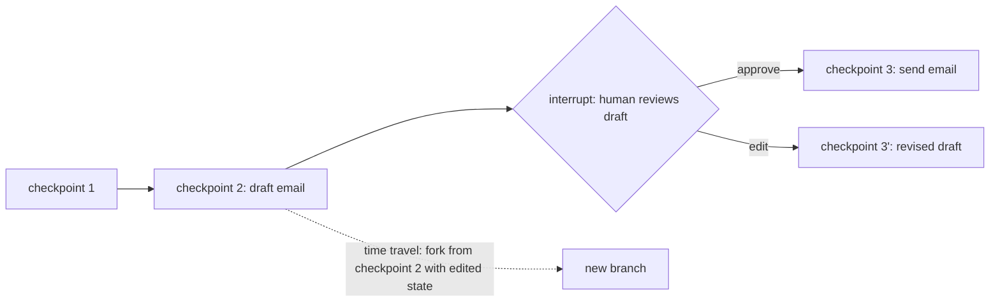

# Module 07: Human-in-the-Loop & Time Travel (State Rewinding)

> **Architectural Scope**: Pausing an agent for human approval, edits or input (interrupts and breakpoints), risk-based approval policy, durable resumption, and **time travel**: inspecting checkpoint history, replaying and forking from an earlier state, with the caveats around side effects and non-determinism.

---

## Why this module matters

Autonomy is a dial, not a switch. Agents are good at drafting, searching and analysing, and unreliable on judgement calls and irreversible actions: sending the email, issuing the refund, deploying to production, deleting the table. The practical answer is **human-in-the-loop (HITL)**: the agent runs on its own until it reaches a decision that needs a person, **pauses without losing its place**, waits (seconds or days), and then continues with the human's input. The same persistence that makes pausing possible also allows **time travel**: rewinding to an earlier step to debug, correct a mistake, or explore "what if". Together they turn a black-box autonomous process into something you can supervise, audit and steer.

## Mental model: a video game with save points and a pause button

At designated moments the game **pauses and waits for the player** (approve, edit, answer). Every step is **saved**, so you can close the game and come back tomorrow. And you can **load an earlier save**, change one decision, and play forward on a new branch without destroying the original timeline.


```mermaid
flowchart LR
    S1["checkpoint 1"] --> S2["checkpoint 2: draft email"]
    S2 --> P{"interrupt: human reviews draft"}
    P -->|"approve"| S3["checkpoint 3: send email"]
    P -->|"edit"| S3b["checkpoint 3': revised draft"]
    S2 -.->|"time travel: fork from checkpoint 2 with edited state"| F1["new branch"]
```

## 1. Human-in-the-loop patterns

| Pattern | What the human does | Example |
|---|---|---|
| **Approve / reject** | gates an action | "Send this refund of $480?" Approve or reject |
| **Edit** | modifies the proposed action or state, then continues | change the tool arguments, fix a draft, adjust a plan |
| **Provide input** | answers a question the agent cannot resolve | "Which of these two customers did you mean?" |
| **Review a plan** | approves, edits or reorders a multi-step plan before execution | planner-executor agents (Module 01) |
| **Supervise / take over** | watches a run, intervenes, resumes or redirects | long-running research or coding agents |
| **Escalate** | agent hands the case to a person with context | low-confidence or policy-sensitive requests |

### Implementing a pause in LangGraph

The `interrupt()` function pauses the graph at that point, **persists** the state (a checkpointer is required, Module 02), and surfaces a payload to the caller. Resuming passes the human's answer back in:

```python
from langgraph.types import interrupt, Command

def review_refund(state):
    decision = interrupt({                       # execution stops here; payload goes to the UI
        "action": "refund",
        "amount": state["amount"],
        "customer": state["customer_id"],
        "question": "Approve this refund?",
    })
    if decision["approved"]:
        return Command(goto="issue_refund", update={"amount": decision.get("amount", state["amount"])})
    return Command(goto="notify_denied")

cfg = {"configurable": {"thread_id": "case-731"}}
out = app.invoke({"customer_id": "C-9"}, cfg)          # runs until interrupt; returns the pending request
# ... hours later, in another process ...
app.invoke(Command(resume={"approved": True, "amount": 400}), cfg)   # continues from the same place
```

Important mechanics:

- **On resume, the interrupted node re-runs from its beginning**, and `interrupt()` now returns the human's value instead of pausing. Therefore, put **side effects after the interrupt** (or make anything before it idempotent), and keep only one decision per interrupt point (or number them consistently).
- **Static breakpoints**: `compile(interrupt_before=["tools"])` or `interrupt_after=[...]` pause before or after named nodes, useful for debugging and simple "review every tool call" setups; dynamic `interrupt()` is more flexible because it can be conditional on the state.
- The caller identifies the pending run by **`thread_id`**, so many paused conversations can wait concurrently, with no process kept alive (state lives in the checkpoint store).

## 2. Deciding *what* needs a human

Asking for approval on everything causes **approval fatigue** (people click "approve" without reading) and destroys the agent's value; asking for nothing is unsafe. Use **risk-based gating**:

| Action class | Examples | Policy |
|---|---|---|
| Read-only, reversible, internal | search, read a ticket, run a SELECT | auto-approve |
| Reversible writes with low impact | create a draft, add a label | auto-approve, log |
| **Irreversible or external** | send email, post publicly, make a payment, delete data, deploy | **require approval** |
| **High value or sensitive** | amounts above a threshold, PII exports, permission changes | approval, possibly two-person |
| **Low model confidence or policy trigger** | ambiguous request, guardrail flag | escalate |

Good practice: show the approver the **exact action with parameters and a short rationale** (not "approve step 4"), a **diff** for edits, and the evidence the agent used; bind approvals to the **authenticated identity**; set **expiry/timeouts** (stale approvals are dangerous; the world changes); support asynchronous channels (Slack, email, a review queue); keep an **audit log** of who approved what and when; and re-validate the action's preconditions at execution time.

## 3. Time travel

Every superstep produced a **checkpoint** (Module 02), so the thread's entire history is a list of snapshots. Time travel uses that history:

1. **Inspect:** list checkpoints with `app.get_state_history(cfg)`. Each snapshot has its `values` (the state), `next` (which nodes would run), metadata and a `checkpoint_id`.
2. **Replay:** invoke from an earlier checkpoint by passing its config (`{"configurable": {"thread_id": ..., "checkpoint_id": ...}}`) with `None` as input; the graph re-executes the steps after that point.
3. **Fork:** call `app.update_state(config_at_checkpoint, new_values)` to write an **edited** state as a new checkpoint (a new branch), then invoke from it. The original history remains intact.

```python
history = list(app.get_state_history(cfg))               # newest first
target = next(s for s in history if s.next == ("call_tool",))   # state just before the bad tool call
forked = app.update_state(target.config, {"messages": [corrected_message]})   # edit and branch
app.invoke(None, forked)                                  # continue from the edited state
```

**Uses:** debugging ("what exactly did the agent know at step 7?"); **fixing a mistake** without restarting an hour-long job (rewind to before the wrong turn, correct the state or instruction, continue); **what-if exploration** (try a different prompt or tool result from the same point); **regression tests and A/B comparisons** from a fixed starting state; and human **steering** ("go back and try approach B").

## 4. Caveats: time travel rewinds the *agent's state*, not the world

- **Side effects re-run.** Replaying nodes that send emails, charge cards or write to databases will do it again. Make tools idempotent (idempotency keys), mark replay-safe vs unsafe nodes, or run time-travel debugging with tools **stubbed or in dry-run mode**.
- **External state is not rewound.** If step 5 deleted a file, rewinding the agent does not restore it; use **compensating actions** (sagas, course 04, Module 23) or snapshots of external systems.
- **Non-determinism.** LLM calls produce different outputs on replay (even at low temperature, and models change). For exact reproduction, **record and replay** LLM and tool responses (cassette-style), or accept divergence and treat replay as "re-run from here".
- **Schema and code drift:** old checkpoints may not load after state-schema or graph changes; version them.
- **Privacy and retention:** checkpoints contain full conversation and tool data; apply retention limits, encryption and access control (Module 04).
- **Size:** store large artefacts by reference so checkpoints stay small.

## Worked example: an outbound-email agent

The agent drafts an email to a client (checkpoint 4), then reaches `review_email`, calls `interrupt({"draft": ..., "to": ..., "reason": ...})`, and the run is persisted and a Slack message with Approve / Edit / Reject buttons goes to the account manager. Six hours later the manager edits one sentence and approves; the app resumes with `Command(resume={"approved": True, "draft": edited})`; the `send_email` node (placed *after* the interrupt, with an idempotency key) sends exactly once. Later, QA notices the agent cited the wrong contract clause; an engineer loads the history, finds checkpoint 3 (before retrieval), forks it with a corrected retrieval filter using `update_state`, and replays the downstream steps with the email tool stubbed to compare the new draft with the old, without sending anything.

## Common pitfalls

1. **Side effects before `interrupt()`** that run again on resume.
2. **Approval fatigue** from gating low-risk actions.
3. **Vague approval prompts** ("approve?") with no parameters or rationale.
4. **No timeout or expiry** on pending approvals.
5. **Using an in-memory checkpointer**: pending approvals vanish on restart.
6. **Replaying with live side-effecting tools**, duplicating real actions.
7. **Assuming replays are deterministic.**
8. **Letting the model decide whether it needs approval** for high-risk actions; enforce policy in code.
9. **No audit trail** of approvals and edits.

## How this connects

- **Module 02** provides checkpoints, `thread_id`, `interrupt`, `Command`; **Module 03** and **Module 06** define which tools are dangerous enough to gate; **Module 05**'s supervisors can escalate to humans; **Module 08** evaluates the quality of escalation and approvals.
- **Course 04** (idempotency, sagas) governs safe replay and compensation; **Course 12** covers guardrails, audit and governance.

## Go further

- roadmap.sh: *AI Agents* nodes on **human in the loop**, **observability**, **state / persistence**; *AI Engineer* safety nodes.
- LangGraph documentation: human-in-the-loop (interrupts, `Command`), persistence and time travel; Anthropic, *Building effective agents* (human checkpoints); NIST AI RMF for human oversight guidance.

---

## Module Study Progression
1. **Beginner Playground**: Read [00_FOUNDATIONS_PLAYGROUND.md](00_FOUNDATIONS_PLAYGROUND.md).
2. **Architecture Theory**: Study this [01_README.md](01_README.md).
3. **Hands-on Project**: Follow [02_PROJECT_GUIDE.md](02_PROJECT_GUIDE.md).
4. **Staff Interview Challenges**: Check [03_SELF_ASSESSMENT_AND_CHALLENGES.md](03_SELF_ASSESSMENT_AND_CHALLENGES.md).
5. **Production Debugging**: Review [04_TROUBLESHOOTING_AND_EDGE_CASES.md](04_TROUBLESHOOTING_AND_EDGE_CASES.md).
