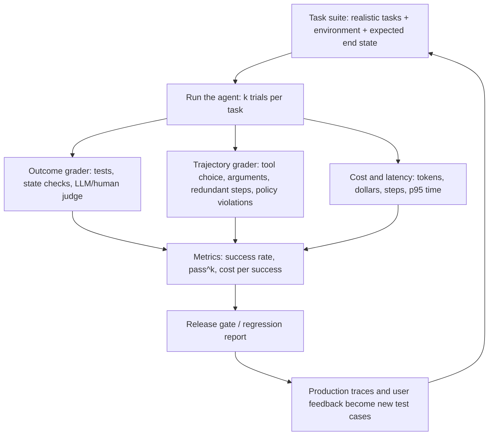

# Module 08: Production Agent Evaluation & Benchmarks

> **Architectural Scope**: What to measure for agents (outcome, trajectory, safety, cost, latency, reliability), public benchmarks and their limits, building your own task suites and graders, handling non-determinism with repeated trials and confidence intervals, regression testing, and online monitoring.

---

## Why this module matters

Agents fail in more ways than single LLM calls: wrong tool, wrong arguments, a good plan executed badly, a correct answer reached by an unsafe path, a task that succeeds nine times out of ten. Without systematic evaluation, you cannot tell whether a prompt tweak, a new model, or an added agent helped or quietly broke something; every change becomes a gamble, and production incidents become the evaluation. The gap between impressive demos and dependable products is almost entirely an evaluation problem. This module sets out how to measure agent quality in a way that guides engineering decisions and gates releases.

## Mental model: grade the exam *and* the working

A student's final answer can be right for the wrong reasons, or wrong after excellent reasoning. For agents, **outcome** (did the task get done correctly?) is what users care about, but **trajectory** (which tools, in what order, with what arguments, at what cost, without violating rules) explains *why* and predicts reliability. And because agents are stochastic, you must run each exam **several times**.

## 1. What to measure

| Dimension | Metrics |
|---|---|
| **Outcome / task success** | % of tasks completed correctly (strict end-state checks where possible) |
| **Reliability** | **pass^k** (all `k` independent trials succeed), variance across trials, success under perturbation (paraphrased request, flaky tool) |
| **Trajectory quality** | correct tool selection, argument correctness, number of steps vs optimal, redundant or looping calls, unnecessary clarifying questions, recovery from tool errors |
| **Safety and policy** | forbidden actions attempted, data leakage, prompt-injection susceptibility, compliance with approval rules (Modules 06 and 07), refusal correctness |
| **Groundedness / faithfulness** | claims supported by tool results or retrieved sources (course 12, Module 01) |
| **Cost** | tokens, dollars per task, **cost per successful task** |
| **Latency** | end-to-end time (p50/p95), steps, time to first useful output |
| **User-level** | satisfaction, escalation/handoff rate, abandonment, edit rate of agent drafts |

**pass@k vs pass^k.** `pass@k` asks "does *at least one* of `k` attempts succeed?" (relevant for generate-and-verify, such as code with tests). `pass^k` asks "do *all* `k` attempts succeed?", which measures **consistency**, what a customer-facing agent needs. If per-trial success is `p`, `pass^k = p^k`: with `p = 0.9`, `pass^8 = 0.43`. The τ-bench benchmark (Sierra) made this visible: agents with decent single-trial success dropped sharply on repeated-trial reliability.

## 2. Public benchmarks (use them to *choose models*, not to *ship agents*)

| Benchmark | Tests |
|---|---|
| **SWE-bench / SWE-bench Verified** | resolving real GitHub issues in repositories, judged by the project's tests |
| **τ-bench (tau-bench)** | tool-using customer-service agents interacting with a simulated user under domain policies; reports pass^k |
| **GAIA** | general assistant questions needing browsing, tools and multi-step reasoning |
| **WebArena / VisualWebArena / Mind2Web / BrowseComp** | web navigation and browsing tasks |
| **OSWorld** | computer-use across real desktop applications |
| **AgentBench**, **TheAgentCompany**, **ToolBench / BFCL (Berkeley Function-Calling Leaderboard)** | multi-environment agent tasks, workplace simulation, function-calling accuracy |
| **LoCoMo / LongMemEval** | long-term memory (Module 04) |

Limits: scores depend heavily on the **scaffold** (prompts, tools, retry logic, budget), not just the model; **contamination** (benchmark data leaking into training); saturation; mismatch with **your** domain, tools and policies; and cherry-picked reporting. Treat leaderboards as a shortlist generator, then evaluate on your own tasks.

## 3. Building your own evaluation

1. **Start from reality:** collect real user requests and traces (or realistic synthetic ones), especially **failures** and edge cases. 20 to 50 well-chosen tasks beat 500 generic ones when you are starting.
2. **Define the environment:** a sandboxed, resettable world (test database, mock APIs/simulators, fixture repositories, a simulated user model) so that runs are repeatable and safe (Module 06). Tools should hit **test systems**, never production.
3. **Specify success by end state where possible:** "the order status is `refunded` and exactly one refund row exists" is more reliable than judging the agent's final message. Add checks for **side effects that must not happen** (no email sent to the wrong person).
4. **Choose graders:**
   - **Code graders:** assertions on state, unit tests, schema checks, exact match (fast, deterministic, preferred).
   - **LLM-as-judge** for open-ended quality or rubric adherence; calibrate against human labels and watch for bias (course 12, Module 02).
   - **Human review** for the hard or high-stakes cases and to validate the automatic graders.
5. **Evaluate trajectories:** compare tool calls with reference or acceptable alternatives (allow different valid paths), count steps, flag policy violations; trace-level metrics reveal fixable tool-design issues (Module 03).
6. **Run multiple trials** (for example 3 to 10 per task) because outputs vary; report mean success and pass^k.
7. **Keep it versioned and runnable in CI:** a **regression suite** that runs on every prompt, model or tool change and blocks releases on regressions; a larger nightly suite.
8. **Read the transcripts.** Aggregate numbers tell you *that* something changed; reading 20 failures tells you *why*. Categorise failures (wrong tool, bad arguments, misunderstood request, hallucinated result, loop, policy violation) and fix the biggest category first.

## 4. Statistics for stochastic agents

Success rate from `n` independent tasks has a **confidence interval**: about `p +/- 1.96 x sqrt(p (1 - p) / n)` for a 95% interval.

**Worked example.** Observed success 80% on 50 tasks: half-width `1.96 x sqrt(0.8 x 0.2 / 50) = 1.96 x 0.0566 = 0.11`, so the true rate is plausibly anywhere from 69% to 91%. A change that moves the observed rate from 80% to 84% on this suite is **noise**. To detect a 5-point improvement reliably you typically need hundreds of tasks (or paired comparisons on the *same* tasks, which are far more sensitive: look at which tasks flipped from fail to pass and back). Use multiple trials to reduce within-task variance, paired tests or bootstrap intervals for comparisons, and be wary of overfitting prompts to a small fixed suite (hold out a test set).

## 5. Production monitoring (evaluation never ends)

- **Tracing:** record every run as a trace (prompts, tool calls, arguments, results, latencies, costs) with OpenTelemetry-style spans (course 12, Module 08). Tools: LangSmith, Langfuse, Arize Phoenix, Braintrust, Helicone, OpenLLMetry, DeepEval and Datadog LLM observability.
- **Online evaluation:** run cheap automatic checks (format validity, policy classifiers, groundedness checks, LLM-judge on a sample) on live traffic; track **tool error rate**, loop/step-limit hits, escalation rate, cost per task, p95 latency and user feedback (thumbs, edits, retries).
- **Release safely:** **shadow mode** (new agent runs on real inputs without acting), **canary** (a small percentage of traffic) and **A/B tests**, with automatic rollback on metric regressions.
- **Feedback loop:** convert production failures and user corrections into new test cases and few-shot examples.
- **Drift:** model updates by a provider, changed tool APIs and shifting user behaviour all change performance; re-run suites on schedule.
- **Alerts and budgets:** per-run and per-day cost caps, anomaly alerts on step counts and tool failures.

## Common pitfalls

1. **Evaluating only the final answer** (missing unsafe or wasteful trajectories) or only the trajectory (missing real outcomes).
2. **One trial per task**, mistaking luck for quality.
3. **Tiny suites with no confidence intervals**, then celebrating noise.
4. **LLM-judge without calibration**, with a judge that shares the agent's blind spots or favours long answers.
5. **Running evaluations against production systems**, or non-resettable environments, causing flaky and unsafe tests.
6. **Overfitting to the benchmark or to a fixed small suite.**
7. **Relying on public leaderboard scores** for a product's real tasks.
8. **No regression gate**, so improvements in one area silently break another.
9. **Never reading transcripts.**

## How this connects

- **Module 01** supplies the reliability maths (`p^n`); **Module 03** tool design is the most common thing evaluation reveals to fix; **Module 05** multi-agent systems must beat a single-agent baseline here; **Modules 06 and 07** define the safety and approval behaviours to test.
- **Course 12** (LLM evaluation science, LLM-as-judge calibration, benchmark harnesses, red teaming, observability) provides the methodology and tooling used throughout this module; **Course 10** retrieval metrics feed agentic RAG evaluation.

## Go further

- roadmap.sh: *AI Agents* nodes on **evaluation**, **observability** (**DeepEval**, **Helicone**, **OpenLLMetry**), **testing**; *AI Engineer* nodes on **model evaluation**.
- Jimenez et al., *SWE-bench* (2024); Yao et al., *tau-bench* (2024); Mialon et al., *GAIA* (2023); Zhou et al., *WebArena* (2023); Xie et al., *OSWorld* (2024); Anthropic, *Demystifying evals for AI agents* and *Building effective agents*; Hamel Husain, *Your AI Product Needs Evals*.
- LangSmith, Langfuse and Arize Phoenix documentation on agent evaluation and tracing.

---

## Module Study Progression
1. **Beginner Playground**: Read [00_FOUNDATIONS_PLAYGROUND.md](00_FOUNDATIONS_PLAYGROUND.md).
2. **Architecture Theory**: Study this [01_README.md](01_README.md).
3. **Hands-on Project**: Follow [02_PROJECT_GUIDE.md](02_PROJECT_GUIDE.md).
4. **Staff Interview Challenges**: Check [03_SELF_ASSESSMENT_AND_CHALLENGES.md](03_SELF_ASSESSMENT_AND_CHALLENGES.md).
5. **Production Debugging**: Review [04_TROUBLESHOOTING_AND_EDGE_CASES.md](04_TROUBLESHOOTING_AND_EDGE_CASES.md).
