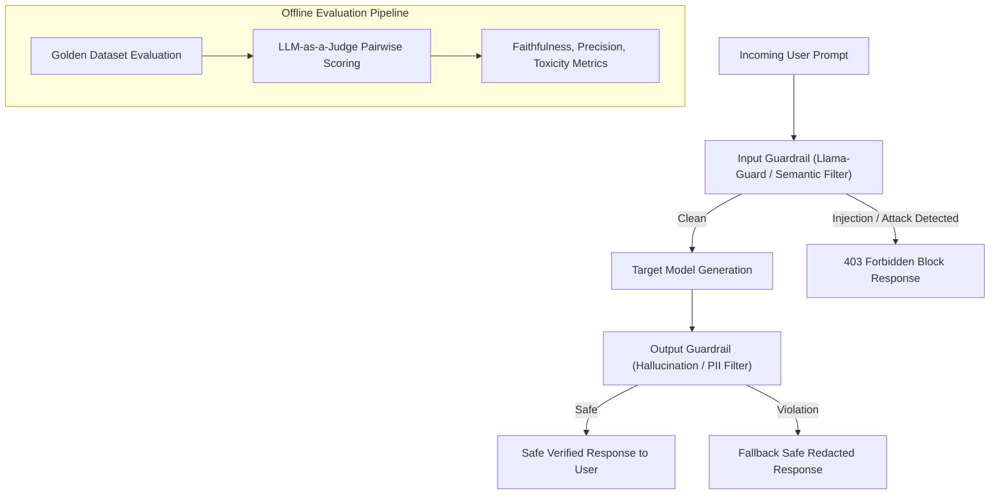

# Module 01: LLM Evaluation Science and Metrics

## Multi-Tiered LLM Evaluation & Guardrails Defense

## 1. Theoretical Foundations: From Lexical Overlap to Semantic Alignment

Evaluating natural language generation (NLG) spans three distinct algorithmic generations:

| Era | Primary Metrics | Strengths | Critical Flaws |
| :--- | :--- | :--- | :--- |
| **Lexical Overlap** | BLEU (Papineni et al.), ROUGE-L (Lin) | Fast, $O(N)$ string matching | Penalizes synonyms; blind to factual accuracy |
| **Semantic Embedding** | BERTScore (Zhang et al.), Cosine Distance | Captures paraphrases | Cannot detect hallucinated numbers or negations |
| **Model-Based Verification** | RAGAS (Es et al.), TruLens | Evaluates reasoning, attribution, and groundedness | Expensive; introduces judge bias |

---

## 2. Mathematical Formulation of the RAG Triad

### 2.1 Faithfulness (Groundedness)
Let $A$ be the generated answer, decomposed into a set of atomic propositional statements $S(A) = \{s_1, s_2, \dots, s_k\}$.
Let $C$ be the retrieved context chunk:

$$\text{Faithfulness}(A, C) = \frac{\sum_{i=1}^{k} \mathbb{I}(C \models s_i)}{|S(A)|}$$

where $C \models s_i$ denotes that proposition $s_i$ can be logically entailed by context $C$.

### 2.2 Answer Relevance
Let $q$ be the original question. Answer relevance measures whether $A$ directly answers $q$ rather than dodging the question:

$$\text{Answer Relevance} = \frac{1}{M} \sum_{j=1}^{M} \cos(\mathbf{e}(q), \mathbf{e}(q_j^{\text{gen}}))$$

where $q_j^{\text{gen}}$ are reverse-generated questions synthesized from answer $A$.

### 2.3 Context Precision
Measures whether the relevant information is ranked at the top of the context chunks:

$$\text{Context Precision@K} = \frac{\sum_{k=1}^K \text{Precision@k} \times v_k}{\sum_{k=1}^K v_k}$$

where $v_k \in \{0, 1\}$ indicates whether chunk $k$ contains ground-truth relevant information.