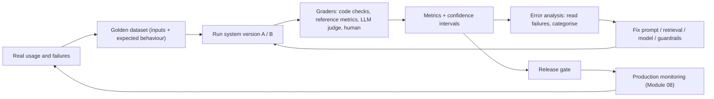

# Module 01: LLM Evaluation Science, Ground Truth & RAGAS

> **Architectural Scope**: Why evaluation is the core engineering discipline of LLM products, the evolution of metrics (lexical, embedding, model-based), building trustworthy ground truth, RAG metrics (faithfulness, answer relevance, context precision and recall, as in RAGAS), error analysis, statistics, and the offline/online evaluation loop.

---

## Why this module matters

Classical software has tests that either pass or fail. LLM systems produce open-ended text that is *sometimes* right, *sometimes* subtly wrong, and different on every run. Without a disciplined way to measure quality you cannot choose a model, tune a prompt, compare retrieval strategies, approve a release, or detect a regression; you are shipping on vibes. Teams that succeed with LLMs treat **evaluation as the product's test suite and its steering wheel**. Everything else in this course (judges, benchmarks, guardrails, red teaming, observability) depends on the concepts here.

## Mental model: a measurement system with three layers

1. **What "good" means** for your product, written down: correct, grounded in sources, safe, on-brand, concise, fast, cheap.
2. **Ground truth and test cases** that represent real use, with labels you trust.
3. **Metrics and graders** that turn model outputs into numbers you can compare across versions, and **error analysis** that tells you what to fix.

```mermaid
flowchart LR
    R["Real usage and failures"] --> D["Golden dataset (inputs + expected behaviour)"]
    D --> RUN["Run system version A / B"]
    RUN --> G["Graders: code checks, reference metrics, LLM judge, human"]
    G --> M["Metrics + confidence intervals"]
    M --> EA["Error analysis: read failures, categorise"]
    EA --> FIX["Fix prompt / retrieval / model / guardrails"]
    FIX --> RUN
    M --> GATE["Release gate"]
    GATE --> PROD["Production monitoring (Module 08)"]
    PROD --> R
```

## 1. Three generations of metrics

| Era | Metrics | What they do | Critical weakness |
|---|---|---|---|
| **Lexical overlap** | BLEU, ROUGE-L, METEOR, exact match, F1 over tokens | compare n-grams with a reference | penalise valid paraphrases; blind to factual errors ("the dose is 5 mg" vs "50 mg" scores almost identically) |
| **Embedding similarity** | BERTScore, cosine similarity of sentence embeddings | capture paraphrase and semantics | cannot detect negations, wrong numbers or entities reliably |
| **Model-based** | LLM-as-a-judge, NLI/entailment models, RAGAS, TruLens, G-Eval | judge reasoning, groundedness, helpfulness with a rubric | costly; judge bias and instability (Module 02) |

Also useful: **deterministic checks** (valid JSON, schema compliance, regex for forbidden content, length limits, unit tests for generated code, SQL result equality) and **task-specific metrics** (pass@k for code, accuracy on closed-form answers, exact match for extraction). **Prefer deterministic graders wherever the task allows**; use model-based graders for what code cannot check; use humans to calibrate both.

## 2. Ground truth: the part everyone underestimates

A metric is only as good as the dataset behind it.

- **Source it from reality:** production logs (with privacy controls), support tickets, subject-matter-expert-written questions, and known failure cases. Synthetic data (LLM-generated questions from your documents) is useful for coverage but tends to be easier and more uniform than real traffic; validate it and mix with real examples.
- **Cover the distribution and the edges:** common cases, rare but important ones, adversarial inputs, multi-turn, ambiguous or unanswerable questions (the right answer may be "I don't know"), different user types and languages.
- **Write labelling guidelines** and **measure agreement**. Two annotators labelling the same items should mostly agree; **Cohen's kappa** corrects for chance: `kappa = (p_observed - p_chance) / (1 - p_chance)`. Example: 90% raw agreement with 50% expected by chance gives `kappa = (0.9 - 0.5) / 0.5 = 0.8` (usually "good"); 70% agreement gives 0.4 ("moderate"), a sign the task or guideline is ambiguous.
- **Size and uncertainty:** start with 50 to 200 carefully chosen cases; report confidence intervals (for accuracy `p`, about `p +/- 1.96 x sqrt(p(1-p)/n)`), and use **paired comparisons** on the same items.
- **Keep a held-out set** you do not tune against, to avoid overfitting prompts to the test.
- **Version the dataset** and treat changes like code changes.

## 3. RAG metrics (the RAGAS family)

RAG systems fail in two places (retrieval and generation), so evaluate both and their interaction. RAGAS and similar toolkits (TruLens, DeepEval, ARES) decompose quality into LLM-judged components:

- **Faithfulness (groundedness):** break the answer `A` into atomic claims `S(A) = {s_1 ... s_k}` and check whether each is supported by the retrieved context `C`:

  `Faithfulness = (number of claims entailed by C) / k`

  *Example:* an answer with 5 claims, of which 4 are supported by the context, scores `4/5 = 0.8`; the unsupported claim is a hallucination relative to the sources.
- **Answer relevance:** does the answer address the question? One method generates questions back from the answer and measures their embedding similarity to the original question; an evasive or off-topic answer scores low.
- **Context precision:** are the relevant chunks ranked **high** in the retrieved list? With relevance flags `v_k` for chunks `1..K`:

  `Context Precision@K = sum over k of (Precision@k x v_k) / (number of relevant chunks)`

  *Example:* `K = 4`, relevance `[1, 0, 1, 0]`: Precision@1 = 1, Precision@3 = 2/3, so `(1 x 1 + 0.667 x 1) / 2 = 0.83`. If the two relevant chunks were at ranks 3 and 4 instead, the score would drop to about 0.42, reflecting wasted prompt space.
- **Context recall:** of the facts in the **ground-truth answer**, how many are present in the retrieved context? (needs a reference answer.) Low recall means the retriever missed information.
- **Answer correctness / semantic similarity** against a reference answer.

Diagnosing with them: low **context recall** means fix retrieval (chunking, embeddings, hybrid, reranking, course 10); high recall but low **faithfulness** means the generator ignores or contradicts the context (prompting, model, constraints); good faithfulness but low **relevance** means the system answers a different question (query understanding). Pure **retrieval metrics** (recall@k, MRR, nDCG, hit rate) on labelled query-to-passage data give a cheaper, deterministic check of the retriever alone.

## 4. Error analysis and the evaluation loop

Numbers show *that* quality changed; **reading failures shows why**. A productive routine:

1. Sample 30 to 100 failing or low-scoring cases.
2. Write a free-text note for each ("cited the wrong section", "refused a valid request", "numbers hallucinated").
3. **Cluster** the notes into failure categories, count them, and fix the biggest cluster first.
4. Turn each fixed failure into a **regression test**; re-run the full suite.
5. Repeat; add production failures continuously.

Practical guidance: use **binary pass/fail criteria** per dimension where possible (easier to label and judge consistently than 1-to-10 scores), keep a **small number of dimensions** that matter, and distinguish **component** evaluations (retriever, generator, tool) from **end-to-end** ones.

## 5. Offline, online and the metric traps

- **Offline** (golden sets, CI): fast, repeatable, safe; cannot capture everything users do.
- **Online** (production monitoring, A/B tests, user feedback, sampled LLM-judge): real distribution; noisier, slower, needs safeguards (Module 08).
- **Goodhart's law:** when a metric becomes a target it stops being a good measure. Optimising a judge's score can produce answers the judge likes (long, confident, formatted) rather than answers users want. Keep human spot checks and multiple independent signals.
- **Non-determinism:** run multiple samples or fix seeds/temperature for comparisons; report variance.
- **Cost of evaluation:** LLM judges multiply token spend; sample, cache, and use cheaper judges where validated.
- **Contamination and leakage:** do not tune on the same questions you report.

## Worked example: diagnosing a documentation chatbot

Suite of 120 questions. Results: context recall 0.62, faithfulness 0.91, answer relevance 0.88. Interpretation: when it has the right context it answers faithfully, but it retrieves the needed facts only 62% of the time. Error analysis of 40 retrieval misses shows 22 are table-heavy PDFs split badly, 10 are acronym queries, 8 are multi-hop. Fixes: structure-aware table chunking (course 10, Module 01), hybrid BM25 (Module 04), query decomposition (Module 08). Re-run: recall 0.81, faithfulness 0.91, relevance 0.89. Paired analysis shows 24 questions flipped to pass and 3 to fail; the 3 regressions are inspected and added to the suite.

## Common pitfalls

1. **Using BLEU/ROUGE for factual or open-ended tasks.**
2. **Tiny, unrepresentative test sets** with no uncertainty estimates.
3. **Unmeasured label quality**: noisy ground truth makes every metric untrustworthy.
4. **Synthetic-only datasets** that are easier than production.
5. **Judging only end-to-end**, unable to tell whether retrieval or generation failed.
6. **Tuning prompts on the test set.**
7. **Averaging away safety failures**: track critical failure categories separately (a 95% average can hide a 0% pass rate on a dangerous class).
8. **Skipping error analysis** and chasing aggregate scores.

## How this connects

- **Module 02** calibrates the LLM judges used here; **Module 03** adds standardised benchmarks; **Module 04 to 07** evaluate guardrails and security; **Module 08** carries evaluation into production monitoring.
- **Course 10** (retrieval metrics and pipeline design) and **Course 11, Module 08** (agent evaluation) are direct applications; **Course 06, Module 11** (MLOps) places evaluation inside the delivery pipeline.

## Go further

- roadmap.sh: *AI Engineer* nodes on **model evaluation**, **bias and fairness**, **observability**; *AI Agents* **evaluation** nodes; *Machine Learning* nodes **accuracy, F1, ROC-AUC, cross-validation**.
- Es et al., *RAGAS: Automated Evaluation of Retrieval Augmented Generation* (2023); RAGAS documentation (metrics); Hamel Husain, *Your AI Product Needs Evals*; Eugene Yan, *Patterns for Building LLM-based Systems and Products*; Liu et al., *G-Eval* (2023).

---

## Module Study Progression
1. **Beginner Playground**: Read [00_FOUNDATIONS_PLAYGROUND.md](00_FOUNDATIONS_PLAYGROUND.md).
2. **Architecture Theory**: Study this [01_README.md](01_README.md).
3. **Hands-on Project**: Follow [02_PROJECT_GUIDE.md](02_PROJECT_GUIDE.md).
4. **Staff Interview Challenges**: Check [03_SELF_ASSESSMENT_AND_CHALLENGES.md](03_SELF_ASSESSMENT_AND_CHALLENGES.md).
5. **Production Debugging**: Review [04_TROUBLESHOOTING_AND_EDGE_CASES.md](04_TROUBLESHOOTING_AND_EDGE_CASES.md).
