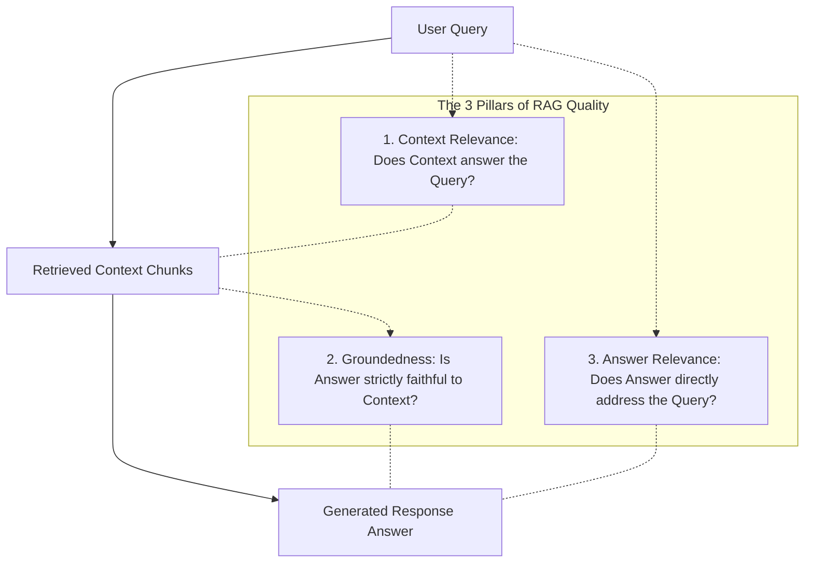

# Module 02: LLM as a Judge Calibration and Bias

## The RAG Triad Evaluation Architecture

---

## 🗺️ Recommended Step-by-Step Learning Path

Follow this exact sequence to achieve complete mastery of this module:

| Step | File to Open | What You Will Do |
| :---: | :--- | :--- |
| **1** | **[01_README.md](01_README.md)** | Read conceptual overview, architectural foundations, and mental models. |
| **2** | **[00_FOUNDATIONS_PLAYGROUND.md](00_FOUNDATIONS_PLAYGROUND.md)** | Practice beginner spoonfed micro-drills and line-by-line syntax breakdowns. |
| **3** | **[00_try_it_yourself.py](00_try_it_yourself.py)** | Run in terminal (`python 00_try_it_yourself.py`) for an interactive zero-dependency sandbox. |
| **4** | **[04_TROUBLESHOOTING_AND_EDGE_CASES.md](04_TROUBLESHOOTING_AND_EDGE_CASES.md)** | Study forensic runbooks, edge cases, and real-world failure post-mortems. |
| **5** | **[03_SELF_ASSESSMENT_AND_CHALLENGES.md](03_SELF_ASSESSMENT_AND_CHALLENGES.md)** | Test your knowledge with self-assessment quizzes, challenges, and diagnostic scenarios. |
| **6** | **[02_PROJECT_GUIDE.md](02_PROJECT_GUIDE.md)** | Follow guided project implementation for `starter/` and `project_solution/`. |
| **7** | **[problems/](problems/)** | Solve hands-on problem bank challenges and verify with `pytest problems/tests`. |
| **8** | **[debug_lab/](debug_lab/)** | Diagnose and fix silent production bugs in the Bug Hunter Drill. |

---

## 1. Theoretical Foundations: Systematic Biases in LLM Judges

LLM-as-a-Judge (Zheng et al., 2023 - MT-Bench & Chatbot Arena) is the industry standard for evaluating open-ended conversation. However, research reveals four dominant systematic biases:

### 1.1 Taxonomy of Judge Biases

| Bias Type | Description | Mitigation Strategy |
| :--- | :--- | :--- |
| **Position Bias** | Tendency to favor the first (or second) candidate in pairwise comparison | Swap-pair evaluation: run $(A, B)$ and $(B, A)$ |
| **Verbosity Bias** | Tendency to award higher scores to longer, fluffier answers | Length normalization penalty; few-shot conciseness rubrics |
| **Self-Enhancement Bias** | Models favor responses generated by themselves or their family | Blind anonymization; multi-judge ensembles (e.g. Claude + GPT-4) |
| **Bandwagon / Anchoring** | Sensitivity to few-shot example order or score anchors | Permutation averaging across few-shot exemplars |

---

## 2. Inter-Annotator Agreement: Cohen's Kappa ($\kappa$)

To validate whether an LLM judge aligns with human expert judgment, we compute Cohen's Kappa coefficient:

$$\kappa = \frac{P_o - P_e}{1 - P_e}$$

where:
- $P_o$: Observed proportional agreement between Judge and Human.
- $P_e$: Hypothetical probability of agreement occurring by pure chance.

| $\kappa$ Range | Level of Agreement |
| :--- | :--- |
| $< 0.20$ | Slight agreement |
| $0.41 - 0.60$ | Moderate agreement |
| $0.61 - 0.80$ | Substantial agreement |
| $0.81 - 1.00$ | Almost perfect agreement |