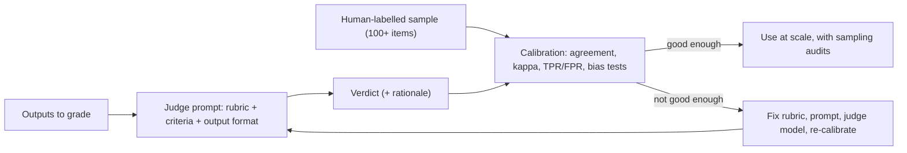

# Module 02: LLM-as-a-Judge Calibration & Bias Mitigation

> **Architectural Scope**: Using a language model as an evaluator, pointwise vs pairwise vs reference-guided judging, the known biases (position, verbosity, self-preference, formatting, sycophancy), mitigation techniques, calibration against human labels (agreement, TPR/FPR, bias correction), judge selection and monitoring.

---

## Why this module matters

Most LLM outputs (summaries, answers, advice, code explanations, agent transcripts) have no single correct string to compare against, and human review does not scale to thousands of cases per release. **LLM-as-a-judge** uses a strong model to grade other models' outputs against a rubric, giving fast, cheap, scalable evaluation. Zheng et al. (2023, *Judging LLM-as-a-Judge with MT-Bench and Chatbot Arena*) showed that a strong judge such as GPT-4 can agree with human preferences more than 80% of the time, about the level at which humans agree with each other. But a judge is a **measuring instrument with systematic errors**. Uncalibrated, it will confidently reward the wrong things, and optimising against it will amplify those errors. This module is about trusting a judge exactly as much as it has earned.

## Mental model: a referee you must audit

A referee is useful because they are fast and consistent, but they have habits: favouring the home team (position), being impressed by long speeches (verbosity), liking their own style (self-preference). You would check the referee's calls against video review (human labels), measure how often they are wrong in each direction, and adjust. Judges need the same audit.


```mermaid
flowchart LR
    O["Outputs to grade"] --> J["Judge prompt: rubric + criteria + output format"]
    J --> V["Verdict (+ rationale)"]
    H["Human-labelled sample (100+ items)"] --> CAL["Calibration: agreement, kappa, TPR/FPR, bias tests"]
    V --> CAL
    CAL -->|"good enough"| USE["Use at scale, with sampling audits"]
    CAL -->|"not good enough"| IMP["Fix rubric, prompt, judge model, re-calibrate"]
    IMP --> J
```

## 1. Judging formats

| Format | Question asked | Pros | Cons |
|---|---|---|---|
| **Pointwise (single-answer) scoring** | "Rate this answer 1 to 5" or "pass/fail against criteria" | scales linearly; works for absolute gates | scores drift and are poorly calibrated; scale compression (everything is a 4) |
| **Pairwise comparison** | "Which of A or B is better?" | humans and models are better at relative judgements; good for A/B model comparisons | `O(n^2)` for many systems; position bias; no absolute quality |
| **Reference-guided** | grade against a gold answer or checklist | far more reliable for factual/maths content | needs references |
| **Rubric / multi-criteria** | separate verdicts for faithfulness, relevance, tone, safety | diagnostic | more calls; criteria must be well defined |
| **Binary criteria checks** | "Does the answer cite a source? yes/no" | easiest to calibrate and reproduce | coarse |

Recommendation: prefer **binary or small-ordinal rubric questions with explicit definitions** for production gates, and **pairwise** for comparing two versions.

## 2. Known biases

| Bias | Behaviour | Typical mitigation |
|---|---|---|
| **Position bias** | in pairwise comparisons the judge favours the first (or second) answer regardless of content | **swap order and run both**; count a win only if consistent, else tie; or average |
| **Verbosity (length) bias** | longer answers score higher even when padded | rubric that penalises padding, length-controlled comparison, include "do not reward length" instruction, measure correlation between length and score |
| **Self-enhancement / self-preference** | a model favours text written in its own style or by itself | use a **different model family** as judge than the generator; use a panel |
| **Formatting / style bias** | markdown lists, confident tone, bold text win | normalise formatting, strip styling, test with style-swapped pairs |
| **Authority / sycophancy** | influenced by claims like "an expert wrote this" or by agreeing with the user's stated belief | hide provenance; blind evaluation |
| **Limited reasoning on hard tasks** | judges mis-grade maths, code and fine factual details | **reference-guided grading**, execute code/tests, retrieve evidence, or use stronger reasoning judges |
| **Leniency / scale bias** | rubric scores cluster at the top | calibrate thresholds on human labels; use pairwise or binary |
| **Prompt sensitivity** | tiny rubric wording changes shift scores | fix and version the prompt; test variants |

## 3. Making the judge reliable (design techniques)

1. **Write precise criteria** with definitions and examples of each verdict, including edge cases ("a hedged answer that includes the correct number counts as pass").
2. **Ask for reasoning before the verdict** (G-Eval-style): "explain step by step, then output `PASS` or `FAIL`". Verdict-first prompts produce worse, less consistent judgements. Parse the final label with a **structured output** (JSON schema, Module 03 of course 11).
3. **Provide a reference or evidence** whenever available (gold answer, retrieved context for faithfulness checks).
4. **Control randomness:** temperature 0 (or low), fixed prompt, and for important decisions **sample several times and take the majority**.
5. **Panel of judges (PoLL):** several different, smaller models voting often beats one big judge on agreement with humans and cost, and reduces self-preference.
6. **Decompose** complex judgements into independent sub-questions (claims supported? key fact present? tone acceptable?).
7. **Few-shot examples** of graded outputs from your own data help anchor the scale (but beware leakage of test cases).
8. **Specialised judges:** fine-tuned evaluators (Prometheus, JudgeLM) or reward models can be cheaper and more consistent for narrow criteria.

```python
def pairwise_judge(question, a, b, judge):
    r1 = judge(question, first=a, second=b)       # returns "first" or "second" or "tie"
    r2 = judge(question, first=b, second=a)       # swap to cancel position bias
    win_a = (r1 == "first") + (r2 == "second")
    win_b = (r1 == "second") + (r2 == "first")
    return "A" if win_a == 2 else "B" if win_b == 2 else "tie"   # only count consistent wins
```

## 4. Calibration: earning trust in numbers

1. **Build a human-labelled sample:** 100 to 300 representative items labelled by qualified humans (ideally 2 annotators, with disagreements resolved). Split into a **development** part (to tune the judge prompt) and a held-out **test** part (to report agreement). Do not tune on the test part.
2. **Measure agreement:** accuracy vs human labels, **Cohen's kappa** (agreement beyond chance), and for ordinal scores a rank correlation (Spearman). Compare with **human-human agreement** (the ceiling).
3. **Measure the error types separately:** for a binary judge compute the **true positive rate** (TPR: of the truly good outputs, how many does the judge pass?) and **false positive rate** (FPR: of the truly bad ones, how many does it wrongly pass?). A judge that is lenient has a high FPR; one that is harsh has a low TPR. Metrics that hide the direction of errors are not enough.
4. **Correct the aggregate:** if the judge's pass rate is `p_obs`, the estimated true pass rate is

   `p_true = (p_obs - FPR) / (TPR - FPR)`.

   **Worked example.** The judge passes 70% of outputs; calibration shows TPR 0.90, FPR 0.20. `p_true = (0.70 - 0.20) / (0.90 - 0.20) = 0.714`. Here the biases happen to nearly cancel; with TPR 0.90 and FPR 0.40 the same observation gives `(0.7 - 0.4)/0.5 = 0.60`, a very different conclusion. Also propagate the uncertainty from the finite calibration set.
5. **Test for specific biases:** swap positions (inconsistency rate), compare scores for original vs padded answers, test same content in different formatting, and same text attributed to different models.
6. **Monitor continuously:** re-sample production judgements for human audit each week; **re-calibrate when you change the judge model, the prompt, or the output distribution** (a model update can silently shift all your scores); keep the judge version in every result record.
7. **Watch for criteria drift:** reviewers often discover what they want only after seeing outputs (Shankar et al., *Who Validates the Validators?*), so iterate rubric and labels together.

## 5. Practical guidance

- **Use judges where code cannot judge**; prefer deterministic graders (tests, schema checks, exact match) whenever possible.
- **Different family for the judge** than the system under test, ideally a stronger model; sanity-check with a second judge.
- **Do not optimise directly against the judge** without holdout humans (the system will learn the judge's quirks: longer, more confident, more formatted).
- **Report uncertainty:** confidence intervals on pass rates; paired comparison on the same items.
- **Cost control:** cache judgements, judge a sample of production traffic, use small judges for narrow binary checks after validating them.
- **Safety-critical judgements** (harmful content, medical or legal claims) should keep humans in the loop.

## Common pitfalls

1. **Treating a judge score as ground truth** without calibration.
2. **Single-order pairwise comparisons**, baking in position bias.
3. **Same model generating and judging**, inflating scores.
4. **Vague rubrics** (rate helpfulness 1 to 10) and verdict-first prompts.
5. **Ignoring length and style effects.**
6. **Tuning the judge on the same human labels used to report its accuracy.**
7. **Not re-validating** after judge or prompt changes.
8. **Reporting only agreement (accuracy)**, hiding a lenient judge's high false-positive rate.

## How this connects

- **Module 01** defines what to measure and the ground truth used for calibration; **Module 03** compares judge-based and programmatic benchmarks; **Module 07** (red teaming) uses judges to classify attack success; **Module 08** applies judges to sampled production traffic.
- **Course 11, Module 08** relies on judges for trajectory and outcome grading; **Course 10** uses them for RAG answer quality.

## Go further

- roadmap.sh: *AI Engineer* nodes **model evaluation**, **bias and fairness**; *AI Red Teaming* nodes on evaluation.
- Zheng et al., *Judging LLM-as-a-Judge with MT-Bench and Chatbot Arena* (2023); Liu et al., *G-Eval* (2023); Verga et al., *Replacing Judges with Juries (PoLL)* (2024); Kim et al., *Prometheus* (2023); Shankar et al., *Who Validates the Validators?* (2024); Hamel Husain, *Using LLM-as-a-Judge: a complete guide*; Eugene Yan, *Evaluating the effectiveness of LLM-evaluators*.

---

## Module Study Progression
1. **Beginner Playground**: Read [00_FOUNDATIONS_PLAYGROUND.md](00_FOUNDATIONS_PLAYGROUND.md).
2. **Architecture Theory**: Study this [01_README.md](01_README.md).
3. **Hands-on Project**: Follow [02_PROJECT_GUIDE.md](02_PROJECT_GUIDE.md).
4. **Staff Interview Challenges**: Check [03_SELF_ASSESSMENT_AND_CHALLENGES.md](03_SELF_ASSESSMENT_AND_CHALLENGES.md).
5. **Production Debugging**: Review [04_TROUBLESHOOTING_AND_EDGE_CASES.md](04_TROUBLESHOOTING_AND_EDGE_CASES.md).
