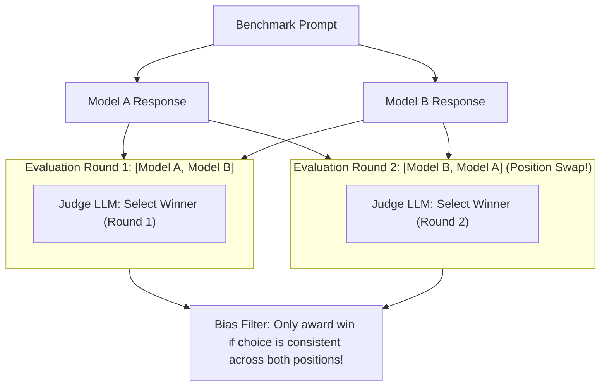

# Module 03: Standardized Benchmark Harnesses

## LLM-as-a-Judge Pairwise Arena & Position Bias Calibration

## 1. Landmark AI Benchmarks & Evaluation Paradigms

Standardized benchmarks form the bedrock of AI capabilities evaluation:

| Benchmark | Target Capability | Format | Metric |
| :--- | :--- | :--- | :--- |
| **MMLU** (Hendrycks et al.) | General Knowledge across 57 subjects | 4-choice Multiple Choice | Macro-averaged Accuracy |
| **GSM8K** (Cobbe et al.) | Multi-step Grade School Math | CoT Free-form generation | Exact numeric match |
| **HumanEval** (Chen et al.) | Python Code Generation | Functional execution | Pass@k on hidden unit tests |
| **TruthfulQA** (Lin et al.) | Hallucination & Common Misconceptions | Adversarial QA | Truthfulness % + Informative % |

---

## 2. Pass@k Unbiased Estimator Formulation

Evaluating Pass@k by drawing $k$ samples directly requires generating millions of tokens. Chen et al. derived an unbiased minimum-variance estimator from $n \ge k$ total generations:

$$\widehat{\text{Pass}@k} = \mathbb{E}\left[ 1 - \frac{\binom{n - c}{k}}{\binom{n}{k}} \right]$$

where $n$ is total candidate samples per task, and $c$ is the number of correct solutions ($0 \le c \le n$).

---

## 3. Data Contamination & Decontamination Auditing

Pre-training corpora (Common Crawl, The Pile, GitHub) frequently ingest benchmark test splits.
Decontamination techniques:
1. **$N$-gram Overlap Filtering**: Any training document sharing an 8-gram or 13-gram with a benchmark test question is flagged as contaminated.
2. **Perplexity Probing**: Comparing cross-entropy loss on benchmark test questions versus syntactically perturbed controls. If loss drops sharply on the original, memorization is confirmed.