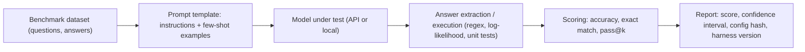

# Module 03: Standardized Benchmark Harnesses (MMLU, GSM8K, HumanEval)

> **Architectural Scope**: What the main public benchmarks measure (MMLU, GSM8K, HumanEval and relatives), how evaluation harnesses (lm-evaluation-harness, HELM, lighteval, Inspect) run them, scoring methods including the unbiased pass@k estimator, reproducibility pitfalls, contamination and saturation, and how to choose and extend benchmarks.

---

## Why this module matters

When a lab announces "87% on MMLU" or an open model tops a leaderboard, those numbers shape which models teams adopt. Benchmarks give a **shared yardstick** for comparing models and tracking progress, and **harnesses** make the process repeatable. But benchmark numbers are easily misread: the same model can score several points differently depending on prompt format, few-shot count and answer-extraction code; popular benchmarks leak into training data; and a high MMLU score says little about whether a model will handle *your* support tickets. This module teaches you to run standard benchmarks correctly, read results critically, and know when to build your own.

## Mental model: standardised exams with a proctor

A standardised exam is only comparable if everyone gets the same questions, instructions, time limits and marking scheme. The **benchmark** is the question bank; the **harness** is the proctor and the marking scheme. Change the instructions or the marking and the scores are no longer comparable, even if the questions are identical.


```mermaid
flowchart LR
    B["Benchmark dataset (questions, answers)"] --> P["Prompt template: instructions + few-shot examples"]
    P --> M["Model under test (API or local)"]
    M --> X["Answer extraction / execution (regex, log-likelihood, unit tests)"]
    X --> S["Scoring: accuracy, exact match, pass@k"]
    S --> R["Report: score, confidence interval, config hash, harness version"]
```

## 1. The classic benchmarks

| Benchmark | What it tests | Format | Metric | Notes |
|---|---|---|---|---|
| **MMLU** (Hendrycks et al., 2021) | broad knowledge across 57 subjects (STEM, humanities, social sciences, professional) | multiple choice, 4 options, about 14K test questions; usually **5-shot** | accuracy | near saturation for frontier models; has label errors; **MMLU-Pro** (10 options, more reasoning-heavy) and **MMLU-Redux** (corrected) are harder or cleaner variants |
| **GSM8K** (Cobbe et al., 2021) | grade-school multi-step arithmetic word problems | free-form with reasoning; 1,319 test problems | exact match of the final number, often with **chain-of-thought** and few-shot | saturated by strong models; harder successors: **MATH**, **AIME**, **GSM-Symbolic** |
| **HumanEval** (Chen et al., 2021) | Python function synthesis from a docstring | 164 hand-written problems with unit tests | **pass@k** (code is *executed*) | small and contaminated; stronger variants: **HumanEval+/MBPP+ (EvalPlus)** with more tests, **LiveCodeBench** (fresh problems), **SWE-bench** (real issues) |
| **GPQA** | graduate-level science questions designed to be "Google-proof" | multiple choice | accuracy | tests expert reasoning; small |
| **BIG-Bench Hard (BBH)** | tasks where earlier models did poorly | mixed | accuracy | |
| **HellaSwag, ARC, WinoGrande, PIQA** | commonsense and science reasoning | multiple choice | accuracy | mostly saturated |
| **TruthfulQA** | tendency to repeat common misconceptions | MC and generation | truthfulness | often gamed; limited validity |
| **IFEval** | following verifiable instructions ("write at least 300 words, no commas") | generation with programmatic checks | strict/loose accuracy | measurable instruction following |
| **Chatbot Arena / LMArena**, **Arena-Hard**, **MT-Bench**, **AlpacaEval** | open-ended chat preference | human votes (Elo/Bradley-Terry) or LLM-judge win rates | rating / win rate | judge biases (Module 02) and style control matter |

## 2. How scoring actually works

- **Multiple choice, log-likelihood scoring.** Many harnesses compute the model's log-probability of each answer option (`A`, `B`, `C`, `D`, or the answer text) given the prompt and pick the highest. It works with base models and is deterministic, but it is not how users interact with chat models.
- **Generative scoring.** The model writes an answer (often with reasoning); a parser extracts the choice or number (regex such as "the answer is (\d+)"), then compares to the gold answer. Sensitive to formatting: a correct answer in an unexpected format counts as wrong.
- **Code: execution-based.** Generated code is run against unit tests in a sandbox (Course 11, Module 06; never run untrusted code unsandboxed). A problem passes if all tests pass.
- **pass@k for code.** With `n` samples per problem of which `c` pass, the **unbiased estimator** is

  `pass@k = 1 - C(n - c, k) / C(n, k)`

  averaged over problems (`C` is the binomial coefficient). **Worked example:** `n = 20` samples, `c = 4` correct: `pass@1 = 1 - C(16,1)/C(20,1) = 1 - 16/20 = 0.20`; `pass@5 = 1 - C(16,5)/C(20,5) = 1 - 4368/15504 = 0.72`. The same model looks very different at `k = 1` versus `k = 5`, so always state `k` and sampling temperature (typically 0.2 for pass@1 estimation, higher for pass@10 or 100).
- **Few-shot and chain-of-thought settings** (for example "MMLU 5-shot", "GSM8K 8-shot CoT") are part of the benchmark definition; scores are comparable only under the same setting.

## 3. Harnesses

| Tool | Notes |
|---|---|
| **EleutherAI `lm-evaluation-harness`** | de-facto standard for open models; hundreds of tasks; HF, vLLM and API backends; powers the Open LLM Leaderboard |
| **HELM** (Stanford CRFM) | "holistic" evaluation: many scenarios and metrics (accuracy, calibration, robustness, fairness, toxicity, efficiency) |
| **lighteval** (Hugging Face), **OpenCompass**, **OpenAI `simple-evals`/`evals`**, **Inspect** (UK AI Security Institute) | alternative harnesses; Inspect has strong agentic and safety evaluation support |
| **EvalPlus, BigCodeBench, LiveCodeBench harnesses** | code-specific with sandboxed execution |
| **Provider and custom harnesses** | your own tasks and graders (Module 01) |

Typical use:

```bash
lm_eval --model vllm --model_args pretrained=meta-llama/Llama-3.1-8B-Instruct \
        --tasks mmlu,gsm8k --num_fewshot 5 --batch_size auto \
        --apply_chat_template --output_path results/
```

## 4. Reproducibility: why the same model gets different scores

Documented causes of score differences of several points (and even different leaderboards rankings) for the *same* model:

- **Prompt format and wording**, option labelling, instruction text.
- **Number and choice of few-shot examples.**
- **Answer extraction** logic and strictness.
- **Chat template and system prompt** (applied or not).
- **Log-likelihood vs generative** scoring and length normalisation.
- **Sampling parameters**, number of samples, seeds.
- **Tokenisation, numerical precision (BF16 vs FP16 vs quantised), batch size**, serving engine.
- **Harness version** and dataset version (fixes to wrong labels).

Defence: report the **exact harness, version, task config, few-shot count, chat template, decoding settings and model revision** (a config hash); re-run baselines **yourself** under identical settings rather than quoting numbers from different papers; publish per-sample outputs; and report **confidence intervals** (a benchmark of 164 items has a standard error of several percentage points: at 80% accuracy on 164 items, `1.96 x sqrt(0.8 x 0.2 / 164) = +/-6.1` points, so 2-point gaps are noise).

## 5. Contamination, saturation and validity

- **Contamination (leakage):** benchmark questions (and answers) appear in web-scale training data, so scores partly measure memorisation. Signals: suspiciously high scores, performance drops on paraphrased or newly written versions. Mitigations: **held-out/private test sets**, **dynamic benchmarks** that refresh (LiveBench, LiveCodeBench), canary strings, n-gram overlap checks, evaluating on **perturbed** versions.
- **Saturation:** once top models hit 90%+, a benchmark stops discriminating; the field moves to harder successors.
- **Label noise:** a notable fraction of MMLU questions have wrong or ambiguous answers, capping achievable accuracy and distorting comparisons near the top.
- **Construct validity:** does the benchmark measure what you care about? Multiple-choice knowledge tests do not predict how a model summarises contracts, calls your tools, or refuses unsafe requests.
- **Goodhart effects:** teams optimise for the benchmark; leaderboard gains may not transfer.

## 6. Using benchmarks well

1. **Use public benchmarks to shortlist models**, never as the final decision.
2. **Pick benchmarks aligned with your use case** (code: LiveCodeBench/SWE-bench; reasoning: MATH/GPQA; instruction following: IFEval; tool use: BFCL/tau-bench).
3. **Run the same harness yourself** on candidate models with your serving configuration (including quantisation, which can shift scores).
4. **Add your own task suite** built from real data (Module 01), the evaluation that actually predicts product quality.
5. **Track regressions** (a quantised or fine-tuned model should not lose more than a tolerated margin on a fixed suite).
6. **Report uncertainty and full configuration.**

## Common pitfalls

1. **Comparing scores from different papers or leaderboards** with different prompts and settings.
2. **Not stating `k`, temperature or few-shot count** (pass@1 vs pass@10, 0-shot vs 5-shot).
3. **Running code-generation benchmarks without a sandbox.**
4. **Ignoring chat templates**, so an instruct model is evaluated as if it were a base model (or vice versa).
5. **Over-reading small differences** without confidence intervals.
6. **Trusting saturated or contaminated benchmarks.**
7. **Choosing a model on general benchmarks alone** and skipping task-specific evaluation.
8. **Evaluating a quantised/optimised model only on perplexity.**

## How this connects

- **Module 01** (metrics, confidence intervals, task-specific evaluation) and **Module 02** (judge-scored benchmarks like MT-Bench and Arena-Hard) frame this module; **Module 04 to 07** apply the same harness mindset to safety benchmarks (jailbreak and toxicity suites).
- **Course 09, Module 08** (quantisation) requires re-running these benchmarks to approve a compressed model; **Course 11, Module 08** covers agent benchmarks (SWE-bench, tau-bench, GAIA).

## Go further

- roadmap.sh: *AI Engineer* nodes **model evaluation**, **open vs closed models**, **Hugging Face models/tasks**, **benchmarks**.
- Hendrycks et al., *Measuring Massive Multitask Language Understanding* (2021); Cobbe et al., *Training Verifiers to Solve Math Word Problems* (GSM8K, 2021); Chen et al., *Evaluating Large Language Models Trained on Code* (HumanEval and pass@k, 2021); Liang et al., *Holistic Evaluation of Language Models* (HELM, 2022); Wang et al., *MMLU-Pro* (2024); Jain et al., *LiveCodeBench* (2024).
- EleutherAI `lm-evaluation-harness` documentation; Hugging Face blog "What's going on with the Open LLM Leaderboard?".

---

## Module Study Progression
1. **Beginner Playground**: Read [00_FOUNDATIONS_PLAYGROUND.md](00_FOUNDATIONS_PLAYGROUND.md).
2. **Architecture Theory**: Study this [01_README.md](01_README.md).
3. **Hands-on Project**: Follow [02_PROJECT_GUIDE.md](02_PROJECT_GUIDE.md).
4. **Staff Interview Challenges**: Check [03_SELF_ASSESSMENT_AND_CHALLENGES.md](03_SELF_ASSESSMENT_AND_CHALLENGES.md).
5. **Production Debugging**: Review [04_TROUBLESHOOTING_AND_EDGE_CASES.md](04_TROUBLESHOOTING_AND_EDGE_CASES.md).
